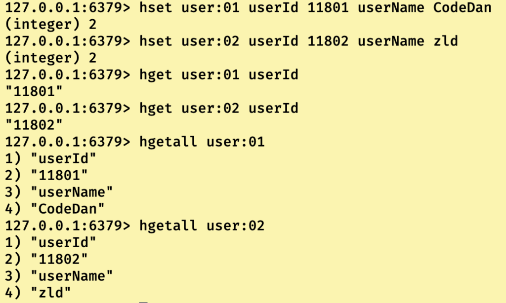
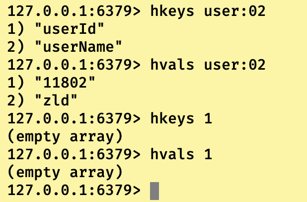
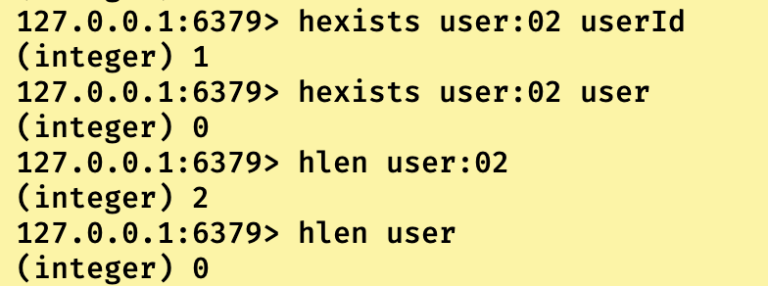
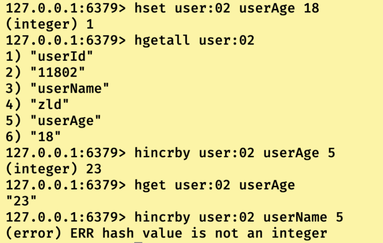

## Hash类型简介

即value为hash类型的数据结构，**也就是此value又是一个key-value对应的键值对，那么就会成为这样的形式，rediskey— < hashkey — hashValue>**。其中rediskey，hashkey以及hashValue均为字符串类型。

这样的特性，让hash类型特别适合存储实例对象，比如我们的User对象包含用户ID，姓名，年龄以及生日等信息，我们使用redis的Hash类型来存储的话，就是下属情况：

即redisKey为用户对象引用，然后redisKey中包含多个<hashKey–hashValue>,比如第一个对键值对可以是姓名(hashKey)–CodeDan(hashValue)，这样以此类推，就可以存储一个实例对象。

我们用redis指令来实现上述过程：只是看看，指令下面会具体说

```
127.0.0.1:6379> hset user:01 userId 11801 userName CodeDan
(integer) 2
127.0.0.1:6379> hset user:02 userId 11802 userName zld
(integer) 2
127.0.0.1:6379> hget user:01 userId
"11801"
127.0.0.1:6379> hget user:02 userId
"11802"
127.0.0.1:6379> hgetall user:01
1) "userId"
2) "11801"
3) "userName"
4) "CodeDan"
127.0.0.1:6379> hgetall user:02
1) "userId"
2) "11802"
3) "userName"
4) "zld"
```

------

## hash类型常用指令

```
//创建/添加RedisKey中一对或者多对Hash键值对
127.0.0.1:6379> hset redisKey hashKey hashValue [hashKey hashValue...]
//删除RedisKey中一对或者多对Hash键值对
127.0.0.1:6379> hdel redisKey hashKey[hashKey....]
//获取redisKey中指定hashKey对应的hashValue的值
127.0.0.1:6379> hget redisKye hashKey
//获取一个redisKey中所有的键值对
127.0.0.1:6379> hgetall redisKey
```



------

```
//获取指定redisKey中所有的Hashkey,如果redisKey不存在，返回空数组
127.0.0.1:6379> hkeys key
//获取指定redsiKey中所有的Hashvalue，如果redisKey不存在，返回空数组
127.0.0.1:6379> hvals key
```



------

```
//检测指定rediskey中是否存在指定的HashKey,存在返回(integer) 1,不存在返回(integer)0.
127.0.0.1:6379> hexists redisKey hashKey
//获取指定redisKey中hashKey的数量,redis存在返回个数，不存在返回integer 0.
127.0.0.1:6379> hlen redisKey
```



------

```
//如果hashKey对应的hashValue是字符串类型纯数字，那么可以使用指令进行相加操作,如果操作hashValue不是纯数字则报错。
127.0.0.1:6379> hincrby redisKey hashKey number
```

