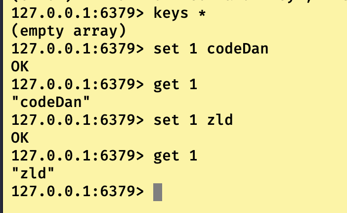
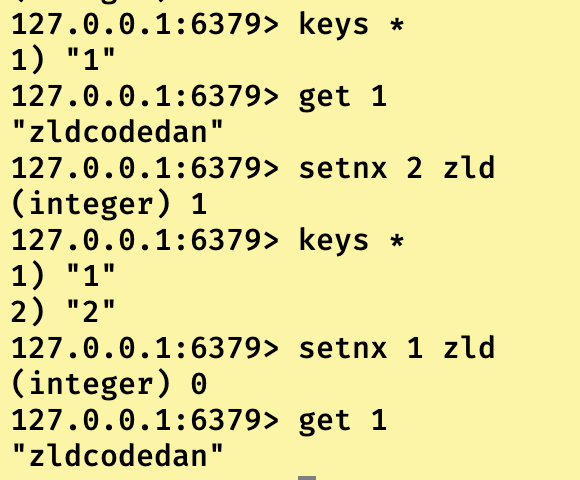
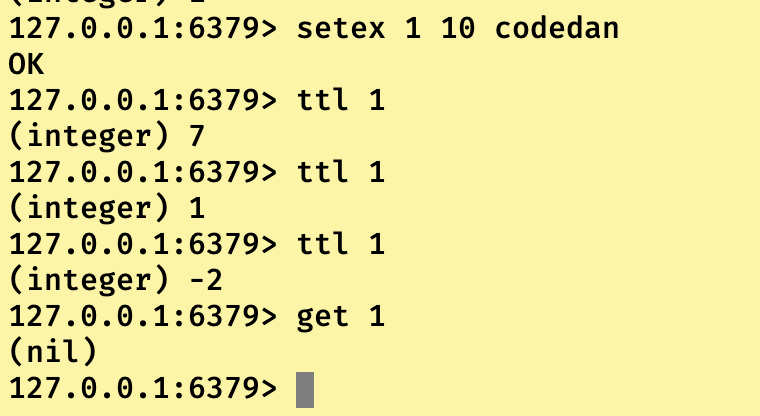
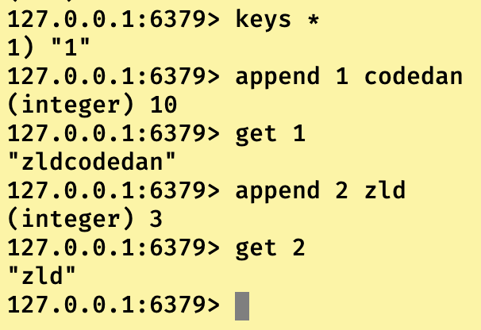
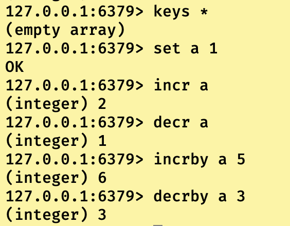
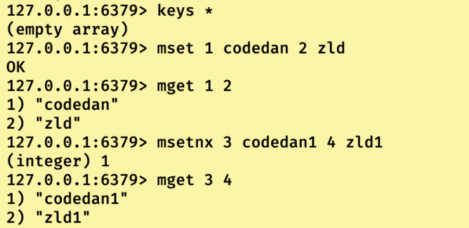
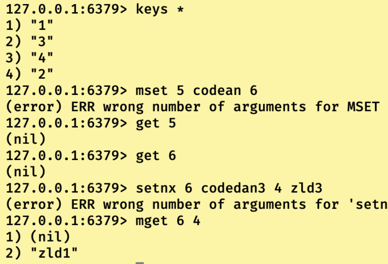
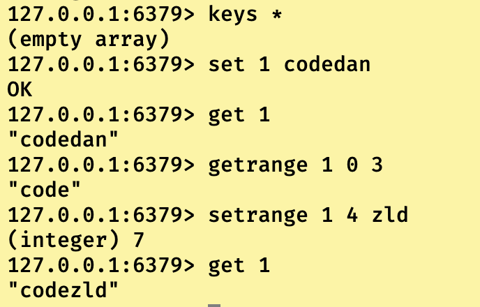

## Redis键值对（Key-Value）

这个不是数据类型，这个是基础知识，我们所说的五大数据类型存储结构指的是Value，而不是Key，所以我们得先聊聊Key这个健的作用。

和哈希表不大一样，redis直接通过key原来的值定位到Value值所在内存地址，所以不管是什么数据类型，Key的定义规则都是一样的的。

下述是key的常用操作指令：

```
//查看当前库(db)中所有的key
127.0.0.1:6379> keys *

//判断当前库(db)中指定的key是否存在,如果存在返回(integer) 1,反之返回(integer) 0.
127.0.0.1:6379> exists keyName

//查看当前库(db)中指定key对应的Value的类型，返回五大类型(String,list,set,zset,hash).
127.0.0.1:6379> type keyName

//删除当前库(db)中指定的key,成功返回(integer) 1,反之返回(integer) 0.
127.0.0.1:6379> del keyName....

//给当前库(db)中指定的key设置过期时间，重要！！！！！,当key过期之后，自动被删除。
127.0.0.1:6379> expire keyName secondValue

//查看当前库(db)中指定的key剩余过期时间，返回剩余时间，当key过期被删除时，返回(integer) -2.(注意：当给没有设置过期时间的Key使用时，返回(integer) -1 ).
127.0.0.1:6379> ttl keyName
```

------

## 字符串类型

即Value的类型为String类型，**占用内存大小最大不能超过512M**。除了存储不同的字符串文字之外，还可以存放jpg图片或者序列化的对象。为什么这么说呢？

**因为Redis中的字符串类型是二进制安全的。意味着Redis的String可以包含任何数据。**

就是说序列化的二进制字节码流转化为字符串，然后读取之后在解码。

常用指令以及演示效果：**重要程度依次递减**

```
//创建一个value为字符串类型的数据,如果keyName已存在，替换掉stringValue。
127.0.0.1:6379> set key stringValue

//查看一个value为字符串类型的数据
127.0.0.1:6379> get key
```



------

```
//只有当key不存在的时候，才可以创建字符串value，此时返回(integer) 1,当创建key存在的时候，返回(integer) 0。
127.0.0.1:6379> setnx key stringValue
```



------

```
//在创建key-stringValue的同时设置过期时间
127.0.0.1:6379> setex key secoudTime stringValue
```



------

```
//在key对应的字符串类型value后添加字符串,当key不存在时相当于set作用,返回添加后字符串的长度.
127.0.0.1:6379> append key stringValue
//返回key对应字符串value的长度,如果key不存在，则返回(integer) 0.
127.0.0.1:6379> strlen key
```



------

```
//如果stringValue的值为数字形式的字符串，那么就可以使用下述两个指令
//自增,返回结果值，如果key不存在，则创建key返回(integer) 1也就是结果。
127.0.0.1:6379> incr key
//递减，返回结果值，如果key不存在,则创建key返回(integer) -1也就是结果值。注意这个-1是普通的数值。继续递减是-2，-3.....
127.0.0.1:6379> decr key
//根据步长来自增/递减
127.0.0.1:6379> incrby/decrby key length
```



------

```
//一次性设置多个key-stringValue对
127.0.0.1:6379> mset key1 value1 key2 value2.....
//一次性通过多个key获取多个stringValue
127.0.0.1:6379> mget key1 key2....
//一次性设置多个key-stringValue对
127.0.0.1:6379> msetnx key1 value key2 value2.....
（由于redis指令是原子性的，也就是当其中一个设置失败则都失败,上图都成功，下图都失败）
```





------

```
//用新的stringvalue从startIndex开始替换掉key值原来下标上的字符，直到stringValue写入结束
127.0.0.1:6379> setrange key startIndex newStringValue
//获取key值所对应的stringValue的范围值
127.0.0.1:6379> getrange key startIndex endIndex
```

