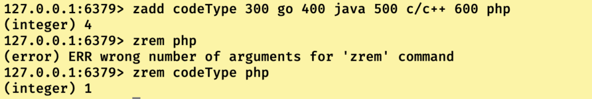
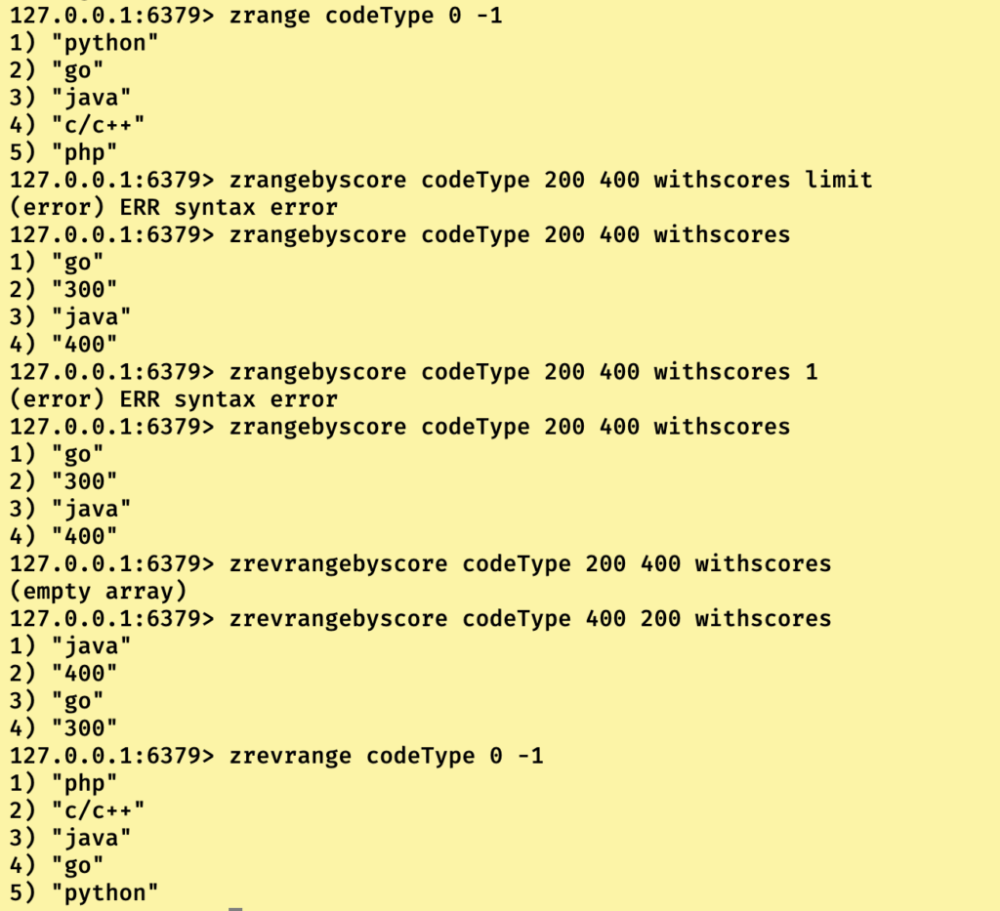
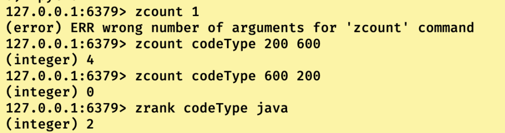
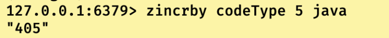

# Redis数据类型之有序集合类型

## 有序集合类型简介

有序集合和集合类型大致相同，**区别在于其数据结构组成和增加了”有序”性。**

即有序集合不仅优化了普通集合类型的hashvalue为空的哈希表，让其hashValue为score值后使其拥有的排序的基础（记住是基础，单凭这个在存储上还是无序的），所以还结合使用了跳表，跳表中的节点为有序集合中的节点，通过其中的score字段从小到大进行排序。所以才能让有序集合有序。

简单来说就是在底层为每一个成员都关联了一个评分(Score)，这个评分(score)被用来按照从最低分到最高分的方式排序集合中的成员。**集合的成员是唯一的，但是评分可以重复（当评分相同的时候，按字段字符串来排序）。**

------

## 有序集合的常用指令

```
//将一个或者多个value-score对放入指定的有序集合key中
127.0.0.1:6379> zadd key score1 value1[score2 value2....]
//将一个或者多个value从指定有序集合中删除,当key存在时抛出异常。
127.0.0.1:6379> zrem key value1 [value2.....]
```



```
//查看有序集合中的startIndex到endIndex之间的元素，默认按socre从小到大排序，range的中的startIndex和enxIndex使用和之前的一样。如果加上withscore那么会把对应的score一并显示。
127.0.0.1:6379> zrange key startIndex endIndex [withscores]
//查看有序集合中的startIndex到endIndex之间的元素，默认按socre从大到小排序，range的中的startIndex和enxIndex使用和之前的一样。如果加上withscore那么会把对应的score一并显示。
127.0.0.1:6379> zrevrange key startIndex endIndex
//查看有序集合中score从min到max之间的的元素，并按score从小到大排序。当min > max时，返回空数组
127.0.0.1:6379> zrangebyscore key min max [withscores]
//查看有序集合中score从max到mix之间的的元素，并按score从大到小排序。当min > max时，返回空数组
127.0.0.1:6379> zrangebyscore key max min [withscores]
```



------

```
//查看有序集合中score从min到max之间的元素有多少个，正常返回个数，当min大于max时返回0，当key不存在时报错。
127.0.0.1:6379> zcount key min max
//返回指定的value在有序集合中的排名，从0开始
127.0.0.1:6379> zrank key value
```



------

```
//对当前有序集合中的指定字段的score值进行增量操作
127.0.0.1:6379> zincrby key increment value 
```



我们可以使用这个指令完成文章访问量的排行榜！！！