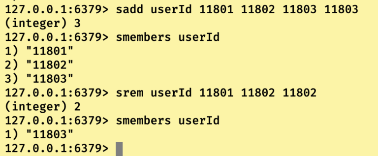
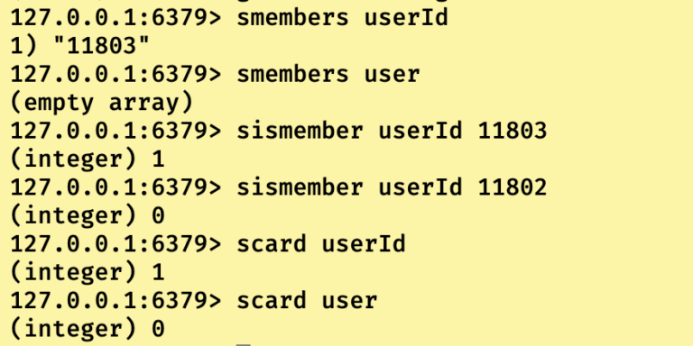
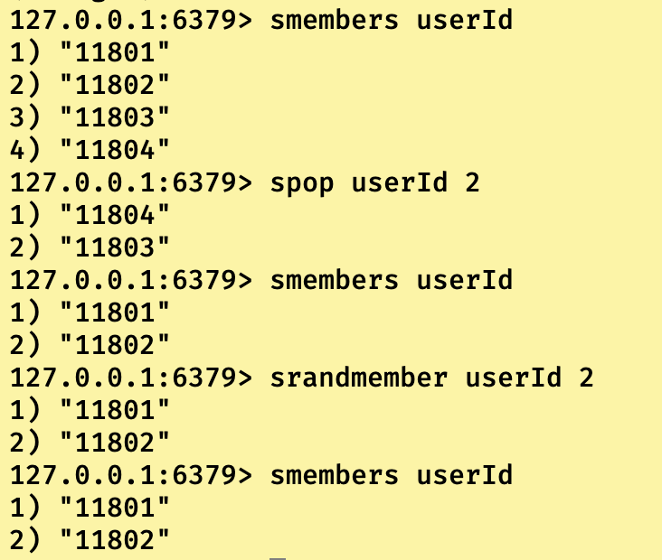

# Redis数据类型之集合类型

## 集合类型简介

即value是set类型的数据，set大部分和list很像，**Redis的set类型也是string类型节点组成的无序集合，底层是有value为空的hash表组成的**，所以添加，删除，查找的时间负责度都是O(1)。最大的区别有两点：

1）**在于list类型是允许数据重复的，但是set类型是不允许数据重复的。**

2）**set专门提供了一个API，用以查询指定元素在set中存不存在。**

当我们的业务着重于不重复的数据的时候，即可考虑redis的set类型。

------

## 集合类型常用指令

```
//往集合key中添加一个或者多个元素，如果元素重复则不进行添加处理。相同的当key不存在时，创建key。
127.0.0.1:6379> sadd key value[value....]
//删除集合key中的一个或者多个指定元素。如果元素重复或者不存在则不进行删除处理,如果key不存在则报错。
127.0.0.1:6379> srem key value[value....]
```



------

```
//获取集合key中元素的个数,如果key存在返回元素个数(integer) 个数,反之(integer)0。
127.0.0.1:6379> scard key
//获取集合key中的全部元素，如果key不存在则返回空集合.
127.0.0.1:6379> smembers key
//判断集合key中是否包含指定元素，如果包含返回(integer) 1,反之(integer)0。
127.0.0.1:6379> sismembers key value
```



------

```
//随机从集合中取出并删除指定个数元素，如果key不存在，返回nil。当指定个数大于集合个数的时候，全部取出
127.0.0.1:6379> spop key [count]
//随机从集合中取出，但是不删除指定个数元素。当指定个数大于集合个数的时候，全部取出
128.0.0.1:6379> srandmember key [count]
```



------

```
//把集合A中的一个值移动到集合B中
127.0.0.1:6379> smove sourceKey destinationKey value
//返回两个集合进行交集的结果(即k1与k2共有的元素集合)
127.0.0.1:6379> sinter key1 key2
//返回两个集合进行并集的结果(即k1和k2的全部元素集合)
127.0.0.1:6379> sunion key1 key2
//返回两个集合进行差集的结果(排除k1中的k2元素，只保留k1中独有的元素)
128.0.0.1:6379> sdiff key1 key2
127.0.0.1:6379> smembers userId
1) "11801"
2) "11802"
3) "11803"
4) "11804"
127.0.0.1:6379> smembers teacherId
1) "11801"
2) "11802"
3) "11809"
4) "11810"
127.0.0.1:6379> smove userId teacherId 11804
(integer) 1
127.0.0.1:6379> smembers teacherId
1) "11801"
2) "11802"
3) "11804"
4) "11809"
5) "11810"
127.0.0.1:6379> smembers userId
1) "11801"
2) "11802"
3) "11803"
127.0.0.1:6379> sinter userId teacherId
1) "11801"
2) "11802"
127.0.0.1:6379> sunion userId teacherId
1) "11801"
2) "11802"
3) "11803"
4) "11804"
5) "11809"
6) "11810"
127.0.0.1:6379> sdiff userId teacherId
1) "11803"
127.0.0.1:6379> sdiff teacherId userId
1) "11804"
2) "11809"
3) "11810"
```