redis主从复制解决的重心在于分担redis服务器之间的读写请求压力以及增强容灾能力。但是主从结构也导致始终只有一个主服务器负责写请求的处理，这样会有什么问题呢？

问题一：我们知道redis数据存储是存放在内存中的，所以一个redis服务端所能存储的数据上限和其所在机器的内存紧密相关，那么一旦当我们主服务器内存不够的时候，我们该怎么办？

问题二：在高并发场景下，同时大量的写请求可能会让redis主服务器宕机。我们该怎么办？

上述问题我们都可以使用搭建Redis集群的方式来解决。

------

## Redis集群中的中心化集群和无中心化集群

### 中心化集群

**中心化：像是领导开会，一切全凭领导这个中心在会议上指示和安排。**

在Redis3.0之前，我们搭建Redis集群就是采用中心化的方式，以一个代理服务器作为集群中心对外提供访问接口。由这个代理服务器来接收和判断请求是属于集群中那个Redis服务器来完成的并转发给这个Redis服务器。

这种方式的缺陷：

1. 消耗服务器数量多，为了保证服务的稳定性，代理服务器和诸多负责不同业务的Redis服务器都需要一个从服务器进行备用。
2. 中心化设定下，一旦代理服务器主从均宕机，集群即刻失效。

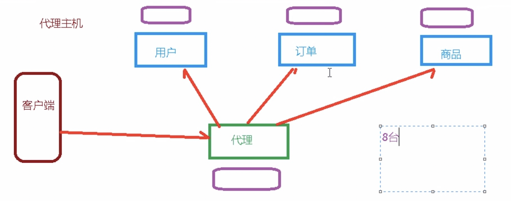

------

### 无中心化集群

**无中心化：像是小组在组长不在的情况下，进行的讨论会议，谁都可以权利发言。**

在Redis3.0及之后，Redis就采用无中心化的方式搭建集群。每一个集群成员都可以是对外界开放的访问接口。不管是哪个业务Redis服务器接收到了请求，都会去判断是不是自己负责的业务请求，不是就转发给集群中的另一个成员，只到转发到能处理这个请求的Redis服务器处。

优势：

1. 相对比中心化集群减少了服务器的开销
2. 每一个Redis服务器都可以作为访问入口的时候，哪怕一些Redis服务器主从均宕机了，也可以使用完成一部分的业务逻辑请求的。

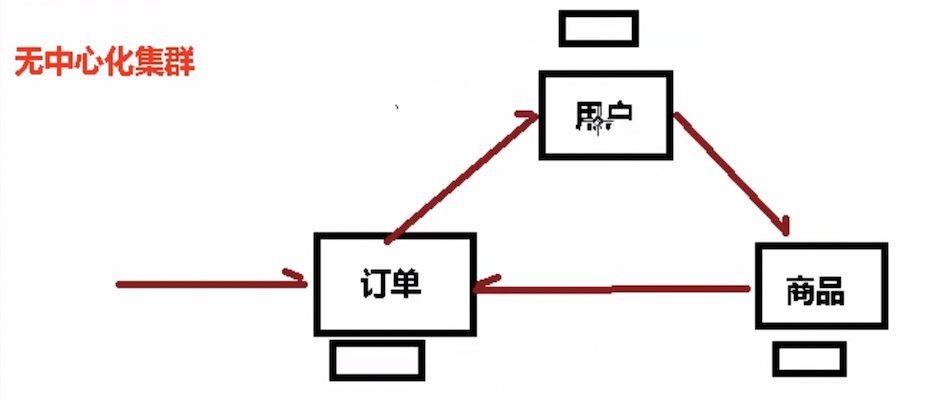

------

------

## Redis集群的特性

**Redis集群实现了对Redis的水平扩容：即启动N个Redis节点，将整个数据库分布存储在N个Redis节点中，每个节点平均存储总数据的1/N。**

那么redis是怎么做到让集群中的每一个节点存储总数据的1/N的呢？

------

Redis采用的实现思路和哈希表类似，即把多个Redis节点内存连起来，当作一个完整的数组，数组中每个下标中节点被称为***Slot(槽位)。***

当我们往集群中写入一个key的时候，就会根据CRC16算法计算出这个key对应的槽位位置，并把key-value放进去。

注意：

1. 槽位本质上是一段内存，所以根据key-value占用情况来说，槽位内可以存在一个key-value也可以存在多个key-value。
2. 由于逻辑数组是有多个Redis实例的内存组成，所以**不支持mset或者多指令事务**等多key同时写入操作（可能每一个key计算出来的槽位都是不同Redis实例的，单次指令无法切换多个Redis实例）

**一般在集群建立完毕之后，会显示出当前集群的总槽位个数。**

------

Redis集群中**一个业务的主从服务器设置比例以及他们之间的切换**是由集群自动完成的，我们只需要提供一定数量的Redis服务器和设置比例策略给集群指令即可完成集群搭建，运行起来之后并不需要我们人为的干涉。

这样我们在客户端层面来看，相当于无感切换。因为不需要改变任何配置信息。

------

------

## Redis无中心化集群搭建

本次搭建集群参与Redis实例分别为6371，6372，6373，6374，6375，6376。其中按照二元组{主服务器，从服务器}来分类，比如{6371,6374}那么6374就是6370的从服务器，6370就是6374的主服务器。

### 配置文件修改

对于每个实例我们都必须要在其conf配置文件下配置如下字段：(内容根据实际环境修改)

```
//添加允许外界访问的指定IP集合
bind 121.199.79.104

//当前redis实例占用端口号
port 6370

//开启redis对外连接防护
protected-mode yes

//配置密码（建议集群中密码均一致）
requirepass "********"

//开启redis守护线程模式
daemonize yes

//指定pid文件目录地址
pidfile "/var/run/redis6370.pid"

//指定log文件目录地址
logfile ""

//开启集群模式
cluster-enabled yes

//设置节点配置文件名称此文件由集群成功开启后自动生成
cluster-config-file nodes-6370.conf

//设置节点配置文件生成路径,这个rdb以及aof文件路径相同
dir ./

//设置节点失联时间，超过该时间(毫秒)，集群自动进行主从切换，在业务场景不能容忍一刻业务失败的情况下，数值尽可能小
cluster-node-timeout 15000

//当某个业务节点的主从均宕机之后，集群是否继续运行来保证一部分业务逻辑的正常进行，yes为集群也宕机，no为集群继续提供部分服务。
cluster-require-full-converage yes


上述为开启集群的基本配置，像持久化等配置可根据业务场景开启(哨兵和主从均不需要配置)，建议开启上rdb持久化配置
```

------

### redis-cluster搭建指令

在使用搭建指令之前，有一个非常非常重要的设置，那就是如果我们开启了防火墙的话，那么就要开放集群总线端口！！！

那么何为集群总线端口？

**集群总线端口：即集群内部每个节点进行数据信息交流的开放端口，在集群内部可不用使用我们开放的网络端口进行通信。**

**所以想要集群搭建成功，就要开放集群中每个节点的集群总线端口，一般的集群总线端口为1+节点端口。比如6371对应16371**。

```
//根据提供的redis节点集合以及主从比例策略来自动创建集群
redis-cli --cluster create --cluster-replicas 主从比例 -a 统一密码 集群中Redis节点真实"IP:PORT"集合
```

主从比例解析：数值可以为1,2,3…..。当数值为1的时候，也就是一个主服务器下配置一个从服务器，当数值为2的时候，也就是一个主服务器下配置两个从服务器。

**注意：计算好你的节点集群个数之后再合理配置主从比例策略**

------

### linux中连接redis集群的方式以及操作集群的指令介绍

```
//添加一个-c表示连接集群(随便选择集群的一个连接节点即可),连接之后就可以对集群完成set等操作
redis-cli -c -h 121.199.79.104 -a 6379 -p 密码
//查看当前集群的节点的信息，可以看到每个redis节点负责的slots范围以及宕机之后从服务器替换情况
cluster nodes

//集群环境下一定非要使用mset等类似指令设置多个key-value,即使用CRCKEY来作为计算的KEY。把多个key-value计算到一个slot中。
mset key1{CRCKEY} value1 key2{CRCKEY} value2

//通过提供的slot下标来查询此slot中有多少个key-value
cluster countkeysinslot slotIndex

//返回指定slot下标中指定个数个key-value信息，当slot中个数小于returncount时，显示全部。
cluster getkeysinsolt slotIndex returncount

//集群(cluster)  
CLUSTER INFO 打印集群的信息  
CLUSTER NODES 列出集群当前已知的所有节点（node），以及这些节点的相关信息。   
  
//节点(node)  
CLUSTER MEET <ip> <port> 将 ip 和 port 所指定的节点添加到集群当中，让它成为集群的一份子。  
CLUSTER FORGET <node_id> 从集群中移除 node_id 指定的节点。  
CLUSTER REPLICATE <node_id> 将当前节点设置为 node_id 指定的节点的从节点。  
CLUSTER SAVECONFIG 将节点的配置文件保存到硬盘里面。   
  
//槽(slot)  
CLUSTER ADDSLOTS <slot> [slot ...] 将一个或多个槽（slot）指派（assign）给当前节点。  
CLUSTER DELSLOTS <slot> [slot ...] 移除一个或多个槽对当前节点的指派。  
CLUSTER FLUSHSLOTS 移除指派给当前节点的所有槽，让当前节点变成一个没有指派任何槽的节点。 
CLUSTER SETSLOT <slot> NODE <node_id> 将槽 slot 指派给 node_id 指定的节点，如果槽已经指派给另一个节点，那么先让另一个节点删除该槽>，然后再进行指派。  
CLUSTER SETSLOT <slot> MIGRATING <node_id> 将本节点的槽 slot 迁移到 node_id 指定的节点中。  
CLUSTER SETSLOT <slot> IMPORTING <node_id> 从 node_id 指定的节点中导入槽 slot 到本节点。  
CLUSTER SETSLOT <slot> STABLE 取消对槽 slot 的导入（import）或者迁移（migrate）。   
  
//键 (key)  
CLUSTER KEYSLOT <key> 计算键 key 应该被放置在哪个槽上。  
CLUSTER COUNTKEYSINSLOT <slot> 返回槽 slot 目前包含的键值对数量。  
CLUSTER GETKEYSINSLOT <slot> <count> 返回 count 个 slot 槽中的键。 
```

------

### 实例演示

redis6371~6376.conf文件展示：

- 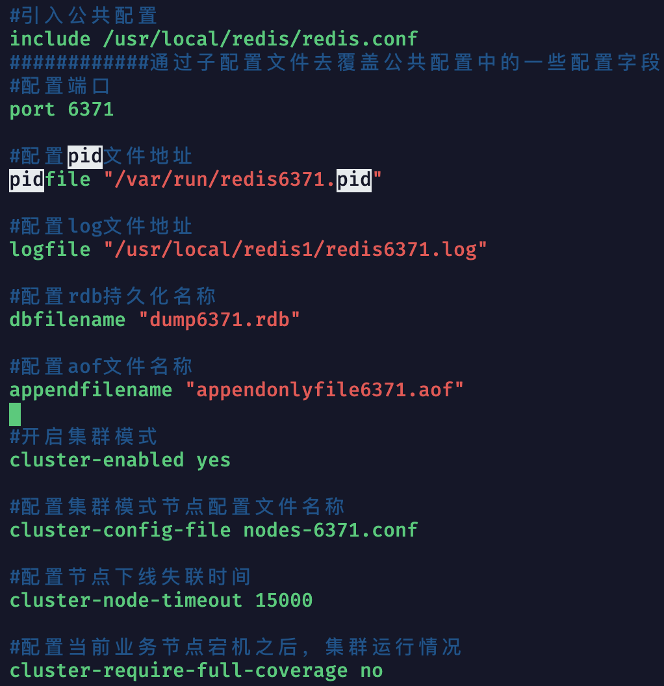
- 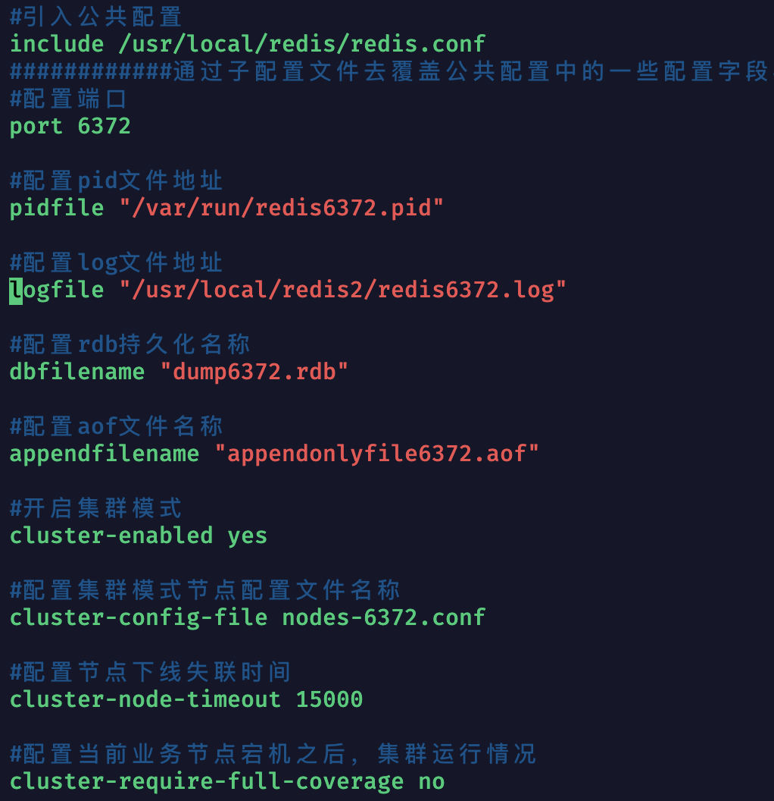

- 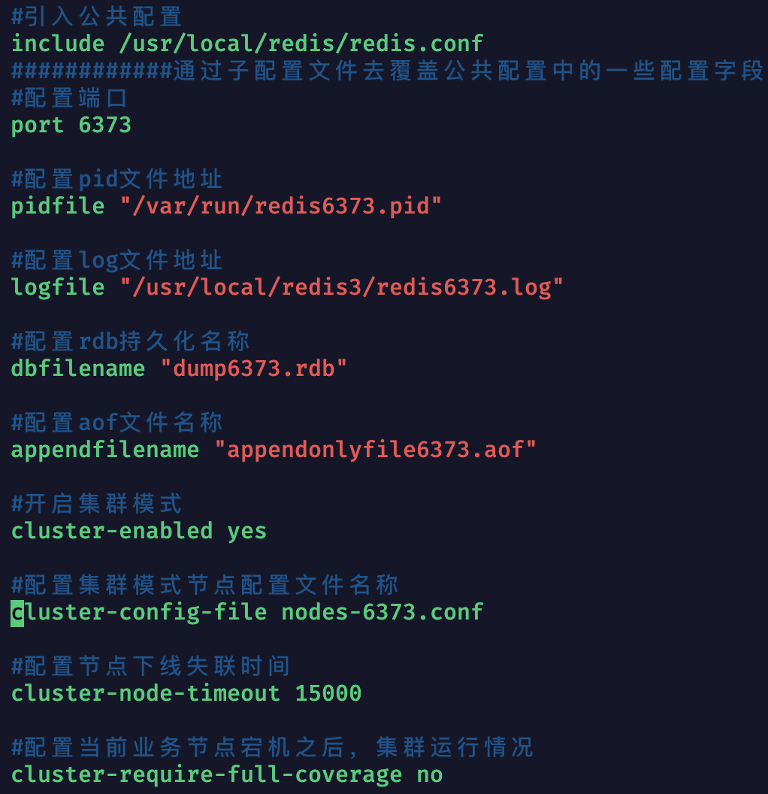
- 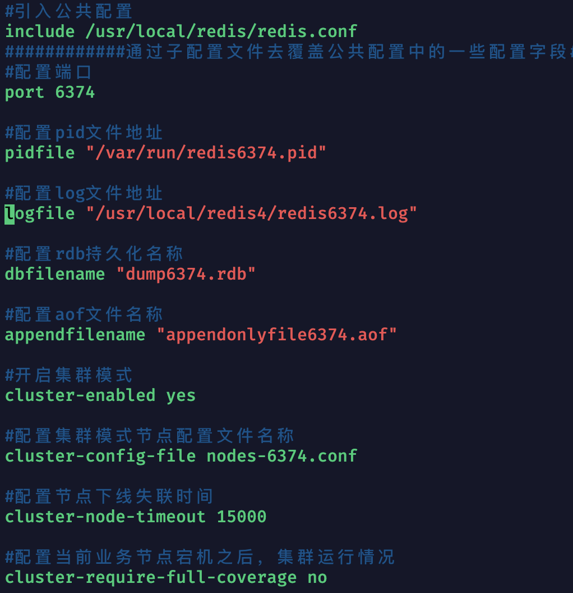

- 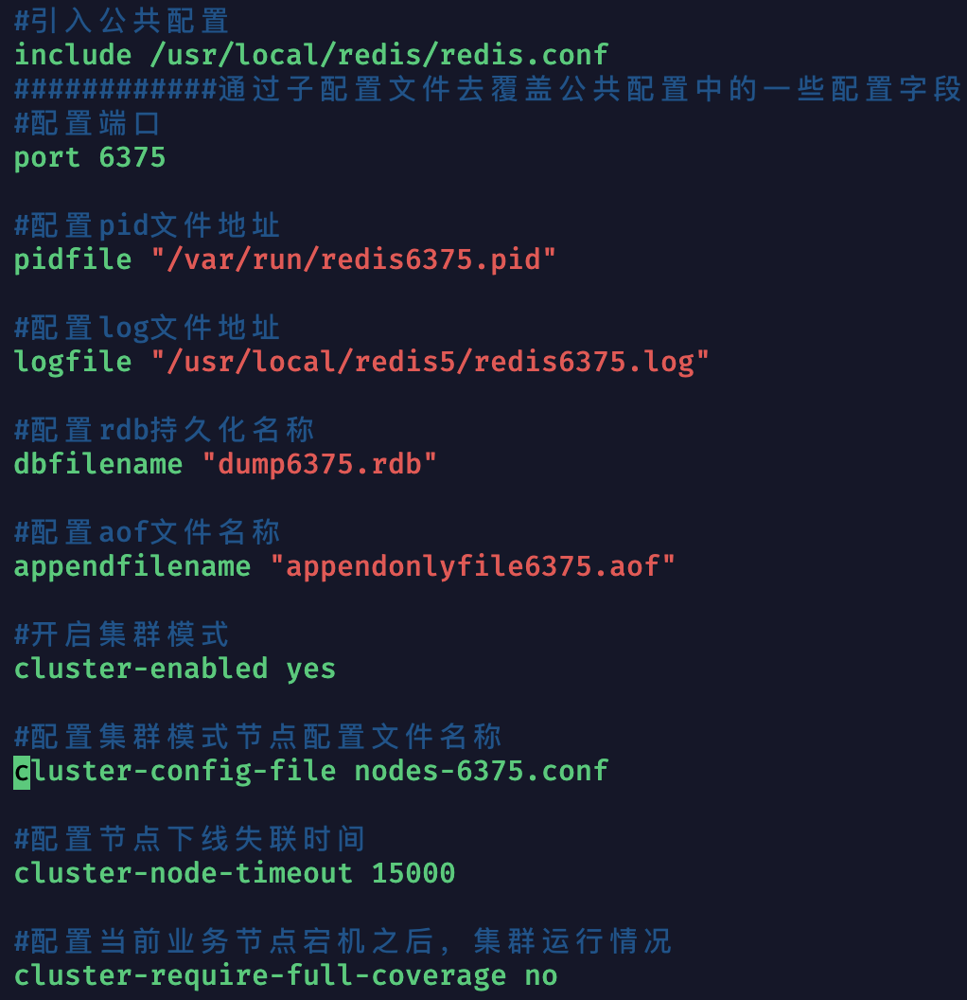
- 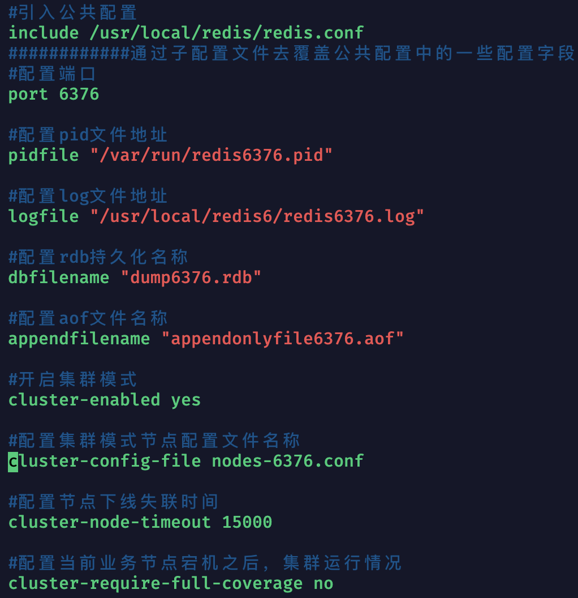

1） 把这些Redis服务器都启动起来：

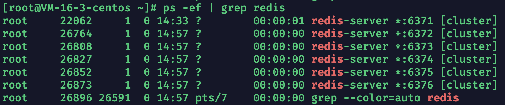

2）使用集群指令建立集群**（注意：防火墙开端口，云服务器配置安全组规则,不仅仅要放6371～6376还有16371～16376）**

```
//这么长指令如果在cmd中编写，容易出错，先找个编辑器写出来
redis-cli --cluster create --cluster-replicas 1 -a password 121.192.79.104:6371 121.192.79.104:6372 121.192.79.104:6373 121.192.79.104:6374 121.192.79.104:6375 121.192.79.104:6376
```

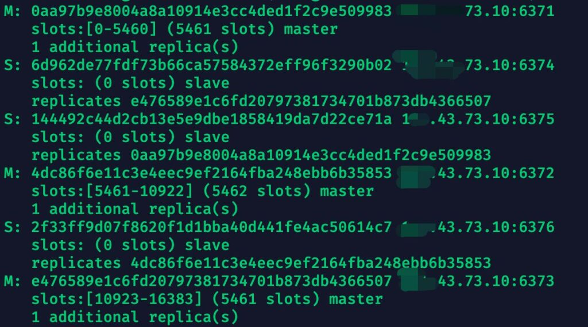


**我们可以看到主从关系信息，总slot数量为0～16383，总数为16385**

3）连接集群后查看集群信息

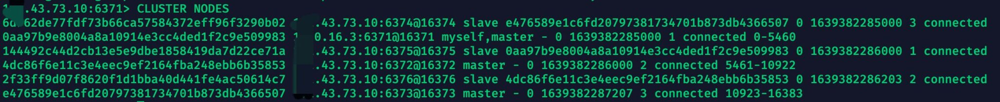

**通过查看集群信息，我们可以清楚看到主服务器和从服务器一一对应的关系，比如{6371,6375},{6372,6376},{6373,6374}**,**以及每个主从服务器负责的slot区域。**

4）往集群中写入信息，查看其slot位置

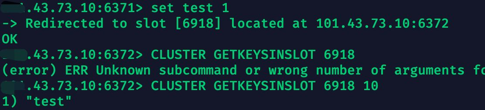

**我们可以看到，由于计算出来的key所处slot超过6371的范围，所以集群切换到6372进行存储。**

5）断开6371主服务器，查看集群怎么处理(直接对连接的6371主服务器shutdown)

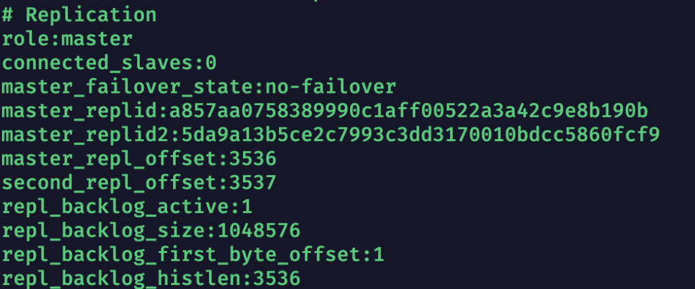

**可以看到其变成主服务器了**

6）断开6371主服务器和其从服务器6375，往别的Redis服务器负责slot中写入，看能不能成功

5中还没有恢复6371，我们连接上6375在shutdown看看集群变化。

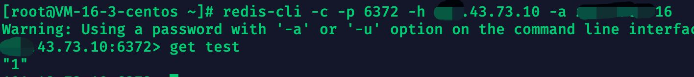

**其他slot业务不受影响，我们再次重新上线6371和6375即可，恢复集群**


------

------

## Jedis使用集群实例

### JedisCluster关键类

```
public JedisCluster(Set<HostAndPort> jedisClusterNode, int connectionTimeout, int soTimeout, int maxAttempts, String password, GenericObjectPoolConfig poolConfig) {
        super(jedisClusterNode, connectionTimeout, soTimeout, maxAttempts, password, poolConfig);
}
```

参数解析：

1. ***set<HostAndPort> jedisClusterNode***：即集群中全部节点的”IP:PORT”集合。
2. ***int connectionTimeout\***：连接超时时间。
3. ***int soTimeout\***：读取数据超时时间。
4. ***int maxAttempts***：在抛出jedisConnectionException异常时，重新尝试的次数。
5. ***String password***：集群中节点密码(统一)。
6. ***GenericObjectPoolConfig poolConfig\***：jedis连接池配置，JedisCluster本身也具有连接池功效，但是是在操作指令中实现run来实现，最后也帮我们回收了jedis连接。

------

Maven坐标：

```
<dependency>
  <groupId>redis.clients</groupId>
  <artifactId>jedis</artifactId>
  <version>2.9.0</version>
</dependency>
```

封住配置JedisClient类：

```
public class RedisClient {
    private static JedisCluster jedisCluster;
    static {
        JedisPoolConfig jedisPoolConfig = new JedisPoolConfig();
        jedisPoolConfig.setMaxTotal(128);
        jedisPoolConfig.setMaxWaitMillis(10000);
        jedisPoolConfig.setMinIdle(8);
        jedisPoolConfig.setMaxIdle(20);
        jedisPoolConfig.setTestOnReturn(true);
        jedisPoolConfig.setTestOnBorrow(true);
        Set<HostAndPort> set = new HashSet<>();
        set.add(new HostAndPort("121.192.79.104",6371));
        set.add(new HostAndPort("121.192.79.104",6372));
        set.add(new HostAndPort("121.192.79.104",6373));
        set.add(new HostAndPort("121.192.79.104",6374));
        set.add(new HostAndPort("121.192.79.104",6375));
        set.add(new HostAndPort("121.192.79.104",6376));
        String password = "*******";
        jedisCluster = new JedisCluster(set,10000,1000,5,password,jedisPoolConfig);
    }

    public static JedisCluster getJedisCluster(){
        return jedisCluster;
    }
}
```

测试方法：

```
@Test
public void testjedisCluster(){
        JedisCluster jedisCluster = RedisClient.getJedisCluster();
        jedisCluster.set("JedisTest","true");
        System.out.println(jedisCluster.get("JedisTest"));
        System.out.println(jedisCluster.getClusterNodes());
    }
}
```

结果：

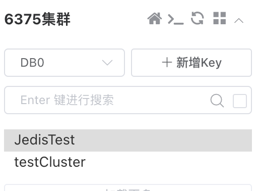

**成功写入！**

------

------

## 哨兵配合主从复制结构对比集群结构

**主从哨兵是全量存储，集群是分布式存储。**

我们来说说开头的两问题：

问题一：我们知道redis数据存储是存放在内存中的，所以一个redis服务端所能存储的数据上限和其所在机器的内存紧密相关，那么一旦当我们主服务器内存不够的时候，我们该怎么办？

Redis集群采用slot的方式，让每个机器负责不同业务的数据存储，在逻辑上可以看成一个巨大的Redis内存。

------

问题二：在高并发场景下，同时大量的写请求可能会让redis主服务器宕机。我们该怎么办？

在Redis集群中，哪怕某个业务主服务器被高并发宕机之后，也会有多个相同业务从服务器顶上。而且由于集群的无中心化，大量的并发请求并不会只从一个开放节点进入。