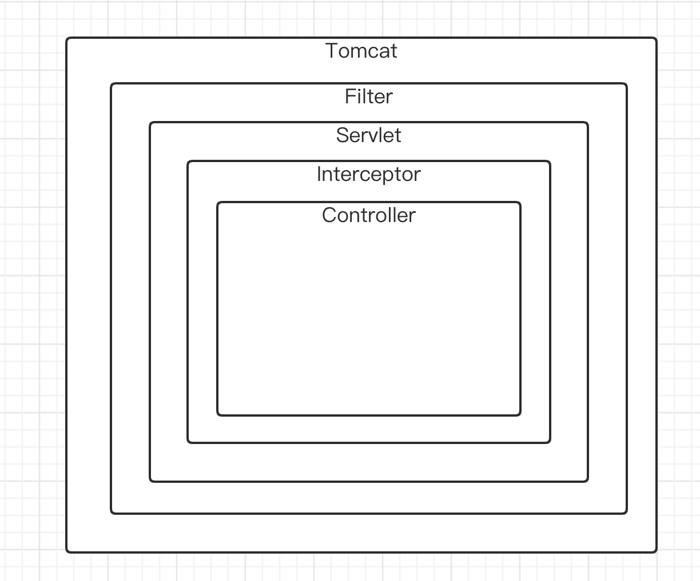

# Spring Security安全框架

> Spring Security是Spring家族中的一个安全管理框架。一般中大型Web项目均采用SpringSercurity来做安全框架。
>
> 而Web应用需要进行的就是`认证`和`授权`，这要是SpringSercurity的核心功能。
>
> **认证**：验证当前访问系统的用户是否合法，并且能定位到是哪一个用户
>
> **授权**：经过认证后判断当前用户是否有权限进行某个操作

### 快速启动

##### 第一步：maven坐标

```xml
        <dependency>
            <groupId>org.springframework.boot</groupId>
            <artifactId>spring-boot-starter-security</artifactId>
        </dependency>
```


##### 第二步：启动boot项目，获取登录密码

```properties
2023-01-01 15:22:04.615  INFO 1501 --- [           main] .s.s.UserDetailsServiceAutoConfiguration : 

Using generated security password: 36476d15-369f-44f0-944c-6c763a592756
```

现在此项目的所有请求都会被Spring Security拦截，并会跳转到security自带的login页面中，进行登录，完成登录之后即可正常访问所有接口。


##### 第三步：完成登录，正常进行接口跳转


用户名称为`user`,密码为启动项目是获取的字符串


### 原理解析

##### 前置知识点

首先我们明确一点，那就是Spring Security本身属于高度封装的Filter，所以其作用范围也是遵循Filter的范围。



可以来看看默认仅仅导入Spring Security的jar包的时候，按照顺序启用的Filter列表为下图所示：


全部的Filter的作用可以自行在学习完此章节之后去查阅一下，这些只对重点Filter进行解析。

此时运用到的重点Filter分别为`UserPasswordAuthenticationFilter`、`ExceptionTranslationFilter`、`FilterSecurityInterceptor`。

+ **UserPasswordAuthenticationFilter**：负责处理登录页面点击登录之后的请求
+ **ExceptionTranslationFilter**：处理过滤器链(上图中filters列表)中抛出的任何AccessDeniedException和AuthenticationExeption。
+ **FilterSecurityInterceptor**：负责权限校验的过滤器


##### 过滤流程解析


`UserPasswordAuthenticationFilter`作为Spring Security的请求入口。

图中也提供了实现类的接口，我们需要改变此流程中方法的实现，从而实现自定义认证过程的话，就可以去实现这些接口后完成配置即可。


##### 模拟真实环境认证

在真实环境中，我们修改的主要有以下几点：

**第一点：登录的校验应该是从数据库中获取用户信息，然后将此用户信息作为校验的根本。**

为了完成这一步，就需要去完成**自定义的实现的UserDetailService接口实现类**以及**可以被Spring Security存储的用户实体类(重写UserDetails接口)**

```java
import lombok.AllArgsConstructor;
import lombok.Data;
import lombok.NoArgsConstructor;
import org.springframework.security.core.GrantedAuthority;
import org.springframework.security.core.userdetails.UserDetails;
import java.util.Collection;

/**
 * @ClassName: LoginUser
 * @Description: TODO
 * @Author: codedan
 * @Date: 2022/12/13 17:05
 * @Version: 1.0.0
 **/
@Data
@AllArgsConstructor
@NoArgsConstructor
public class LoginUser implements UserDetails {

    /**
     * 自定义的用户类，里面必须包含三个字段(多的不作限制)，用户名，密码，角色列表。
     */
    private User user;

    /**
     * 暂时还没有权限，当需要进行鉴权操作的时候，需要这里将数据库的查出来的角色列表进行GrantedAuthority转化
     * @return
     */
    @Override
    public Collection<? extends GrantedAuthority> getAuthorities() {
        return null;
    }

    /**
     * 获取当前用户的密码
     * @return
     */
    @Override
    public String getPassword() {
        return user.getPassword();
    }

    /**
     * 获取当前用户的用户名
     * @return
     */
    @Override
    public String getUsername() {
        return user.getUserName();
    }

    /**
     * 是否过期，改为true
     * @return
     */
    @Override
    public boolean isAccountNonExpired() {
        return true;
    }

    @Override
    public boolean isAccountNonLocked() {
        return true;
    }

    /**
     * 是否超时
     */
    @Override
    public boolean isCredentialsNonExpired() {
        return true;
    }

    /**
     * 是否可用
     * @return
     */
    @Override
    public boolean isEnabled() {
        return true;
    }
}
```


```java
import cn.codedan.security.camelmergersecurity.model.entity.LoginUser;
import cn.codedan.security.camelmergersecurity.model.entity.User;
import org.springframework.beans.factory.annotation.Autowired;
import org.springframework.security.core.userdetails.UserDetails;
import org.springframework.security.core.userdetails.UserDetailsService;
import org.springframework.security.core.userdetails.UsernameNotFoundException;
import org.springframework.security.crypto.password.PasswordEncoder;
import org.springframework.stereotype.Service;
import java.util.Objects;

/**
 * @ClassName: UserDetailsServiceImpl
 * @Description: TODO
 * @Author: codedan
 * @Date: 2022/12/13 17:02
 * @Version: 1.0.0
 **/
@Service
public class UserDetailsServiceImpl implements UserDetailsService {

    @Autowired
    private PasswordEncoder passwordEncoder;

    @Override
    public UserDetails loadUserByUsername(String s) throws UsernameNotFoundException {
        // 查询用户信息(模拟数据库采用假数据)
        User user = new User();
        user.setId(1l);
        user.setUserName("zhangldc");
        user.setPassword(passwordEncoder.encode("12345"));
        if(Objects.isNull(user) ){
            throw new RuntimeException("用户名密码错误");
        }
        return new LoginUser(user);
    }
}
```

到这里第一步看似结束了，不过有一个细节必须注意一下，那就是Spring Security认证的时候密码这里有一个坑，正常不做设置的情况下其进行的认证都是有密码格式要求的，这点肯定不符合我们正常使用习惯，所以我们得额外给Security设置一个密码加密以及符合我们要求的密码认证方式。

完成这一步得继承`WebSecurityConfigurerAdapter`类，去实现一个Spring Security的配置类，这里我起名为`SpringSecurityConfig`类。并在其内部编写一个创建`BCryptPasswordEncoder对象`的方法，通过@Bean交给Spring管理。

```java
import org.springframework.context.annotation.Bean;
import org.springframework.context.annotation.Configuration;
import org.springframework.security.config.annotation.web.configuration.WebSecurityConfigurerAdapter;
import org.springframework.security.crypto.bcrypt.BCryptPasswordEncoder;
import org.springframework.security.crypto.password.PasswordEncoder;

/**
 * @ClassName: SecurityConfig
 * @Description: TODO
 * @Author: codedan
 * @Date: 2022/12/13 15:03
 * @Version: 1.0.0
 **/
@Configuration
public class SecurityConfig extends WebSecurityConfigurerAdapter {

    @Bean
    public PasswordEncoder passwordEncoder(){
        return new BCryptPasswordEncoder();
    }
}

```

这里第一步才正式结束了，如果就停在这一步，那么只是完成了正常逻辑的用户密码认证流程，但是一般我们使用SpringSecurity的目的在于实现jwt认证，即能够返回一个用户消息token作为单点登录的基础。

所以我们还需要进行下一步的改造。即第二部操作-----通过`UserPasswordAuthenticationFilter`改变Security认证开始的入口中流程。


**第二步：修改Security入口处处理流程**

当前改造思路是通过Controller接口接受到请求中的用户账号与密码，然后调用自定义的Service中的业务处理方法，在此方法中调用`AuthenticationManager`的`authenticate`方法进行之后的流程认证，完成之后再当前service业务处理方法中进行后续操作即可。

(Controller层接口以及统一返回体这个就不在这里展示了，这个大家一般都有备份公司或者自己写的统一返回体吧，都一样的)

不过在开始编写自定义认证Service之前，需要做一个前置任务，那就是把`AuthenticationManager`提取出来，交给Spring管理，不然我们使用不了这个玩意，实现上和`BCryptPasswordEncoder`类似，也是在`SecurityConfig`里面，代码如下所示：

```java
import org.springframework.beans.factory.annotation.Autowired;
import org.springframework.context.annotation.Bean;
import org.springframework.context.annotation.Configuration;
import org.springframework.security.authentication.AuthenticationManager;
import org.springframework.security.config.annotation.web.configuration.WebSecurityConfigurerAdapter;
import org.springframework.security.crypto.bcrypt.BCryptPasswordEncoder;
import org.springframework.security.crypto.password.PasswordEncoder;

/**
 * @ClassName: SecurityConfig
 * @Description: TODO
 * @Author: codedan
 * @Date: 2022/12/13 15:03
 * @Version: 1.0.0
 **/
@Configuration
public class SecurityConfig extends WebSecurityConfigurerAdapter {

    @Bean
    public PasswordEncoder passwordEncoder(){
        return new BCryptPasswordEncoder();
    }

    @Bean
    @Override
    public AuthenticationManager authenticationManagerBean() throws Exception {
        return super.authenticationManagerBean();
    }
}
```

这样就可以在自定义的Service中使用`authenticationManager`对象了。

```java
/**
 * @ClassName: LoginService
 * @Description: TODO
 * @Author: codedan
 * @Date: 2022/12/13 17:30
 * @Version: 1.0.0
 **/
public interface LoginService {

    ResponseReusltDTO login(User user);

}
```

```java
/**
 * @ClassName: LoginServiceImpl
 * @Description: TODO
 * @Author: codedan 
 * @Date: 2022/12/13 17:30
 * @Version: 1.0.0
 **/
@Service
public class LoginServiceImpl implements LoginService {

    @Autowired
    private AuthenticationManager authenticationManager;

    @Autowired
    private RedisCache cache;

    @Override
    public ResponseReusltDTO login(User user) {
        UsernamePasswordAuthenticationToken AuthenticationToken = new UsernamePasswordAuthenticationToken(user.getUserName(), user.getPassword());
        Authentication authenticate = authenticationManager.authenticate(AuthenticationToken);
        if(authenticate == null){
            throw new RuntimeException("登陆失败");
        }
        LoginUser principal = (LoginUser) authenticate.getPrincipal();
        User loginUser = principal.getUser();
        String token = JwtUtils.getJwtToken(loginUser.getId().toString());
        HashMap<String, String> map = new HashMap<>();
        map.put("token",token);
        cache.setCacheObject("login:"+loginUser.getId(),loginUser);
        return new ResponseReusltDTO(200,"登陆成功",map);
    }
}
```

到这里一套完整的整合Security登录流程就完成了，但是由于Security默认拦截了所有的接口，所以我们必须在`SecurityConfig`配置类中将登录接口放心，让用户顺利获取到token。

```java
import org.springframework.beans.factory.annotation.Autowired;
import org.springframework.context.annotation.Bean;
import org.springframework.context.annotation.Configuration;
import org.springframework.security.authentication.AuthenticationManager;
import org.springframework.security.config.annotation.web.builders.HttpSecurity;
import org.springframework.security.config.annotation.web.configuration.WebSecurityConfigurerAdapter;
import org.springframework.security.config.http.SessionCreationPolicy;
import org.springframework.security.crypto.bcrypt.BCryptPasswordEncoder;
import org.springframework.security.crypto.password.PasswordEncoder;
import org.springframework.security.web.authentication.UsernamePasswordAuthenticationFilter;

/**
 * @ClassName: SecurityConfig
 * @Description: TODO
 * @Author: codedan
 * @Date: 2022/12/13 15:03
 * @Version: 1.0.0
 **/
@Configuration
public class SecurityConfig extends WebSecurityConfigurerAdapter {

    @Bean
    public PasswordEncoder passwordEncoder(){
        return new BCryptPasswordEncoder();
    }

    @Bean
    @Override
    public AuthenticationManager authenticationManagerBean() throws Exception {
        return super.authenticationManagerBean();
    }

        @Override
    protected void configure(HttpSecurity http) throws Exception {
        http
                .csrf().disable()  //关闭csrf
                .sessionManagement().sessionCreationPolicy(SessionCreationPolicy.STATELESS)   //不从session中获取authentication对象
                .and()
                .authorizeRequests()   //设置拦截和方向请求
                .antMatchers("/user/login").anonymous() //放行请求，多个时使用,进行分隔
                .anyRequest().authenticated(); //拦截所有请求
    }
}

```

现在用户就可以访问到登录接口，正常获取到token了，但是Security访问接口时的认证原理是**判断当前SecurityContextHolder中是否存在符合的Authentication来判断用户是否完成认证的**，现在别的用户完成登录之后需要携带token访问别的接口，那么我们就可以从每次请求的token中获取到用户信息，并存放到SecurityContextHolder中，从而让我们可以正常访问其他接口。

为了完成这个目的，我们需要定义一个在Security的Filter执行之前的获取token并解析后将用户信息放入SecurityContextHolder中的Filter，代码如下所示                                       nm：

```java
import cn.codedan.security.camelmergersecurity.model.entity.User;
import cn.codedan.security.camelmergersecurity.util.JwtUtils;
import cn.codedan.security.camelmergersecurity.util.RedisCache;
import org.springframework.beans.factory.annotation.Autowired;
import org.springframework.security.authentication.UsernamePasswordAuthenticationToken;
import org.springframework.security.core.context.SecurityContextHolder;
import org.springframework.stereotype.Component;
import org.springframework.web.filter.OncePerRequestFilter;
import javax.servlet.FilterChain;
import javax.servlet.ServletException;
import javax.servlet.http.HttpServletRequest;
import javax.servlet.http.HttpServletResponse;
import java.io.IOException;
import java.util.Objects;

/**
 * @ClassName: JwtAuthenticationTokenFilter
 * @Description: TODO
 * @Author: codedan
 * @Date: 2022/12/13 18:42
 * @Version: 1.0.0
 **/
@Component
public class JwtAuthenticationTokenFilter extends OncePerRequestFilter {

    @Autowired
    private RedisCache redisCache;

    @Override
    protected void doFilterInternal(HttpServletRequest request, HttpServletResponse response, FilterChain filterChain)
            throws ServletException, IOException {
        String token = request.getHeader("token");
        if( token == null ){
            filterChain.doFilter(request,response);
            return;
        }
        String userid = JwtUtils.getMemberIdByJwtToken(token);
        String redisKey = "login:"+userid;
        User user = (User) redisCache.getCahcheObject(redisKey);
        if(Objects.isNull(user) ){
            throw new RuntimeException("用户未登陆");
        }
        UsernamePasswordAuthenticationToken usernamePasswordAuthenticationToken =
                new UsernamePasswordAuthenticationToken(user,null,null);
        SecurityContextHolder.getContext().setAuthentication(usernamePasswordAuthenticationToken);
        filterChain.doFilter(request,response);
    }
}
```

编写完Filter之后我们需要将其执行位置放置到Security all Filter之前，所以我们需要修改一下`SecurityConfig`这个配置类：

```java
import cn.codedan.security.camelmergersecurity.filter.JwtAuthenticationTokenFilter;
import org.springframework.beans.factory.annotation.Autowired;
import org.springframework.context.annotation.Bean;
import org.springframework.context.annotation.Configuration;
import org.springframework.security.authentication.AuthenticationManager;
import org.springframework.security.config.annotation.web.builders.HttpSecurity;
import org.springframework.security.config.annotation.web.configuration.WebSecurityConfigurerAdapter;
import org.springframework.security.config.http.SessionCreationPolicy;
import org.springframework.security.crypto.bcrypt.BCryptPasswordEncoder;
import org.springframework.security.crypto.password.PasswordEncoder;
import org.springframework.security.web.authentication.UsernamePasswordAuthenticationFilter;

@Configuration
public class SecurityConfig extends WebSecurityConfigurerAdapter {

    @Autowired
    private JwtAuthenticationTokenFilter jwtAuthenticationTokenFilter;

    @Bean
    public PasswordEncoder passwordEncoder(){
        return new BCryptPasswordEncoder();
    }

    @Bean
    @Override
    public AuthenticationManager authenticationManagerBean() throws Exception {
        return super.authenticationManagerBean();
    }

        @Override
    protected void configure(HttpSecurity http) throws Exception {
        http
                .csrf().disable()
                .sessionManagement().sessionCreationPolicy(SessionCreationPolicy.STATELESS)
                .and()
                .authorizeRequests()
                .antMatchers("/user/login").anonymous()
                .anyRequest().authenticated();
				// 这里将我们自定义的拦截器放到Security all filter之前
        http.addFilterBefore(jwtAuthenticationTokenFilter, UsernamePasswordAuthenticationFilter.class);
    }
}
```


##### 模拟真实环境鉴权

真实的鉴定权限，原理是将用户登录之后的权限消息也放入`authentication`对象中，这样在存入redis的对象内也会有一份权限消息，之后使用token访问的时候，就可以获取拥有权限内容的用户对象后，将其构建为Authentication对象，向后进行链式过滤器中的`FilterSercuirtyInterceptor`处理。

而对于Spring Security来说是使用`FilterSercuirtyInterceptor`进行权限的校验的，即从SecurityContextHolder中获取其中的Authentication对象，从其内部获取到权限内容。

以下全部是`注解`实现方式：

**第一步**：开启权限鉴定相关配置

```java
@Configuration
@EnableGlobalMethodSecurity(prePostEnabled = true)
public class SecurityConfig extends WebSecurityConfigurerAdapter
```


**第二步**：在Controller层提供的接口处使用@PreAuthorize("hasAuthority('authorName')")进行权限设定

```java
@RestController
@RequestMapping("/test")
public class TestController {

    @PostMapping("/hello")
    @PreAuthorize("hasAuthority('test')")
    private ResponseReusltDTO test(){
        return ResponseReusltDTO.ok();
    }
}
```

这里稍微提一下，除了hasAuthority()之外，还有hasAllAuthority(放入多个权限名称)，其次是hasRole和hasAllRole这两个方法，如果想要使用这两个方法，那么必须在权限名称中加入`ROLE_`作为前缀。


**第三步**：封住权限信息，步骤就是先把权限在登录的时候取出来，然后等token---id---redis---user，最后把user封装到authentication

这里先改造一下LoginUser这个对象，新增权限处理

```JAVA
@Data
@AllArgsConstructor
@NoArgsConstructor
public class LoginUser implements UserDetails {

    /**
     * 自定义的用户类，里面必须包含三个字段(多的不作限制)，用户名，密码，角色列表。
     */
    private UserInfo user;

    /**
     * 权限存储集合
     */
    private List<String> authorityNames;

    /**
     * 权限存储集合
     */
    private List<GrantedAuthority> authorities;

    /**
     * 这里将数据库的查出来的角色列表进行GrantedAuthority转化
     * @return
     */
    @Override
    public Collection<? extends GrantedAuthority> getAuthorities() {
        if(!StringUtils.isEmpty(authorities)){
           return authorities;
        }
        ArrayList<GrantedAuthority> grantedAuthorities = new ArrayList<>();
        for( String authorityName : authorityNames){
            grantedAuthorities.add(new SimpleGrantedAuthority(authorityName));
        }
        this.authorities = grantedAuthorities;
        return grantedAuthorities;
    }

    /**
     * 获取当前用户的密码
     * @return
     */
    @Override
    public String getPassword() {
        return user.getPassword();
    }

    /**
     * 获取当前用户的用户名
     * @return
     */
    @Override
    public String getUsername() {
        return user.getUserName();
    }

    /**
     * 是否过期，改为true
     * @return
     */
    @Override
    public boolean isAccountNonExpired() {
        return true;
    }

    @Override
    public boolean isAccountNonLocked() {
        return true;
    }

    /**
     * 是否超时
     */
    @Override
    public boolean isCredentialsNonExpired() {
        return true;
    }

    /**
     * 是否可用
     * @return
     */
    @Override
    public boolean isEnabled() {
        return true;
    }
}
```

然后我们在数据库中查询出对应消息，并转化为loginUser对象即可**(数据库SQL放在github中)**

```java
@Component
public class JwtAuthenticationTokenFilter extends OncePerRequestFilter {

    @Autowired
    private RedisCache redisCache;

    @Override
    protected void doFilterInternal(HttpServletRequest request, HttpServletResponse response, FilterChain filterChain)
            throws ServletException, IOException {
        String token = request.getHeader("token");
        if( token == null ){
            filterChain.doFilter(request,response);
            return;
        }
        String userid = JwtUtils.getMemberIdByJwtToken(token);
        String redisKey = "login:"+userid;
        LoginUser user = redisCache.getCahcheObject(redisKey);
        if(Objects.isNull(user) ){
            throw new RuntimeException("用户未登陆");
        }
        // 新增权限数据放入
        UsernamePasswordAuthenticationToken usernamePasswordAuthenticationToken =
                new UsernamePasswordAuthenticationToken(user,null,user.getAuthorities());
        SecurityContextHolder.getContext().setAuthentication(usernamePasswordAuthenticationToken);
        filterChain.doFilter(request,response);
    }
}
```


### RBAC权限模型

Role-Based-Access-Control,基于角色的权限控制模型,经典的权限五表，通用就完事儿了


### 改变抛出异常

上述例子中，如果中途出现异常，返回结果是403，很不直观，我们可以自定义Security异常处理方式，比如把异常消息通过统一返回体，返回给前端。

在SpringSecurity中分为两个阶段性异常，分别是`认证期间`、`鉴权期间`异常，不同期间的异常处理的类也不同，比如：

+ 认证期间：被封装为AuthenticationException类，然后使用AuthenticationEntryPoint对象中方法进行异常处理。
+ 鉴权期间：被封装为AccessDeniedException类，然后使用AccessDeniedHandler对象的方法进行异常处理。

所以如果我们想要自定义异常处理，那么必须重新定义AuthenticationEntryPoint和AccessDeniedHandler对象后交给SpringSecurity即可。

```JAVA
@Component
public class AccessDeniedHandlerImpl implements AccessDeniedHandler {

    @Override
    public void handle(HttpServletRequest httpServletRequest, HttpServletResponse httpServletResponse, AccessDeniedException e) throws IOException, ServletException {
        // 进行异常处理
        ResponseReusltDTO fail = ResponseReusltDTO.fail(e.getMessage());
//        WebUtils.renderString(httpServletResponse, JSONUtil.toJsonStr(fail));
        httpServletResponse.setStatus(HttpStatus.FORBIDDEN.value());
        httpServletResponse.setContentType("application/json;charset=utf-8");
        httpServletResponse.setCharacterEncoding("utf-8");
        httpServletResponse.getWriter().write(JSONUtil.toJsonStr(fail));
    }
}
```

```JAVA
@Component
public class AuthenticationEntryPointImpl implements AuthenticationEntryPoint {

    @Override
    public void commence(HttpServletRequest httpServletRequest, HttpServletResponse httpServletResponse, AuthenticationException e) throws IOException, ServletException {
        // 进行异常处理
        ResponseReusltDTO fail = ResponseReusltDTO.fail(e.getMessage());
//        WebUtils.renderString(httpServletResponse, JSONUtil.toJsonStr(fail));
        httpServletResponse.setStatus(HttpStatus.UNAUTHORIZED.value());
        httpServletResponse.setContentType("application/json;charset=utf-8");
        httpServletResponse.setCharacterEncoding("utf-8");
        httpServletResponse.getWriter().write(JSONUtil.toJsonStr(fail));
    }
}
```

```java
@Configuration
@EnableGlobalMethodSecurity(prePostEnabled = true)
public class SecurityConfig extends WebSecurityConfigurerAdapter {

    @Autowired
    private JwtAuthenticationTokenFilter jwtAuthenticationTokenFilter;

    @Autowired
    private AccessDeniedHandlerImpl accessDeniedHandler;

    @Autowired
    private AuthenticationEntryPointImpl authenticationEntryPoint;

    @Bean
    public PasswordEncoder passwordEncoder(){
        return new BCryptPasswordEncoder();
    }

    @Bean
    @Override
    public AuthenticationManager authenticationManagerBean() throws Exception {
        return super.authenticationManagerBean();
    }

        @Override
    protected void configure(HttpSecurity http) throws Exception {
        http
                // 关闭csrf
                .csrf().disable()
                // 设置不从session中生成Security上下文
                .sessionManagement().sessionCreationPolicy(SessionCreationPolicy.STATELESS)
                .and()
                // 设置认证请求
                .authorizeRequests()
                // 无条件放行请求
                .antMatchers("hello").permitAll()
                // 匿名访问请求
                .antMatchers("/user/login","/user/sign").anonymous()
                .anyRequest().authenticated();
        // 在原本SpringSecurity过滤器的最前面新增一个过滤器
        http.addFilterBefore(jwtAuthenticationTokenFilter, UsernamePasswordAuthenticationFilter.class);
        // 配置异常处理器
        http.exceptionHandling().authenticationEntryPoint(authenticationEntryPoint);
        http.exceptionHandling().accessDeniedHandler(accessDeniedHandler);
    }
}
```


### 跨域配置

跨域的基础知识：https://blog.csdn.net/weixin_66375317/article/details/124545878

同源策略这个东西，如果是前后端分离而且使用nginx作为反向代理服务器的话，是没有跨域问题的，因为nginx所在服务器和前端文件在一个服务器上，而且请求是的nginx中的转发路径。

这里是假设处于前后端分离，但是没有进行nginx反向代理的一个情况，首先我们肯定得在Boot项目中配置跨域信息，即在实现的WebMvcConfigurer接口的实现类中进行跨域配置。

```java
@Configuration
public class CorsConfig implements WebMvcConfigurer {
    
    @Override
    public void addCorsMappings(CorsRegistry registry) {
        // 设置允许跨域的路径
        registry.addMapping("/**")
                // 设置允许跨域域名
              .allowedOrigins("*")
                // 设置允许的请求方式
              .allowedMethods("GET", "POST", "PUT", "DELETE", "OPTIONS")
                // 是否允许cookie
              .allowCredentials(true)
                // 设置允许的header属性
              .allowedHeaders("")
                // 设置允许跨域的时间
              .maxAge(3600);
    }
}
```

然后我们继续配置SpringSecurity进行配置，开启跨域访问

```java
@Configuration
@EnableGlobalMethodSecurity(prePostEnabled = true)
public class SecurityConfig extends WebSecurityConfigurerAdapter {

    @Autowired
    private JwtAuthenticationTokenFilter jwtAuthenticationTokenFilter;

    @Autowired
    private AccessDeniedHandlerImpl accessDeniedHandler;

    @Autowired
    private AuthenticationEntryPointImpl authenticationEntryPoint;

    @Bean
    public PasswordEncoder passwordEncoder(){
        return new BCryptPasswordEncoder();
    }

    @Bean
    @Override
    public AuthenticationManager authenticationManagerBean() throws Exception {
        return super.authenticationManagerBean();
    }

        @Override
    protected void configure(HttpSecurity http) throws Exception {
        http
                // 关闭csrf
                .csrf().disable()
                // 设置不从session中生成Security上下文
                .sessionManagement().sessionCreationPolicy(SessionCreationPolicy.STATELESS)
                .and()
                // 设置认证请求
                .authorizeRequests()
                // 无条件放行请求
                .antMatchers("hello").permitAll()
                // 匿名访问请求
                .antMatchers("/user/login","/user/sign").anonymous()
                .anyRequest().authenticated();
        // 在原本SpringSecurity过滤器的最前面新增一个过滤器
        http.addFilterBefore(jwtAuthenticationTokenFilter, UsernamePasswordAuthenticationFilter.class);
        // 配置异常处理器
        http.exceptionHandling()
                .authenticationEntryPoint(authenticationEntryPoint)
                .accessDeniedHandler(accessDeniedHandler);
        // 允许跨域
        http.cors();
    }
}
```


### CSRF防范处理

CSRF基础知识：https://huaweicloud.csdn.net/63a560c2b878a54545945753.html?spm=1001.2101.3001.6650.3&utm_medium=distribute.pc_relevant.none-task-blog-2%7Edefault%7EOPENSEARCH%7Eactivity-3-123227342-blog-115283688.pc_relevant_3mothn_strategy_recovery&depth_1-utm_source=distribute.pc_relevant.none-task-blog-2%7Edefault%7EOPENSEARCH%7Eactivity-3-123227342-blog-115283688.pc_relevant_3mothn_strategy_recovery&utm_relevant_index=6

CSRF主要是Cookie中携带用户信息导致的，所以SpringSecurity采用`CSRF_TOKEN`拼接url的方式进行防范。

注意：前后端分离项目而且本身就是token方式的已经算是预防了


### 自定义认证、注销处理器

