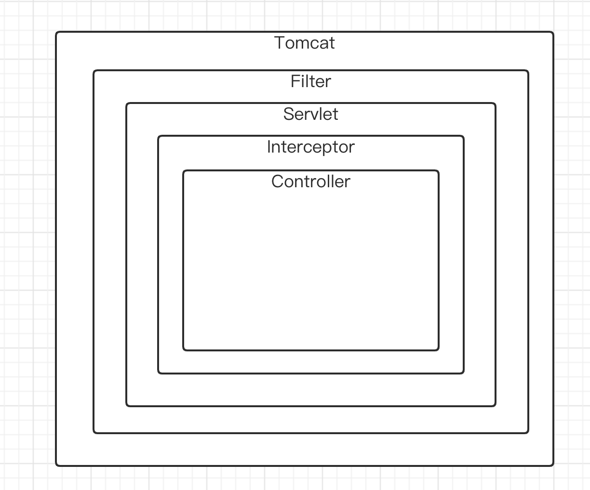

### Spring boot 过滤器与拦截器

> 对于过滤器Filter来说，属于tomcat等容器的请求Request过滤器，隶属于Web三大组件Servlet程序、Listener监听器、Filter过滤器中过滤器部分。

而对Spring框架则是承担了Web三大组件中Servlet部分，具体来说应该是DispatherServlet这个对象实现了Servlet接口。

那么一个HTTP协议请求报文来到tomcat容器之后，由tomcat容器去负责封装HTTP报文成ServletRequest对象，那么此ServletRequest对象流入流出流程如下：



而一般在Web程序中想要操作Filter过滤器，首先我们需要重写Filter过滤器这个类,如下所示：

```java
@Component
public class MyFilter implements Filter {

    /***
     * 此方法是过滤器自行初始化时执行，一般无需要操作
     * @param filterConfig
     * @throws ServletException
     */
    @Override
    public void init(FilterConfig filterConfig) throws ServletException {
        Filter.super.init(filterConfig);
    }

    /***
     * 此方法是过滤器重中之重，是Request与Response前后流转之处
     * @param servletRequest 流转的Request
     * @param servletResponse 流转的Response
     * @param filterChain 传递Request与Response的传递对象
     * @throws IOException
     * @throws ServletException
     */
    @Override
    public void doFilter(ServletRequest servletRequest, ServletResponse servletResponse, FilterChain filterChain) throws IOException, ServletException {

        //此方法之前为Request请求来到Servlet容器之前执行
        filterChain.doFilter(servletRequest,servletResponse);
        //此方法之后为Response请求离开Servlet容器之后执行

    }

    /***
     * 销毁FIlter过滤器
     */
    @Override
    public void destroy() {
        Filter.super.destroy();
    }
}
```

当请求来过Filter过滤器之后就会来到DispatherServlet后，再经过DispatherServlet的处理之后，来到Interceptor拦截器。来看看拦截器`HandlerInterceptor`的代码编写：

```java
@Component
public class WebInterceptor implements HandlerInterceptor {
    /***
     * 此方法属于Request请求在还未在进Controller层之前进行处理
     * @param request 请求
     * @param response 响应
     * @param handler
     * @return 通行是否
     * @throws Exception
     */
    @Override
    public boolean preHandle(HttpServletRequest request, HttpServletResponse response, Object handler) throws Exception {
        return HandlerInterceptor.super.preHandle(request, response, handler);
    }

    /***
     * 在业务处理器处理请求执行完成后，生成视图之前执行。后处理（调用了Service并返回ModelAndView，但未进行页面渲染），有机会修改ModelAndView （这个博主就基本不怎么用了）；
     * @param request
     * @param response
     * @param handler
     * @param modelAndView
     * @throws Exception
     */
    @Override
    public void postHandle(HttpServletRequest request, HttpServletResponse response, Object handler, ModelAndView modelAndView) throws Exception {
        HandlerInterceptor.super.postHandle(request, response, handler, modelAndView);
    }

    @Override
    public void afterCompletion(HttpServletRequest request, HttpServletResponse response, Object handler, Exception ex) throws Exception {
        HandlerInterceptor.super.afterCompletion(request, response, handler, ex);
    }
}

```

```java
/**
 * @ClassName WebRequestInterceptorConfiguration
 * @Author CodeDan
 * @Date 2022/7/18 15:07
 * @Version 1.0
 **/
@Configuration
public class WebRequestInterceptorConfiguration extends WebMvcConfigurerAdapter {

    @Resource
    private RequestInterceptor requestInterceptor;

    @Override
    public void addInterceptors(InterceptorRegistry registry) {
        registry.addInterceptor(requestInterceptor).addPathPatterns("/**");
    }
}
```

一般拦截器编写之后，需要将其放入拦截器职责链中，那么就需要继承一个WebMvconfigurerAdapter类，重写`addInterceptors`方法，将其放入职责链中，并设置拦截目录即可。
