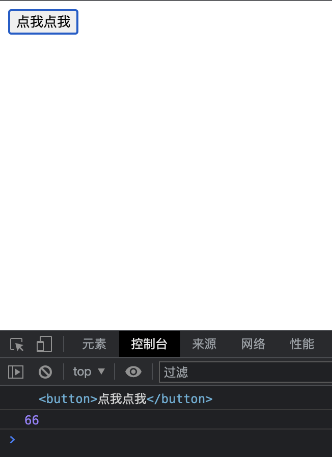

### Vue简单事件处理

##### （1）点击事件处理v-on:click

<mark>即使用v-on:click进行点击事件添加</mark>。即当一个组件需要点击事件的时候，我们就可以在组件中新增点击事件。下述代码即是Vue添加点击事件的代码：

**格式1：v-on:click="方法名"**

**格式2：@:click="方法名"**

```html
<!DOCTYPE html>
<html>
    <head>
        <meta charset="utf-8" />
        <title></title>
        <script type="application/javascript" src="./js/vue.js"></script>
    </head>
    <body>
        <div id="root">
            <button v-on:click="one">点我点我</button>
        </div>

        <script type="application/javascript">
        Vue.config.productionTip = false;
        const vm = new Vue({
            el:'#root',
            //对象式data
            data:{
            },
            //Vue实例中的事件集合
            methods:{
                one(){
                    alert("哈哈哈哈哈哈");
                }
            }
        });
        </script>
    </body>
</html>
```


上述只是Vue中简单的使用，那么下述代码是`携带自定义参数`以及`Event对象`的点击事件代码演示：

**携带参数格式1：v-on:click="方法名($event,自定义参数值,....)"**

**携带参数格式2：@:click="方法名($event,自定义参数值,....)"**

```html
<!DOCTYPE html>
<html>
    <head>
        <meta charset="utf-8" />
        <title></title>
        <script type="application/javascript" src="./js/vue.js"></script>
    </head>
    <body>
        <div id="root">
            <button v-on:click="one($event,66)">点我点我</button>
        </div>

        <script type="application/javascript">
        Vue.config.productionTip = false;
        const vm = new Vue({
            el:'#root',
            //对象式data
            data:{
            },
            //Vue实例中的事件集合
            methods:{
                //点击事件@click中有多少参数这个就有多少参数
                one(event,number){
                    console.log(event.target);
                    console.log(number);
                }
            }
        });
        </script>
    </body>
</html>
```



&nbsp;

##### （2）滚动栏拖动事件处理v-on:scoll

<mark>即使用v-on:scroll进行滚动事件添加</mark>。即当一个组件需要滚动触发事件的时候，我们就可以在组件中新增滚动事件。下述代码即是Vue添加滚动事件的代码

<mark>(添加参数和@click一致，看上述代码即可)：</mark>

**格式1：v-on:scroll="方法名"**

**格式2：@:scroll="方法名"**

```html
<!DOCTYPE html>
<html>
    <head>
        <meta charset="utf-8" />
        <title></title>
        <script type="application/javascript" src="./js/vue.js"></script>
        <style>
            #root{
                width: 50px;
                height: 100px;
                overflow: scroll;
            }
        </style>
    </head>
    <body>
        <div id="root" v-on:scroll="two">
            123
            123
            123
            123
            123
            123
            123
        </div>

        <script type="application/javascript">
        Vue.config.productionTip = false;
        const vm = new Vue({
            el:'#root',
            //对象式data
            data:{
            },
            methods:{
                two(){
                    console.log("1");
                }
            }
        });
        </script>
    </body>
</html>
```


&nbsp;

##### （3）滚动栏拖动事件处理v-on:mousewheel

<mark>即使用v-on:mousewheel进行鼠标滚轮滚动事件添加</mark>。即当一个组件需要鼠标滚动触发事件的时候，我们就可以在组件中新增鼠标滚轮滚动事件。下述代码即是Vue添加鼠标滚轮滚动事件的代码：

(添加参数和@click一致，看上述代码即可)：

**格式1：v-on:mousewheel="方法名"**

**格式2：@:mousewheel="方法名"**

**注意：scroll和mousewheel的区别在于scroll只要滚动条改变一点就触发一次，比如向下滚动53距离，那么触发53次。mousewheel则是鼠标滚动不管多大，均只算一次，也就是触发一次。**

```html
<!DOCTYPE html>
<html>
    <head>
        <meta charset="utf-8" />
        <title></title>
        <script type="application/javascript" src="./js/vue.js"></script>
        <style>
            #root{
                width: 50px;
                height: 100px;
                overflow: scroll;
            }
        </style>
    </head>
    <body>
        <div id="root" v-on:mousewheel="two">
            123
            123
            123
            123
            123
            123
            123
        </div>

        <script type="application/javascript">
        Vue.config.productionTip = false;
        const vm = new Vue({
            el:'#root',
            //对象式data
            data:{
            },
            methods:{
                two(){
                    console.log("1");
                }
            }
        });
        </script>
    </body>
</html>
```


&nbsp;

-----

### 事件修饰符

在Vue中一共有三种常用事件修饰符和三种不常用修饰符，他们作用于Vue触发事件时，进行修饰。

##### prevent事件修饰符

<mark>用于取消原本事件组件的默认事件</mark>，比如a标签的跳转事件等。使用方式如下代码所示：

```html
<!DOCTYPE html>
<html>
    <head>
        <meta charset="utf-8">
        <title></title>
        <script type="application/javascript" src="js/vue.js"></script>
    </head>
    <body>
        <div id="holder">
            <!--使用事件修饰符prevent-->
            <a href="https://www.baidu.com" @click.prevent="show">点我点我</a>
        </div>

        <script type="application/javascript">
            const vm = new Vue({
                el:"#holder",
                methods:{
                    show(){
                        alert("11111111");
                    }
                }
            })

        </script>
    </body>
</html>

```


**我们可以发现标签并没有触发默认的条件事件。而是触发了我们添加的点击事件。**

&nbsp;

##### stop事件修饰符

<mark>用于取消事件冒泡</mark>，即被当前修饰符修饰的事件不会触发事件冒泡。使用方式如下代码所示：

```html
<!DOCTYPE html>
<html>
    <head>
        <meta charset="utf-8">
        <title></title>
        <script type="application/javascript" src="js/vue.js"></script>
        <style>
            #one{
                width: 200px;
                height: 100px;
                background-color: aquamarine;
            }
        </style>
    </head>
    <body>
        <div id="holder">
            <div id="one" @click="show2">
                <a href="#" @click.stop="show">点我点我</a>
            </div>
        </div>

        <script type="application/javascript">
            const vm = new Vue({
                el:"#holder",
                methods:{
                    show(){
                        alert("11111111");
                    },
                    show2(){
                        alert("22222222");
                    }
                }
            })

        </script>
    </body>
</html>

```


**我们可以发现点击标签时，并没有触发到外层div标签的点击事件。也就是说stop修饰符组织了本应该触发的事件冒泡。**

&nbsp;

##### once事件修饰符

<mark>即让事件只触发一次</mark>，哪怕之后再操作事件也无法进行事件的触发。使用方式如下代码所示：

```html
<!DOCTYPE html>
<html>
    <head>
        <meta charset="utf-8">
        <title></title>
        <script type="application/javascript" src="js/vue.js"></script>
        <style>
            #one{
                width: 200px;
                height: 100px;
                background-color: aquamarine;
            }
        </style>
    </head>
    <body>
        <div id="holder">
            <div id="one" @click.once="show2">

            </div>
        </div>

        <script type="application/javascript">
            const vm = new Vue({
                el:"#holder",
                methods:{
                    show2(){
                        alert("22222222");
                    }
                }
            })

        </script>
    </body>
</html>
```


**可以看到事件只在第一次点击的时候触发，之后再怎么点击也无法触发。**

&nbsp;

##### capture事件修饰符

用于事件的捕获模式  

##### self事件修饰符

只有event.target是当前操作的元素才会触发事件

##### capture事件修饰符

事件的默认行为会优先执行，附加行为会进行异步执行。
