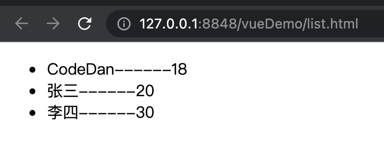
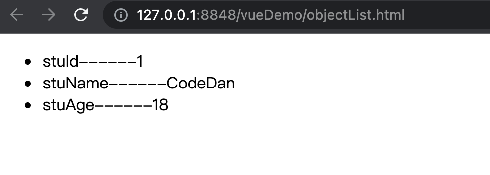
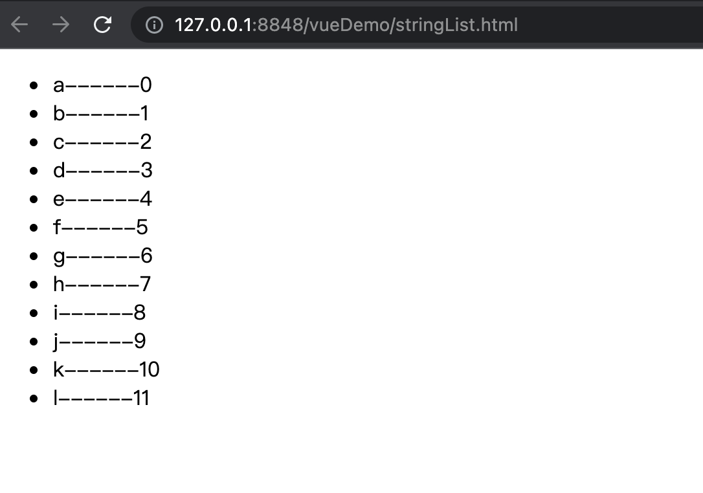
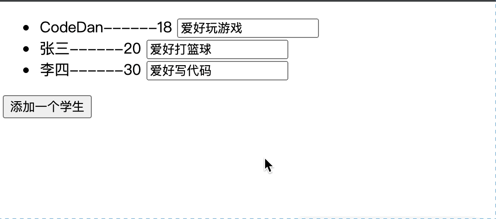
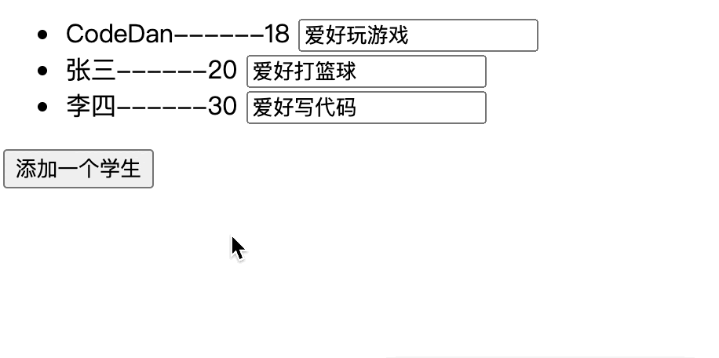
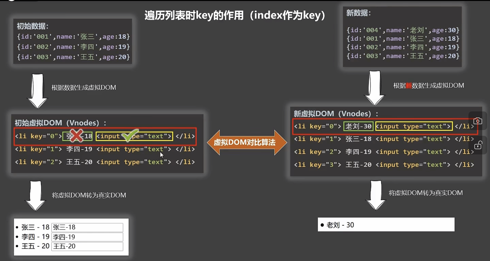
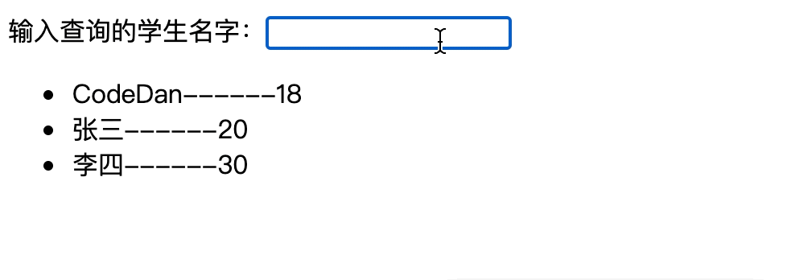
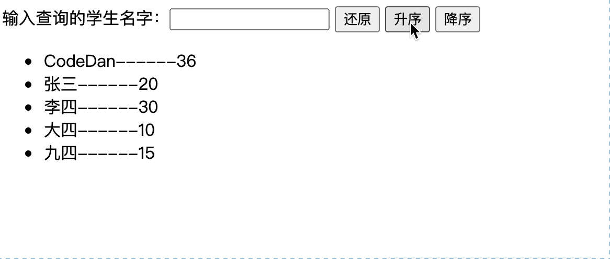
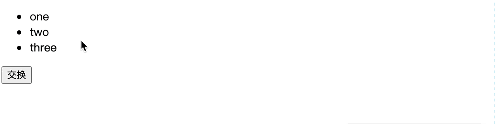

### Vue列表技术

即通过后端返回的时候，进行与data中数据进行交互的方式，让此data中数据与其建立绑定的组件进行列表变化。

**格式：v-for = "( item , index )  in  items"    :key="index|primary key"**

##### 数组形式数据形成列表演示

```html
<!DOCTYPE html>
<html>
    <head>
        <meta charset="utf-8">
        <title></title>
        <script type="application/javascript" src="js/vue.js"></script>
    </head>
    <body>
        <div id="list">
            <ul>
                <li v-for="(student,index) in students" :key="student.stuId">
                    {{student.stuName}}------{{student.stuAge}}
                </li>
            </ul>
        </div>

        <script>
        const m2 = new Vue({
            el:"#list",
            data:{
                students:[
                    {stuId:0001,stuName:"CodeDan",stuAge:18},
                    {stuId:0002,stuName:"张三",stuAge:20},
                    {stuId:0003,stuName:"李四",stuAge:30},
                ]
            }
        });
        </script>
    </body>
</html>
```



&nbsp;

##### 对象形式数据形成列表演示

```html
<!DOCTYPE html>
<html>
    <head>
        <meta charset="utf-8">
        <title></title>
        <script type="application/javascript" src="js/vue.js"></script>
    </head>
    <body>
        <div id="objectlist">
            <ul>
                <li v-for="(value,key) in student" :key="key">
                    {{key}}------{{value}}
                </li>
            </ul>
        </div>

        <script>
        const m3 = new Vue({
            el:"#objectlist",
            data:{
                student:{
                    stuId:0001,
                    stuName:"CodeDan",
                    stuAge:18,
                    }
            }
        });
        </script>
    </body>
</html>
```



&nbsp;

##### 字符串形式数据形成列表演示

```html
<!DOCTYPE html>
<html>
    <head>
        <meta charset="utf-8">
        <title></title>
        <script type="application/javascript" src="js/vue.js"></script>
    </head>
    <body>
        <div id="objectlist">
            <ul>
                <li v-for="(char,index) in student" :key="index">
                    {{char}}------{{index}}
                </li>
            </ul>
        </div>

        <script>
        const m3 = new Vue({
            el:"#objectlist",
            data:{
                student:"abcdefghijkl"
            }
        });
        </script>
    </body>
</html>
```



&nbsp;

------

### 关于Key的作用与原理

##### key的作用

即列表组件在Vue开发模式下，都会为列表中每一项指定一个`虚拟DomKey`， 那么我们在v-for生成列表时，就需要使用`:key`去指定一个值作为虚拟DomKey。以便之后数据改变时虚拟Dom根据Key的不同来完成不同的操作。

**<mark>注意：在数组渲染列表时，尽可能的使用唯一主键作为Key，少用Index作为Key</mark>**

比如下述场景中，使用index就会出现问题，但是使用唯一主键作为Key时不会出现问题：

```html
<!DOCTYPE html>
<html>
    <head>
        <meta charset="utf-8">
        <title></title>
        <script type="application/javascript" src="js/vue.js"></script>
    </head>
    <body>
        <div id="list">
            <ul>
                <li v-for="(student,index) in students" :key="index">
                    {{student.stuName}}------{{student.stuAge}}
                    <input type="text" value="" />
                </li>
            </ul>
            <button @Click="add()">添加一个学生</button>
        </div>

        <script>
        const m2 = new Vue({
            el:"#list",
            data:{
                students:[
                    {stuId:0001,stuName:"CodeDan",stuAge:18},
                    {stuId:0002,stuName:"张三",stuAge:20},
                    {stuId:0003,stuName:"李四",stuAge:30},
                ]
            },
            methods:{
                add(){
                    this.students.unshift({stuId:0000,stuName:"Zero",stuAge:16})
                }
            }
        });
        </script>
    </body>
</html>
```



我们可以发现每一项对应input输入框中的内容都错误了，理想状态下，应该Zero同学的input框为新生成的input框，内容应该为空才对。

我们把`:key="student.stuId"`再试试：



&nbsp;

##### key的原理

那么为什么上述例子往数据源数组<mark>**之前**</mark>插入新数据，采用index时会出现每项对应input框中数据不改变的问题，而采用唯一主键之后input框数据显示就正常了呢？

通过模拟虚拟Dom的操作来展示Key的原理，模拟图如下所示：



左边为第一次生成虚拟Dom的过程，最终会生成左下角的真实Dom，那么重点来了，右边从上到下依次就是新增一个学生之后的虚拟Dom的操作流程。

1. 首先新的数据源会去生成新的虚拟Dom。

2. 其次新旧虚拟Dom之间就会通过Diff算法去进行比较。

3. 最后将比较相同的项进行真实Dom复用，不相同的直接生成新的真实Dom。

那么通过上述操作流程，我们就会发现图中，两个虚拟Dom进行比较时

+ 首先判断key是否相同
  
  + key相同，则将key所在标签所对应的真实Dom进行复用(只是key所在标签Dom，不包含其子标签Dom)。
  
  + key不相同，则此key所在标签以及其子标签Dom均无需再比较，直接生成新的真实Dom。

+ 其次继续判断文本内容是否相同
  
  + 文本内容相同，则将文本Dom所对应的真实Dom进行复用
  
  + 文本内容不相同，则生成新的真实文本Dom

+ 最后判断input框Dom是否相同
  
  + input框相同，则将Input框Dom所对应的真实Dom进行复用
  
  + input框不相同，则生成新的真实Input框Dom

<mark>现在理解为什么Key采用index和采用唯一主键时产生的结果不一致了吧！！！！</mark>

***我们也可以推测出如果在数据源后<mark>追加</mark>新数据，那么key采用index也可以得到正确的结果，因为新数据的key生成的虚拟Dom中key从来没出现过，是新数据。***

----

### 列表过滤

即前端形式的模糊查询，通过输入需要模糊查询的值，那么相应的列表中进行数据的变化。

```html
<!DOCTYPE html>
<html>
    <head>
        <meta charset="utf-8">
        <title></title>
        <script type="application/javascript" src="js/vue.js"></script>
    </head>
    <body>
        <div id="list">
            输入查询的学生名字：<input type="text" value="" v-model="selectName"/>
            <ul>
                <li v-for="(student,index) in filterStudents" :key="student.stuId">
                    {{student.stuName}}------{{student.stuAge}}
                </li>
            </ul>
        </div>

        <script>
        const m2 = new Vue({
            el:"#list",
            data:{
                selectName:"",
                students:[
                    {stuId:0001,stuName:"CodeDan",stuAge:18},
                    {stuId:0002,stuName:"张三",stuAge:20},
                    {stuId:0003,stuName:"李四",stuAge:30},
                ]
            },
            computed:{
                filterStudents:{
                    get(){
                        //过滤一下，get方法第一次加载的时候会被调用，此时this.selectName=""，第二个return结果为0.
                        return this.students.filter((param)=>{
                            return param.stuName.indexOf(this.selectName) !== -1;
                        })
                    }
                }
            }
        });
        </script>
    </body>
</html>
```



-----

### 列表排序

通过前端数组类型的sort搭箭头函数，作出类似于java的compateTo方法的排序效果。

```html
<!DOCTYPE html>
<html>
    <head>
        <meta charset="utf-8">
        <title></title>
        <script type="application/javascript" src="js/vue.js"></script>
    </head>
    <body>
        <div id="list">
            输入查询的学生名字：<input type="text" value="" v-model="selectName"/>
            <button @click="initSortType()">还原</button>
            <button @click="setSortTypeOne()">升序</button>
            <button @click="setSortTypeTwo()">降序</button>
            <ul>
                <li v-for="(student,index) in filterStudents" :key="student.stuId">
                    {{student.stuName}}------{{student.stuAge}}
                </li>
            </ul>
        </div>

        <script>
        const m2 = new Vue({
            el:"#list",
            data:{
                selectName:"",
                //零代表无需排序，1代表按年龄升排序，2降序
                sortType:0,
                students:[
                    {stuId:0001,stuName:"CodeDan",stuAge:36},
                    {stuId:0002,stuName:"张三",stuAge:20},
                    {stuId:0003,stuName:"李四",stuAge:30},
                    {stuId:0004,stuName:"大四",stuAge:10},
                    {stuId:0005,stuName:"九四",stuAge:15},
                ]
            },
            computed:{
                filterStudents:{
                    get(){
                        //过滤一下，get方法第一次加载的时候会被调用，此时this.selectName=""，第二个return结果为0.
                        let arr =  this.students.filter((param)=>{
                            return param.stuName.indexOf(this.selectName) !== -1;
                        });
                        if( this.sortType != 0 ){
                            //和java里我们实现compateTo方法是一样的
                            arr.sort((p1,p2)=>{
                                return this.sortType === 1 ? p1.stuAge - p2.stuAge : p2.stuAge - p1.stuAge
                            })
                        }
                        return arr;
                    }
                }
            },
            methods:{
                setSortTypeOne(){
                    this.sortType = 1;
                },
                setSortTypeTwo(){
                    this.sortType = 2;
                },
                initSortType(){
                    this.sortType = 0;
                }
            }
        });
        </script>
    </body>
</html>
```



-----

### v-for搭配@click使用

```html
<!DOCTYPE html>
<html>
    <head>
        <meta charset="utf-8">
        <title></title>
        <script type="application/javascript" src="js/vue.js"></script>
    </head>
    <body>
        <div id="object" >

            <ul>
                <li v-for="(value,index) in list" :key="index" @click="show(event,value)">
                    {{ value }}
                </li>
            </ul>
            <button @click="swap()">交换</button>
        </div>

        <script type="application/javascript">
        const m3 = new Vue({
            el:"#object",
            data:{
                list:["one","two","three"],
            },
            methods:{
                show(event,data){
                    alert(data);
                },
                swap(){
                    this.list=["hello","world"];
                }
            }
        });
        </script>
    </body>
</html>
```


