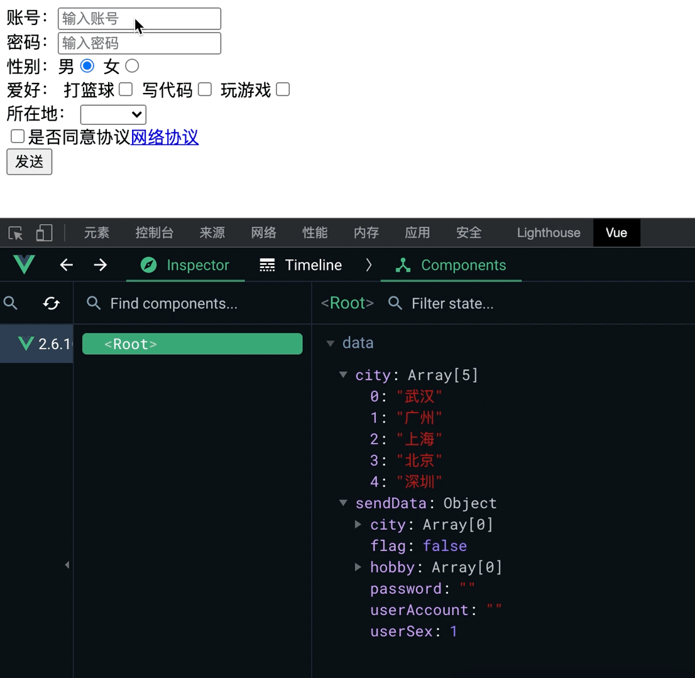

### Vue收集表单数据

```html
<input type="text｜password">
```

**此时v-model收集的是value值，用户输入的就是value值**

&nbsp;

```html
<select v-model="表达式">
    <option value="">提示</option>
    <option value="valueOne">valueOne</option>
    <option value="valueTwo">valueTwo</option>
</select>  
```

**此时v-model收集的就是用户下拉框中选中的option标签的value值**

&nbsp;

```html
<input type="radio" value="man" name="sex">
<input type="radio" value="woman" name="sex">
```

***此时v-model收集的是value值，但是一定要给input设置value值***

&nbsp;

```html
<input type="checkbox" value="valueOne" >
<input type="checkbox" value="valueTwo" >
<input type="checkbox" value="valueThree" >
```

此时如果checkbox没有配置value，那么v-model收集此标签的checked值(勾选true，不勾选false)，反之如果配置了value，那么就是以下情况：

+ v-model的初始值是非数组，那么收集checked值

+ v-model的初始值是数组，那么收集就是value组成的数组

&nbsp;

在使用v-model时，还可以使用其三个方法来进行优化：

+ lazy：失去焦点时，在收集数据

+ number：输入字符串转为有效数字

+ trim：输入首尾空格过滤

-----

### Vue表单实例演示

```html
<!DOCTYPE html>
<html>
    <head>
        <meta charset="utf-8">
        <title></title>
        <script type="application/javascript" src="js/vue.js"></script>
    </head>
    <body>
        <div id="formList">
            账号：<input type="text" v-model.trim.number="sendData.userAccount" placeholder="输入账号" /><br>
            密码：<input type="password" v-model.trim="sendData.password" placeholder="输入密码" /><br>
            性别：男<input type="radio" name="sex" value="1" v-model="sendData.userSex">    
            女<input type="radio" name="sex" value="2" v-model="sendData.userSex"><br>
            爱好：
            打篮球<input type="checkbox" value="打篮球" v-model="sendData.hobby">
            写代码<input type="checkbox" value="写代码" v-model="sendData.hobby">
            玩游戏<input type="checkbox" value="玩游戏" v-model="sendData.hobby"><br>
            所在地：
            <select v-model="sendData.city">
                <option value=" ">请选择</option>
                <option v-for="(value,index) in city" :key="index" v-text="value">{{ value }}</option>
            </select><br>
            <input type="checkbox" v-model="sendData.flag">是否同意协议<a href="#">网络协议</a>
            <button @click="send()">发送</button>
        </div>


        <script>
            let formVm = new Vue({
                el:'#formList',
                data:{
                    sendData:{
                        userAccount:"",
                        password:"",
                        userSex:1,
                        hobby:[],
                        city:[],
                        flag:false,
                    },
                    city:["武汉","广州","上海","北京","深圳"],
                },
                methods:{
                    send(){
                        console.log(JSON.stringify(this.sendData));
                    }
                }
            })
        </script>
    </body>
</html>
```


