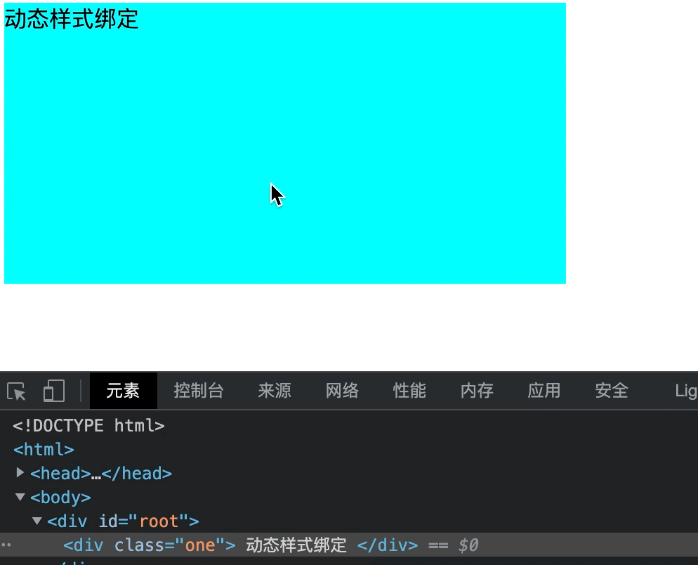
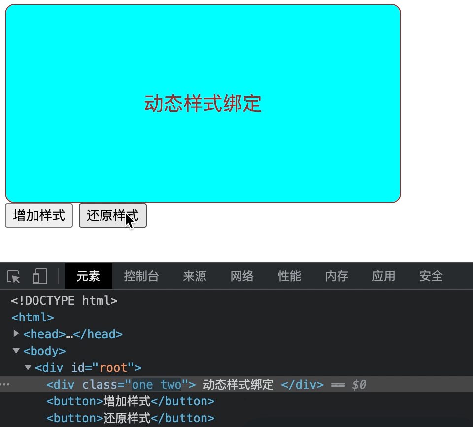
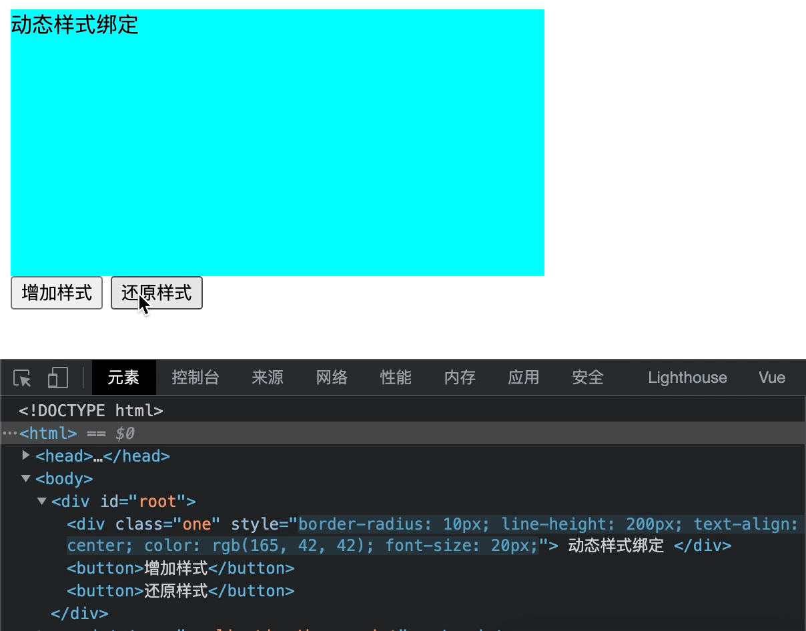

### VueClass样式绑定

##### 字符串动态绑定Class

即使用Vue的方式去动态的改变class样式，而不是使用传统的获取Dom对象后修改其class。

***方式：v-bind:class="表达式"***

<mark>适用于样式的类名不确定，需要动态指定的情况</mark>

```html
<html>
    <head>
        <meta charset="utf-8">
        <title></title>
        <script type="application/javascript" src="js/vue.js"></script>
        <style>
        .one{
            width: 400px;
            height: 200px;
            background-color: aqua;
        }
        .two{
            border: brown 1px solid;
            border-radius: 10px;
            line-height: 200px;
            text-align: center;
            color: #A52A2A;
            font-size: 20px;
        }
        </style>
    </head>
    <body>
        <div id="root">
            <div class="one" :class="model" @Click="changeClass()">
                动态样式绑定
            </div>
        </div>

        <script type="application/javascript">
            const vm1 = new Vue({
                el:'#root',
                data:{
                    model:""
                },
                methods:{
                    changeClass(){
                        this.model = "two";
                    }
                }
            })
        </script>
    </body>
</html>

```



&nbsp;

##### 搭配数组形式去配合动态Class样式绑定

<mark>适用于不确定绑定class的数量以及不确定其名称，均需要动态绑定</mark>

```html
<html>
    <head>
        <meta charset="utf-8">
        <title></title>
        <script type="application/javascript" src="js/vue.js"></script>
        <style>
        .one{
            width: 400px;
            height: 200px;
            background-color: aqua;
        }
        .two{
            border: brown 1px solid;
            border-radius: 10px;
            line-height: 200px;
            text-align: center;
            color: #A52A2A;
            font-size: 20px;
        }
        </style>
    </head>
    <body>
        <div id="root">
            <div class="one" :class="model">
                动态样式绑定
            </div>
            <button @click="addClass()">增加样式</button>
            <button @Click="removeClass()" >还原样式</button>
        </div>

        <script type="application/javascript">
            const vm1 = new Vue({
                el:'#root',
                data:{
                    model:[]
                },
                methods:{
                    removeClass(){
                        this.model.shift();
                    },
                    addClass(){
                        this.model.push('two');
                    }
                }
            })
        </script>
    </body>
</html>
```



&nbsp;

##### 对象形式搭配动态Class样式绑定

<mark>适用于确定绑定class的数量以及确定其名称，只是不确定使不适用</mark>

```html
<html>
    <head>
        <meta charset="utf-8">
        <title></title>
        <script type="application/javascript" src="js/vue.js"></script>
        <style>
        .one{
            width: 400px;
            height: 200px;
            background-color: aqua;
        }
        .two{
            border: brown 1px solid;
            border-radius: 10px;
            line-height: 200px;
            text-align: center;
            color: #A52A2A;
            font-size: 20px;
        }
        </style>
    </head>
    <body>
        <div id="root">
            <div class="one" :class="model">
                动态样式绑定
            </div>
            <button @click="addClass()">增加样式</button>
            <button @Click="removeClass()" >还原样式</button>
        </div>

        <script type="application/javascript">
            const vm1 = new Vue({
                el:'#root',
                data:{
                    model:{
                        two:false
                    }
                },
                methods:{
                    removeClass(){
                        this.model.two = false;
                    },
                    addClass(){
                        this.model.two = true;
                    }
                }
            })
        </script>
    </body>
</html>
```


-----

### Vue绑定Style样式

即使用Vue的方式去动态的改变style样式，而不是使用传统的获取Dom对象后修改其style。

***方式：v-bind:style="表达式"***

```html
<html>
    <head>
        <meta charset="utf-8">
        <title></title>
        <script type="application/javascript" src="js/vue.js"></script>
        <style>
        .one{
            width: 400px;
            height: 200px;
            background-color: aqua;
        }
        .two{
            border: brown 1px solid;
            border-radius: 10px;
            line-height: 200px;
            text-align: center;
            color: #A52A2A;
            font-size: 20px;
        }
        </style>
    </head>
    <body>
        <div id="root">
            <div class="one" :style="model">
                动态样式绑定
            </div>
            <button @click="addClass()">增加样式</button>
            <button @Click="removeClass()" >还原样式</button>
        </div>

        <script type="application/javascript">
            const vm1 = new Vue({
                el:'#root',
                data:{
                    model:{
                    }
                },
                methods:{
                    removeClass(){
                        this.model = {};
                    },
                    addClass(){
                        this.model = {
                        borderRadius: '10px',
                        lineHeight: '200px',
                        textAlign: 'center',
                        color: '#A52A2A',
                        fontSize: '20px'
                        }
                    }
                }
            })
        </script>
    </body>
</html>

```


