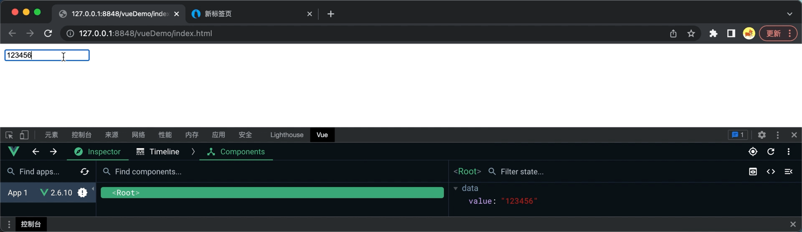

### Vue模版语法

对于HTML中与Vue实例相关联的组件就是Vue模版，一般在Vue模版中存在自己的语法结构，比如`{{ }}`就是一种模版语法。所以这章目的就是过一遍Vue模版中常用的一些语法结构。

-----

### Vue插值模版语法

插值模版语法就是将数据源中的数据通过js表达式传递到Vue模版中的语法。

##### {{  }}插值语法

一般用于将Vue实例对象中data字段所建立的数据源中数据通过js表达式传递到`Vue模版文本区域`，需要遵循数据源与js表达式中数据字段名称一致。

<mark>注意：插值语法也是可以作用于拥有返回值的方法的，{{ 方法名(参数) }</mark>

```html
<!DOCTYPE html>
<html>
    <head>
        <meta charset="utf-8" />
        <title></title>
        <script type="application/javascript" src="./js/vue.js"></script>
    </head>
    <body>
        <div id="root">
            <h1>Hello {{ message.name }}</h1>
            <h3>{{ statue }}</h3>
        </div>

        <script type="application/javascript">
        Vue.config.productionTip = false;
        const vm = new Vue({
            el:'#root',
            //对象式data
            data:{
                statue:400,
                message:{
                    name:"CodeDan"
                },
            }
            //函数式data,这里是提一下，之后组件时经常用！！！！
            // data:function(){
            //     return{
            //         statue:400,
            //         message:{
            //             name:"CodeDan"
            //         }
            //     }
            // }
        });
        </script>
    </body>
</html>
```


------

### Vue指令模版语法

即当我们需要动态改变一个组件的属性值(只要是属性值都可以这样改变)，比如 `<a href>`，``中href或者src属性的值，那么我们可以把动态值放入到Vue实例对象的数据源中，但是如何通过js表达式将数据源中数据传递到到Vue模版中呢？`也可以将其说成如何将数据源数据与Vue模版中一个组件的属性进行绑定`

##### （1）v-bind指令

<mark>主要是用于href，src，value以及自定义属性的动态修改</mark>。将Vue实例对象中data字段所建立的数据源中数据通过js表达式传递到Vue模版`组件的属性`中，需要遵循数据源字段与js表达式中数据字段名称一致。<mark>完成双方的数据绑定。</mark>

***v-bind格式1：v-bind:属性名称 = "数据源字段名称"***

***v-bind格式2：:属性名称 = "数据源字段名称"***

注意现在""中的数据不再是字符串，而是js表达式。所以如果遇到需要拼接的场景，那么拼接格式如下所示：

***v-bind拼接格式：“['拼接字符串' + 数据源字段名称]“***

```html
<!DOCTYPE html>
<html>
    <head>
        <meta charset="utf-8" />
        <title></title>
        <script type="application/javascript" src="./js/vue.js"></script>

    </head>
    <body>
        <div id="root">
            <a v-bind:href="url" :data-account="account">百度</a>
            
        </div>

        <script type="application/javascript">
        Vue.config.productionTip = false;
        const vm = new Vue({
            el:'#root',
            data:{
                url:"https://www.baidu.com",
                photo:"userPhoto1.png",
                account:"1804230910"
            }
        });
        </script>
    </body>
</html>
```


##### &nbsp;

##### （2）v-model指令模版语法

上述关于v-bind指令语法其实都是单向数据绑定，即数据源单向绑定了Vue模版。其实除了单项绑定之后，还有`双向绑定`。

***字面意思来说就是数据源绑定了Vue模版并且Vue模版也绑定了数据源。只要其中一个数据发生改变，数据源和Vue模版中数据均改变。***

<mark>v-model只能运用在表单类标签并存在value值属性的情况下</mark>

下述代码演示就是演示双向数据绑定效果：

```html
<!DOCTYPE html>
<html>
    <head>
        <meta charset="utf-8" />
        <title></title>
        <script type="application/javascript" src="./js/vue.js"></script>

    </head>
    <body>
        <div id="root">
            <input v-model:value="value" type="text">

        </div>

        <script type="application/javascript">
        Vue.config.productionTip = false;
        const vm = new Vue({
            el:'#root',
            data:{
                value:"123"
            }
        });
        </script>
    </body>
</html>
```

视频结果：



&nbsp;
