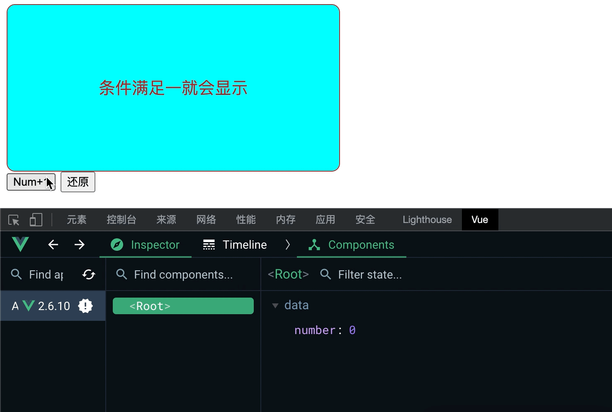

### Vue条件渲染

##### V-Show指令

当v-show指令中表达式满足条件或者结果为true时，即可将`display:block`添加入样式。反之则修改`display:none`即可。

```html
<!DOCTYPE html>
<html>
    <head>
        <meta charset="utf-8">
        <title></title>
        <script type="application/javascript" src="js/vue.js"></script>
    </head>
    <body>
        <div id="root">
            <div class="one two" v-show=" number === 1 ">
                条件满足一就会显示
            </div>
            <div class="one two" v-show=" number === 2 ">
                条件满足二就会显示
            </div>
            <div class="one two" v-show=" number === 3 ">
                条件满足三就会显示
            </div>
            <button @click="addNumber()">Num+1</button>
            <button @click="initNumber()">还原</button>
        </div>

        <script type="application/javascript">
            const vm1 = new Vue({
                el:'#root',
                data:{
                    number:0
                },
                methods:{
                    addNumber(){
                        this.number = this.number + 1;
                    },
                    initNumber(){
                        this.number = 0;
                    }
                }
            })
        </script>
    </body>
</html>
```


&nbsp;

##### V-if指令

当v-if指令中表达式满足条件或者结果为true时，即可将自动生成当前标签以及其下子标签。反之不生成。

```html
<!DOCTYPE html>
<html>
    <head>
        <meta charset="utf-8">
        <title></title>
        <script type="application/javascript" src="js/vue.js"></script>
    </head>
    <body>
        <div id="root">
            <div class="one two" v-if=" number === 1 ">
                条件满足一就会显示
            </div>
            <div class="one two" v-if=" number === 2 ">
                条件满足二就会显示
            </div>
            <div class="one two" v-if=" number === 3 ">
                条件满足三就会显示
            </div>
            <button @click="addNumber()">Num+1</button>
            <button @click="initNumber()">还原</button>
        </div>

        <script type="application/javascript">
            const vm1 = new Vue({
                el:'#root',
                data:{
                    number:0
                },
                methods:{
                    addNumber(){
                        this.number = this.number + 1;
                    },
                    initNumber(){
                        this.number = 0;
                    }
                }
            })
        </script>
    </body>
</html>

```


***除了v-if指令外，还可以使用v-else以及v-else-if与v-if进行搭配使用，使用规则和java一致，其中被他们修饰的标签不能间断(也不能插入无他们修饰的同级以及上层标签)。***

```html
<!DOCTYPE html>
<html>
    <head>
        <meta charset="utf-8">
        <title></title>
        <script type="application/javascript" src="js/vue.js"></script>
    </head>
    <body>
        <div id="root">
            <div class="one two" v-if=" number === 1 ">
                条件满足一就会显示
            </div>
            <div class="one two" v-else-if=" number === 2 ">
                条件满足二就会显示
            </div>
            <div class="one two" v-else-if=" number === 3 ">
                条件满足三就会显示
            </div>
            <div class="one two" v-else="">
                条件满足零就会显示
            </div>
            <button @click="addNumber()">Num+1</button>
            <button @click="initNumber()">还原</button>
        </div>

        <script type="application/javascript">
            const vm1 = new Vue({
                el:'#root',
                data:{
                    number:0
                },
                methods:{
                    addNumber(){
                        this.number = this.number + 1;
                    },
                    initNumber(){
                        this.number = 0;
                    }
                }
            })
        </script>
    </body>
</html>

```


