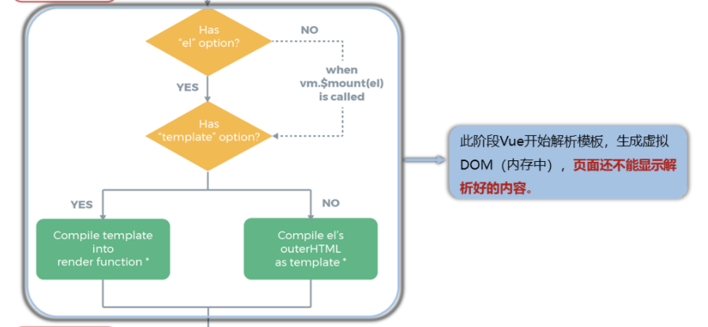
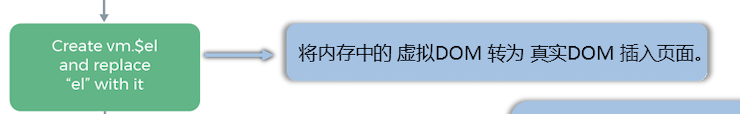

### Vue生命周期

从上图中，我们可以把Vue生命周期分为三个阶段，分别为`挂载阶段`、`更新阶段` 以及`销毁阶段`。

##### 挂载阶段详解

挂载阶段即从new vue()开始到执行完mounted方法结束，其中需要注意的重点如下所示：

+ ***重点一***：首先会去解析vue实例中是否存在el字段，如果有，说明此vue已经绑定了外部HTML组件，可以确定绑定关系以及外部HTML组件位置，反之没有则需要手动调用实例的`&mount(外部HTML组件Id)`的方式告诉vue实例其要绑定的外部HTML组件。
  
  当然在vue实例仅仅拥有el字段，而无template字段时，直接进行el对应的外部HTML组件解析，并生成对应的虚拟DOM。
  
  但是如果vue实例仅仅拥有el字段，而还拥有template字段时，此时el的作用只是确定由template字段生成的虚拟DOM映射真实DOM填入HTML时的插入位置。template生成的真实DOM会将el对应的外部HTML组件整个替换掉。

&nbsp;

+ ***重点二***：上述虚拟DOM生成完成后，会将虚拟DOM转变为真实DOM，并将真实DOM存储到vue实例的`$el`字段中，***用于以后数据更新时，新的虚拟DOM与真实DOM进行的数据对比。***

&nbsp;

##### 更新阶段详解

更新阶段从检测到数据变化开始到页面数据与数据都是新的结束。其中需要注意的是，当检测到数据变化时会调用beforeUpdate函数并更新数据，但是此时不会在页面中显示最新数据，而是根据新的数据生成新的虚拟DOM，再去进行DOM之间的比较，最后显示出新的数据。

那么如果我们在update函数中，设置一个初始值为1的数据永远等于99，那么不会陷入死循环，而是第二次修改的时候就会发现新的虚拟DOM和真实DOM一致，直接复用真实DOM。

&nbsp;

##### 销毁阶段详解

销毁阶段从实例被调用`&destory`函数时开始，执行完`destroyed`函数后结束。其中需要注意如下内容：

+ ***beforeDestroy函数中无效化数据的变化***，如果在beforeDestroy中执行vue实例中数据的改变，那么在vue看来，既然都要销毁了，那么数据的改变已经无意义的了。

+ ***销毁实例具备解除相关监听以及撤销自定义事件能力***，销毁实例除了销毁vue实例本身之外，还会放弃管理其他组件实例，并且撤销watch监听以及该vue实例的自定义事件。

***对于vue实例methods中的已经绑定HTML组件的事件，无法进行撤销，因为底层还是使用js进行DOM的事件生成了，所以无法撤销已经生成的事件。***
