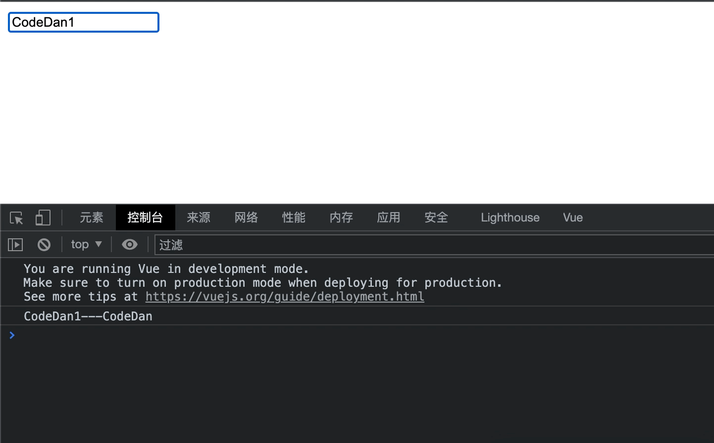
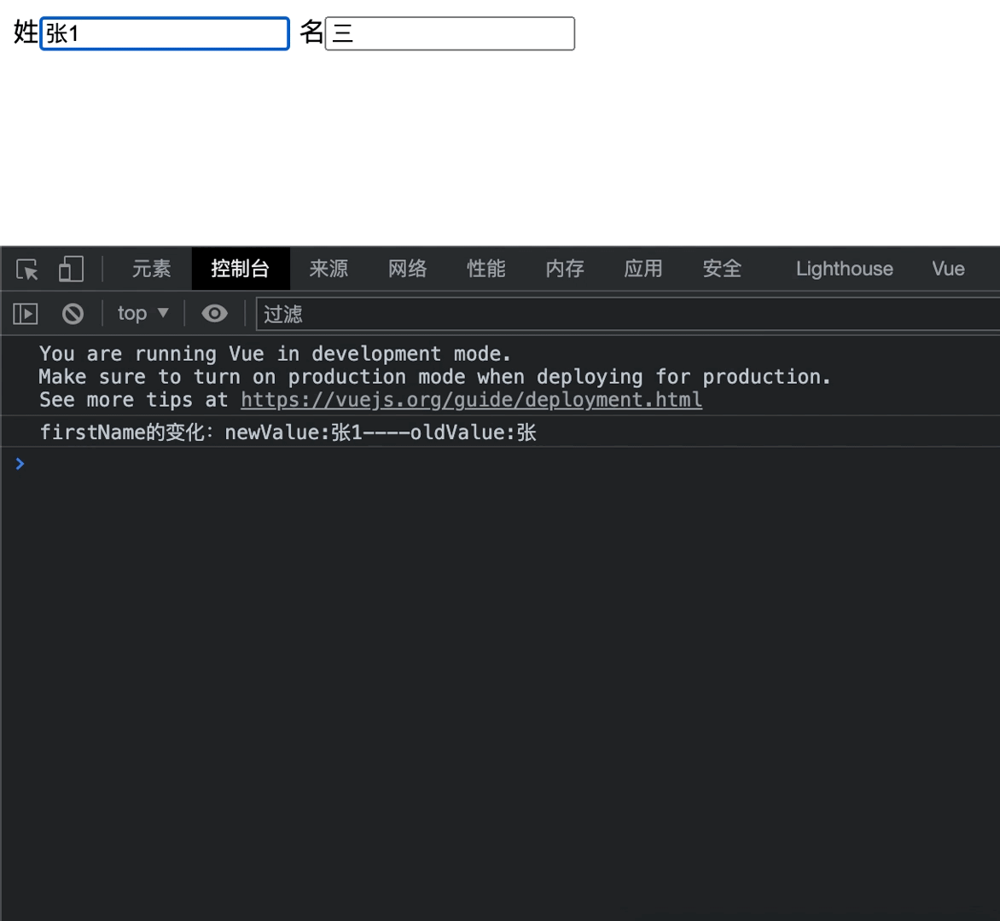
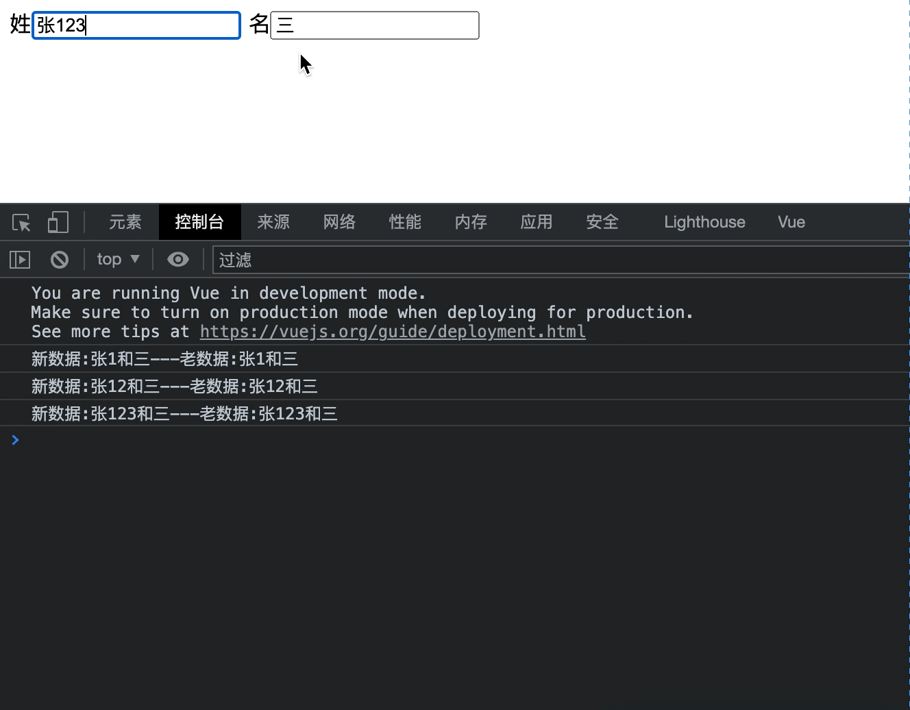
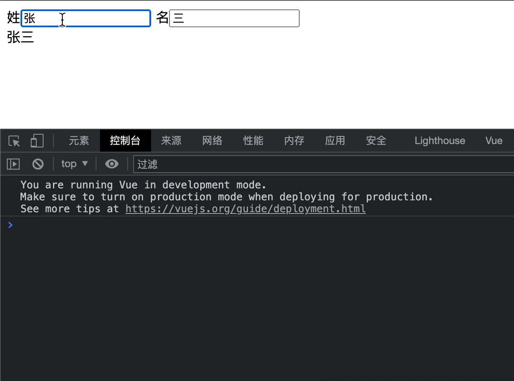

### Vue监视属性

##### watch属性简介

当我们需要<mark>监听Vue实例中的字段(比如data和computed代理到Vue实例中的字段)时</mark>，就必须要使用Vue的watch属性进行设置，Watch监听分为`单层`和`多层`监听。

##### Watch单层监听

即当data字段中的字段只是单纯的字段，而不是对象时，可以直接使用watch进行监听，只要这个字段发生改变，那么就会触发监听方法。

拥有两个参数:   `newValue`和`oldValue`，分别对应着修改后的数据和修改之前的数据。使用方式如下所示：

```html
<!DOCTYPE html>
<html>
    <head>
        <meta charset="utf-8">
        <title></title>
        <script type="application/javascript" src="js/vue.js"></script>

    </head>
    <body>
        <div id="test">
            <input type="text"  v-model="name" />
        </div>

        <script type="application/javascript">
            const vm1 = new Vue({
                el:'#test',
                data:{
                    name:"CodeDan"
                },
                watch:{
                    name:{
                        handler(newValue,oldValue){
                            console.log(newValue + "---" + oldValue);
                        }
                    }
                }
            })
        </script>
    </body>
</html>
```



&nbsp;

##### Watch多层监听

+ **监听对象中某个特定字段**：即当data字段中的字段不只是单纯的字段，而是对象时，使用watch进行监听其中某个特定字段时，需要使用`'对象.字段'`去声明`Handler`，那么此时就只要这个对象内部被监听字段发生改变，那么就会触发监听方法。

```html
<!DOCTYPE html>
<html>
    <head>
        <meta charset="utf-8">
        <title></title>
        <script type="application/javascript" src="js/vue.js"></script>

    </head>
    <body>
        <div id="test">
            姓<input type="text"  v-model="name.firstName" />
            名<input type="text"  v-model="name.endName" />
        </div>

        <script type="application/javascript">
            const vm1 = new Vue({
                el:'#test',
                data:{
                    name:{
                        firstName:"张",
                        endName:"三"
                    }
                },
                watch:{
                    'name.firstName':{
                        handler(newValue,oldValue){
                            console.log("firstName的变化：newValue:"+newValue+"----"+"oldValue:"+oldValue);
                        }
                    },
                    'name.endName':{
                        handler(newValue,oldValue){
                            console.log("endName的变化：newValue:"+newValue+"----"+"oldValue:"+oldValue);
                        }
                    }
                }
            })
        </script>
    </body>
</html>
```



&nbsp;

+ **监听对象内全部字段**：即当data字段中的字段不只是单纯的字段，而是对象时，使用watch进行监听时还需要再配置一下`deep`属性为true，那么此时就只要这个对象内部字段发生改变，那么就会触发监听方法。

拥有两个参数:   `newValue`和`oldValue`，分别对应着修改后的数据和修改之前的数据。使用方式如下所示：

```html
<!DOCTYPE html>
<html>
    <head>
        <meta charset="utf-8">
        <title></title>
        <script type="application/javascript" src="js/vue.js"></script>

    </head>
    <body>
        <div id="test">
            姓<input type="text"  v-model="name.firstName" />
            名<input type="text"  v-model="name.endName" />
        </div>

        <script type="application/javascript">
            const vm1 = new Vue({
                el:'#test',
                data:{
                    name:{
                        firstName:"张",
                        endName:"三"
                    }
                },
                watch:{
                    name:{
                        deep:true,
                        handler(newValue,oldValue){
                            console.log("新数据:"+newValue.firstName+"和"+newValue.endName+"---"+"老数据:"+oldValue.firstName+"和"+oldValue.endName)
                        }
                    }
                }
            })
        </script>
    </body>
</html>
```



**从中我们可以发现监听整体内所有字段缺陷也明显，那就是新老数据一样啊，没错这就是多层监听的缺陷，可以结合computed整出来旧数据。但是看有没有必要。**

&nbsp;

-------

### Watch与Computed的区别

其实一对比，我们会发现，Computed能实现的，Watch基本上也能实现，比如下述computed代码效果：

```html
<!DOCTYPE html>
<html>
    <head>
        <meta charset="utf-8">
        <title></title>
        <script type="application/javascript" src="js/vue.js"></script>

    </head>
    <body>
        <div id="root">
            姓<input type="text"  v-model="firstName" />
            名<input type="text"  v-model="endName" /></br>
            <span>{{ result }}</span>
        </div>

        <script type="application/javascript">
            const vm1 = new Vue({
                el:'#root',
                data:{
                    firstName:"张",
                    endName:"三",
                },
                computed:{
                    result(){
                        return this.firstName+this.endName;
                    }
                }
            })
        </script>
    </body>
</html>
```



<mark>那么这两个有啥区别嘛。</mark>

1. 首先computed本质上是数据代理的一种，所以不需要借助data中字段进行显示，自己生成一个全新字段就可以代理到Vue实例中。但是Watch不行，Watch只能监听Vue实例中已存在的字段，所以哪怕实现相同的功能，Watch也需要在data中新增一个结果字段。

2. computed依赖于return进行数据返回，来进行当前字段的修改。但是watch只进行字段的修改，本身只是监听已存在的字段，不需要return数据。

3. 在执行一些异步方式时，推荐使用Watch，而不是Computed。因为异步方法的返回值和computed的返回值往往数据不是想要的。所以Watch没有return的特性，刚刚好。并且最好在Computed中使用同步方法。

**注意：异步方法比如axios以及定时器这些最好使用箭头函数，这样this代表着vue实例。**

------

### 监听使用扩展

当需要数据还未发生变化时，首先在页面加载成功时，进行一次监听字段的handler方法触发，那么就要在监听字段内，新增`immediate:true`的属性。

```javascript
watch:{
    field:{
        immediate:true,
        handler(value){

        }
    }
}
```
