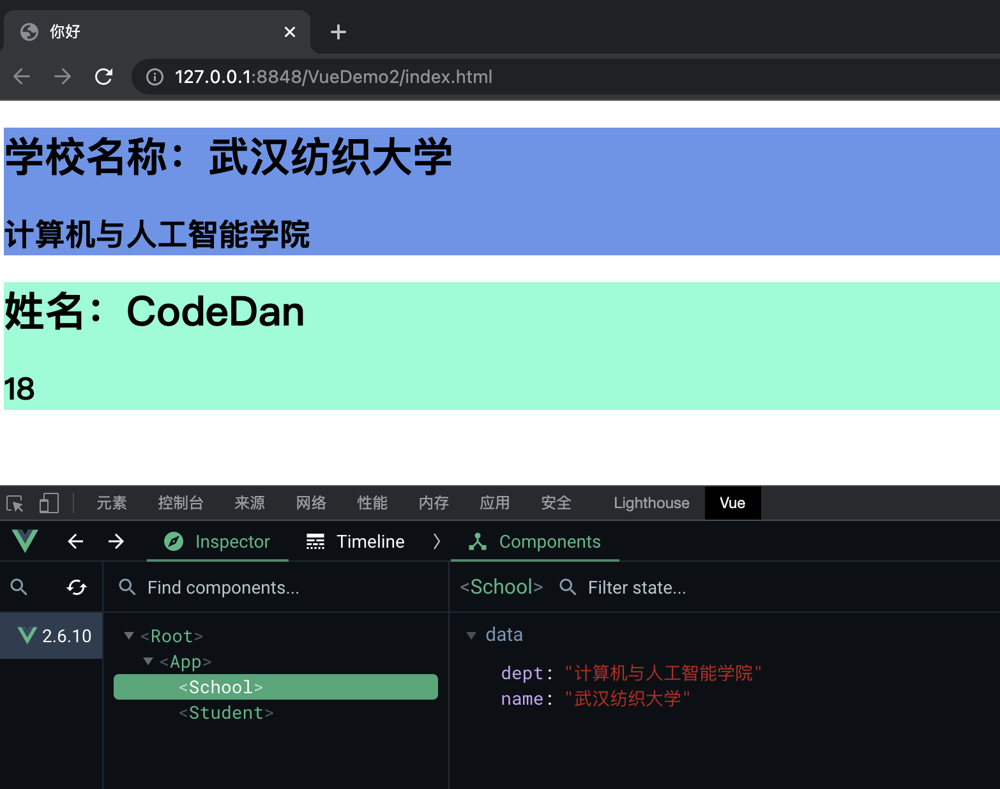

### Vue组件化开发

在正常前端开发中，如果多个页面出现相同的模块，那么我们会通过在多个HTML文件中编写并复制多个相同的HTML代码，并复用多个JS以及CSS文件。虽然存在复用，但是复用率低，毕竟HTML文件中存在大量冗余代码。

但是Vue组件化开发不同，其将页面中不同模块进行区分，然后由一个Vue组件实例去生成单独的模块，多个Vue组件实例即可完成一个页面的生成。

所以Vue组件化开发中一个Vue组件包含了此组件CSS代码、JS代码、HTML代码。哪怕离开了原来的页面，此Vue组件实例在别的页面也能正常使用。

当然一个页面不可能由多个Vue组件随意去生成，而是交给一个名为`app`的大哥级别的Vue组件实例去管理这些其他的Vue组件实例。因为这些其他Vue组件实例可能存在各种嵌套关系，必须在源头交给一个大哥管理。

最后大哥Vue组件实例归一个页面对应一个的Vue实例去管理。

-----

### 组件化开发实例

##### 非单文件组件写法

```html
<!DOCTYPE html>
<html>
    <head>
        <meta charset="utf-8" />
        <title>你好</title>
        <script type="application/javascript" src="js/vue.js"></script>
        <style>
            .student{
                background-color: aquamarine;
            }
            .school{
                background-color: cornflowerblue;
            }
        </style>
    </head>

    <body>

        <div id="root">

        </div>

        <script type="application/javascript">


            // 实例组件第一步：进行创建。Vue.extend()创建Vue组件实例语法
            let student = Vue.extend({
                template:`<div class="student"><h1>姓名：{{ name }}</h1> <h2> {{ age }} </h2> </div>`,
                //data函数式编写，因为组件可以那里需要去那里，
                //所以必须要让多个相同Vue组件实例的data进行去共享化，避免线程安全冲突
                data(){
                    return {
                        name:'CodeDan',
                        age:18
                    }
                }
            })

            let school = Vue.extend({
                template:`<div class="school"><h1>学校名称：{{ name }}</h1><h2>{{ dept }}</h2></div>`,
                data(){
                    return {
                        name:'武汉纺织大学',
                        dept:'计算机与人工智能学院'
                    }
                },
                //实例组件第二步：进行绑定。进行自定义标签与组件实例的绑定
                //四种命名规则：
                //    一.当只有一个单词时，要不选择和组件名称一致，要不直接不写自动生成自定义标签
                //    二.当有多个单词时，要不使用'_'进分隔,自定义标签名相同，要不采用全部首字母大些的方式，自定义标签名相同。
                components:{
                    student:student
                }
            })

            let app = Vue.extend({
                name:'app',
                //实例组件第三步：进行使用，在html标签中使用自定义标签即可使用
                template:`<div><school></school><student></student></div>`,
                components:{
                    school:school,
                    student:student,
                }
            })

            new Vue({
                el:"#root",
                //必须存在一个根元素
                template:`<app></app>`,
                components:{
                    app:app
                }
            })

        </script>
    </body>
</html>


```



可以发现上述写法中Vue组件实例只能包含Html部分代码以及JS代码，但是其组件渲染的CSS代码还是得写在当前页面HTML文件中，或者引入的外部CSS文件中，组件化开发应该将CSS文件也一并写入到对应的Vue组件实例中。

&nbsp;

##### 单文件组件写法

在开发中均采用单文件组件写法，即一个文件只写一个Vue组件实例，此实例包含此组件的Html代码、CSS代码、JS代码。完整的将一个组件模块化。

不过要注意单文件的文件不再是HTML文件，而是Vue自己编写的`.vue`文件。此文件只能在脚手架模式下正常运行。

我们来改造上述的代码，使其变成单文件组件式写法：

***student.vue内容展示：***

```html
<!-- 编写此组件的HTML代码 -->
<template>
    <div class="student">
        <h1>姓名：{{ name }}</h1> 
        <h2> {{ age }} </h2> 
    </div>
</template>

<!-- 编写此组件的JS代码 -->
<script>
    export default Vue.extend({
        name:'student',
        data(){
            return {
                name:'CodeDan',
                age:18
            }
        }
    })
</script>

<!-- 编写此组件的CSS代码 -->
<style>
    .student{
        background-color: aquamarine;
    }
</style>
```

***school.vue内容展示：***

```html
<template>
    <div class="school">
        <h1>学校名称：{{ name }}</h1>
        <h2>{{ dept }}</h2>
    </div>
</template>

<script>
    export default Vue.extend({
        name:'school',
        data(){
            return {
                name:'武汉纺织大学',
                dept:'计算机与人工智能学院'
            }
        }
    })
</script>

<style>
    .school{
        background-color: cornflowerblue;
    }
</style>
```

***app.vue内容展示：***

```html
<template>
    <div>
        <school></school>
        <student></student>    
    </div>

</template>

<script>
    import student from 'student.vue';
    import school from 'school.vue';
    export default Vue.extend({
        name:'app',
        components:{
            school:school,
            student:student,
        }
    })
</script>

<style>

</style>
```

***main.js内容展示：***

```js
import app from './app.vue';

new Vue({
    el:'#root2',
    template:`<app></app>`,
    components:{
        app:app
    }
})
```

***index.html内容展示：***

```html
<!DOCTYPE html>
<html>
    <head>
        <meta charset="utf-8">
        <title></title>
        <script type="application/javascript" src="js/vue.js"></script>
    </head>
    <body>


        <div id="root2">

        </div>
        <script type="application/javascript" src="./main.js"></script>
    </body>
</html>

```
