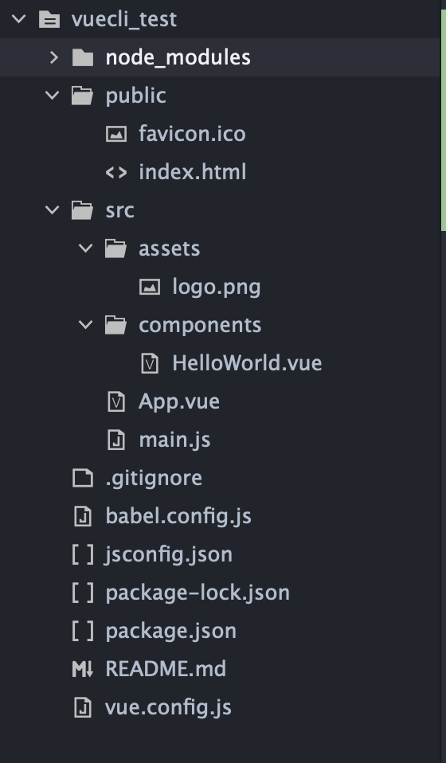
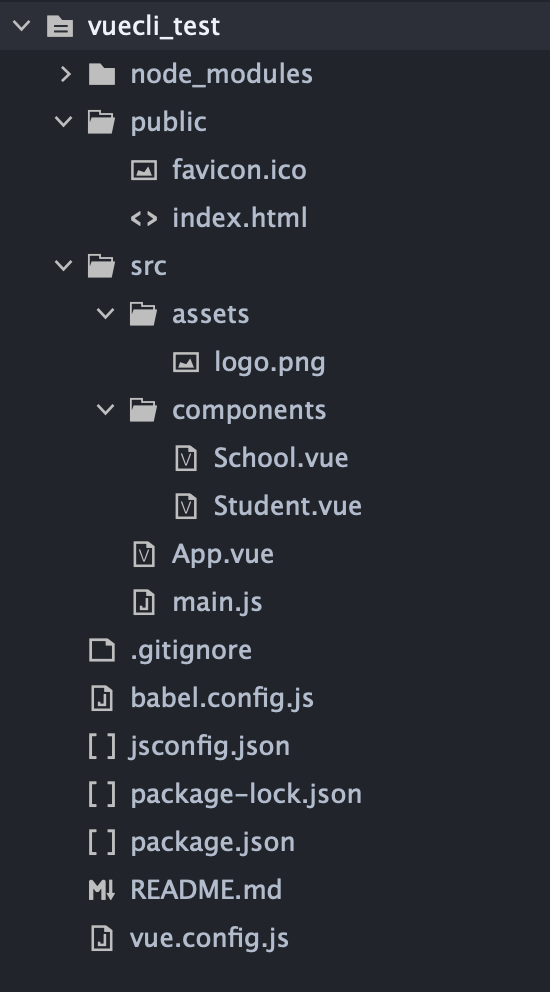
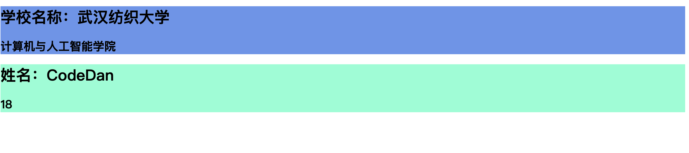

### Vue脚手架安装

[Macbook 苹果电脑 安装搭建Vue脚手架教程m1芯片Vue脚手架初学_Trillion-star的博客-CSDN博客_mac安装vue脚手架](https://blog.csdn.net/No1banana/article/details/124590181)

-----

### Vue脚手架使用

创建指令：

```tex
> vue create fileUrl/fileName  
```

运行项目指令：

```tex
> cd fileUrl/fileName
> npm run serve | yarn serve
```

暂停项目运行指令：

```tex
Ctrl+C
```

-----

### Vue脚手架结构解析

 目录结构如下所示：



+ ***node_modules目录***：即当前运行时环境所依赖的其他组件存放目录

+ ***public目录***：存放核心html文件以及ico格式的网站logo

+ ***src目录***：存放vue项目的诸多核心文件。比如app组件实例以及main.js启动文件等
  
  + ***assets目录***：存放静态文件的地方
  
  + ***components目录***：存放除app组件实例之外的全部其他组件实例的目录

----

### 运行上一个项目"单文件组件实例项目"

首先项目结构：



***Student.vue文件***

```html
<!-- 编写此组件的HTML代码 -->
<template>
    <div class="student">
        <h1>姓名：{{ name }}</h1> 
        <h2> {{ age }} </h2> 
    </div>
</template>

<!-- 编写此组件的JS代码 -->
<script>
    export default {
        //根据ESlint标准，name必须具备两个单词而且全部大驼峰
        name:'StudentModel',
        data(){
            return {
                name:'CodeDan',
                age:18
            }
        }
    }
</script>

<!-- 编写此组件的CSS代码 -->
<style>
    .student{
        background-color: aquamarine;
    }
</style>
```

***School.vue***

```html
<template>
    <div class="school">
        <h1>学校名称：{{ name }}</h1>
        <h2>{{ dept }}</h2>
    </div>
</template>

<script>
    export default {
        //根据ESlint标准，name必须具备两个单词而且全部大驼峰
        name:'SchoolModel',
        data(){
            return {
                name:'武汉纺织大学',
                dept:'计算机与人工智能学院'
            }
        }
    }
</script>

<style>
    .school{
        background-color: cornflowerblue;
    }
</style>
```

***App.vue***

```html
<template>
    <div>
        <School></School>
        <Student></Student>    
    </div>

</template>

<script>
    //根据ESlint标准，除了App.vue之外，from必须不能带.vue
    import Student from './components/Student';
    import School from './components/School';
    export default {
        name:'App',
        components:{
            //根据ESlint标准，只能使用大驼峰或者_
            School,
            Student,
        }
    }
</script>

<style>

</style>
```

***main.js***

```js
import Vue from 'vue'
import App from './App.vue';

new Vue({
    el:'#app',
    render: h => h(App),
})
```

***index.html***

```html
<!DOCTYPE html>
<html lang="">
  <head>
    <meta charset="utf-8">
    <meta http-equiv="X-UA-Compatible" content="IE=edge">
    <meta name="viewport" content="width=device-width,initial-scale=1.0">
    <link rel="icon" href="<%= BASE_URL %>favicon.ico">
    <title><%= htmlWebpackPlugin.options.title %></title>
  </head>
  <body>
    <noscript>
      <strong>We're sorry but <%= htmlWebpackPlugin.options.title %> doesn't work properly without JavaScript enabled. Please enable it to continue.</strong>
    </noscript>
    <div id="app"></div>
    <!-- built files will be auto injected -->
  </body>
</html>
```

    

    

##### 对于Vue搭建项目时注意点（Render）

对于Vue来说，分为`Vue核心`以及`Vue模版解析器`，如果使用脚手架构建的Vue项目，那么只引入了Vue核心，也就是如下代码：

```js
import Vue from 'vue'
```

对于Vue模版解析器并么有进行引入，那么就需要在Vue实例中引入其他子组件时，使用`render`函数进行处理。

```js
import Vue from 'vue'
import App from './App.vue'

Vue.config.productionTip = false

const app = new Vue({
  //引入Vue组件不全，所以需要使用render进行组件的引入解析
  render: h => h(App),
})

app.$mount('#app')
```

    

    

### Vite搭建Vue项目

```tex
npm init vite@latest  ｜ yarn create vite
```

按照顺序填写项目名称，选择项目前端框架Vue，最选择是采用普通Vue还是有代码检查的Vue-ts即可

跳转到脚手架搭建的项目中，执行下属指令：

```tex
npm install
```

或者

```tex
yarn
```

对于Vite搭建Vue项目来说，其使用`createApp`函数在内部使用render函数完成了对根组件App的模版解析，代码如下所示：

```js
const app = createApp(App)
```