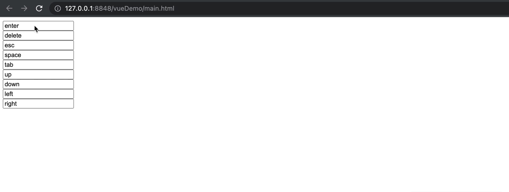
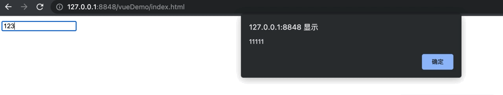

### Vue键盘事件

##### 处理方式一：直接使用Vue定义好的键盘事件用法

Vue准备了下述几个已经定义好的键盘别名来提供使用：

+ Enter ----- 回车

+ delete  ----- 删除

+ ese ----- 退出

+ space ----- 空格

+ tab ----- 换行(这个使用得注意，不能使用keyup，得使用keydown)

+ up ----- 键盘上

+ down ----- 键盘下

+ left ----- 键盘左

+ right ----- 键盘右

使用方式如下代码所示：

```html
<!DOCTYPE html>
<html>
    <head>
        <meta charset="utf-8">
        <title></title>
        <script type="application/javascript" src="js/vue.js"></script>
    </head>

    <body>
        <div id="holder">
            <input type="text" v-model="enter1" @keyup.enter="show1" style="display: block;"/>
            <input type="text" v-model="delete1" @keyup.delete="show2" style="display: block;"/>
            <input type="text" v-model="esc1" @keyup.esc="show3" style="display: block;"/>
            <input type="text" v-model="space1" @keyup.space="show4" style="display: block;"/>
            <input type="text" v-model="tab1" @keydown.tab="show5" style="display: block;"/>
            <input type="text" v-model="up1" @keyup.up="show6" style="display: block;"/>
            <input type="text" v-model="down1" @keyup.down="show7" style="display: block;"/>
            <input type="text" v-model="left1" @keyup.left="show8" style="display: block;"/>
            <input type="text" v-model="right1" @keyup.right="show9" style="display: block;"/>
        </div>

        <script type="application/javascript">
            const vm = new Vue({
                el:"#holder",
                data:{
                    enter1: "enter",
                    delete1:"delete",
                    esc1:"esc",
                    space1:"space",
                    tab1:"tab",
                    up1:"up",
                    down1:"down",
                    left1:"left",
                    right1:"right"

                },
                methods:{
                    show1(){
                        alert(this.enter1);
                    },
                    show2(){
                        alert(this.delete1);
                    },
                    show3(){
                        alert(this.esc1);
                    },
                    show4(){
                        alert(this.space1);
                    },
                    show5(){
                        alert(this.tab1);
                    },
                    show6(){
                        alert(this.up1);
                    },
                    show7(){
                        alert(this.down1);
                    },
                    show8(){
                        alert(this.left1);
                    },
                    show9(){
                        alert(this.right1);
                    }
                }
            })

        </script>
    </body>
</html>
```



&nbsp;

##### 处理方式二：自定义Vue键盘映射

虽然Vue提供了常用的键盘的别名映射，但是还有一些不常用的键盘按键也可能在业务中使用，所以Vue提供了自定义键盘按键别名的方式。

**格式：Vue.config.keyCodes.自定义别名 = 按钮的KeyCode**

```html
<!DOCTYPE html>
<html>
    <head>
        <meta charset="utf-8">
        <title></title>
        <script type="application/javascript" src="js/vue.js"></script>

    </head>
    <body>
        <div id="root">
            <input type="text" @keyup.huiche="show" value="123" />
        </div>

        <script type="application/javascript">
            //自定义语句,vue.config.keyCodes.自定义别名 = 按键的KeyCode
            Vue.config.keyCodes.huiche=13;
            const vm1 = new Vue({
                el:'#root',
                methods:{
                    show(){
                        alert("11111");
                    }
                }
            })
        </script>
    </body>
</html>
```



--------

### Vue特殊键盘事件

即组合按键的键盘事件，比如ctrl，shift，alt以及meta(window的图标健，mac的command健)。

这些按键在`keyup`与`keydown`之间的用法完全不同。

+ ***keydown模式下***：没有组合健的说法，ctrl，shift，alt以及meta按下就执行对应的事件

+ ***keyup模式下***：组合健的使用模式，ctrl，shift，alt以及meta按住后再按任意健，放开任意键的同时触发事件。

<mark>使用上这些已经被Vue别名处理过了，直接使用即可。</mark>
