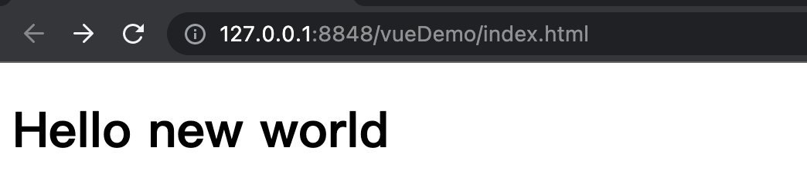
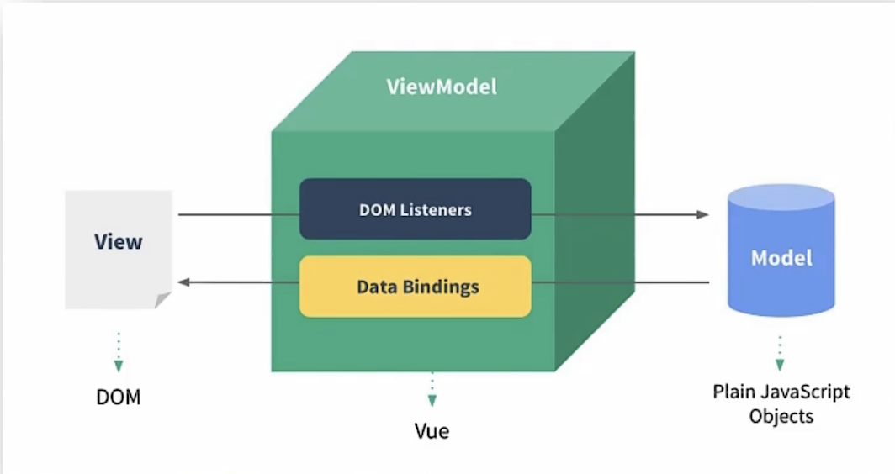
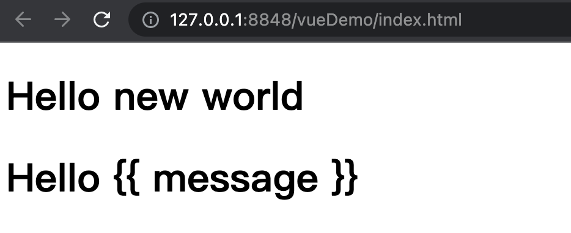

### vue.js介绍与特点

> 往常的前端动态页面开发都是通过js不断的去编写指令，通过指令去完成HTML中不同的动态数据显示。比如js获取数据后进行凭借html，最后获取到显示组件后将类型进行显示。
> 
> 这样当我们缺少任何一个js指令下，这个动态数据的显示就是不完整的，甚至是失败的。所以vue.js就可以保证让开发者脱离这种`命令式开发模式`。
> 
> vue.js采用`声明式编程`，即将动态数据进行封装后为数据源之后，直接就可以在前端页面上通过vue特定动态语法进行动态显示。无需多个指令操作。

vue开发就围绕三个特点：

1. ***采用组件式模式***，提高代码复用率，并让代码更好的维护。

2. ***声明式编程***，让编程人员无需直接操作DOM，提高开发效率。

3. ***使用虚拟DOM+优秀的DIff算法***，尽量复用DOM节点

关于第三个特点，举个例子就好理解了。比如一个聊天平台，采用双向通信WebSocket协议进行消息交互，前端向后端获取当前在线人数后，将A，B，C三个人数据进行拼接后显示在了在线列表中。

此时D上线了，那么后端就会去通知前端并发送当前在线人员列表，这个列表和第一次的列表只相差D一个人，其他均一摸一样。正常我们会将数据重新拼接后，再显示。

而vue则不同，尽量不使用替换机制，而是使用虚拟DOM(相当于DOM缓存对象)保存第一次数据源生成的DOM后，将此虚拟DOM转化为

页面显示的真实DOM。那么当第二次数据来时，再次将第二次数据生成新的虚拟DOM，此时关键在于`当存在对应的虚拟DOM时，其次产生的虚拟DOM会与其进行比较(Diff算法)，得到与其不同的数据`，vue会将已存在虚拟DOM中和其次产生的新虚拟DOM中共同部分数据对应的真实DOM进行复用，不会生成新的DOM。而将通过diff算法获取不同数据进行真实DOM的创建并追加显示。

------

### vue环境搭建(非脚手架)

任何vue的实际运用都建议查询官方文档：[vue官网文档](https://cn.vuejs.org/v2/guide/)

##### hello word搭建

1）首先得引入vue.js。引入方式可以是通过script标签src字段进行vue.js的路径引入(可以网络引入和本地引入)。本地引入的话，已放入本笔记物料中。网络引入url为`https://cdn.jsdeliver.net/npm/vue/dist/vue.js`

```html
<!DOCTYPE html>
<html>
    <head>
        <meta charset="utf-8" />
        <title></title>
        <script type="application/javascript" src="./js/vue.js"></script>
    </head>
    <body>

    </body>
</html>
```

2）下载vue开发者工具：[github网址](https://github.com/vuejs/vue-devtools#vue-devtoolhttps://github.com/vuejs/vue-devtools#vue-devtoolss)，下载对应浏览器的开发者工具，这里默认google。下载完成后开启google开发者模式并添加扩展程序，将下载的开发者工具中vue_dev_tools.crx拖动到google并使用即可。这里已将vue_dev_tools.crx放入物料。

安装要注意可能说Google不让你直接拖进去安装，点击[chrome无法从该网站添加应用、扩展程序和用户脚本的有效解决方法_suancai1993的博客-CSDN博客_无法从该网站添加应用,扩展程序或脚本](https://blog.csdn.net/suancai1993/article/details/120410784)看看如何解决即可。

&nbsp;

3）在html编写如下代码，完成Hello world的代码编写。

```html
<!DOCTYPE html>
<html>
    <head>
        <meta charset="utf-8" />
        <title></title>
        <script type="application/javascript" src="./js/vue.js"></script>

    </head>
    <body>
        <div id="root">
            <h1>Hello {{ message }}</h1>
        </div>

        <!--为什么这里写在root的div之下，因为vue来说，是先有的root所代表的div组件，
        后才有vue实例，所以必须先写容器，再写对应vue实例-->
        <script type="application/javascript">
        //阻止vue在启动的时候生成生产提示
        Vue.config.productionTip = false;
        const vm = new Vue({
            el:'#root',
            data:{
                message:'new world'
            }
        });
        </script>
    </body>
</html>
```



-------

### MVVM模型介绍

VUE作者在开发Vue时，参考但是没有完成使用MVVM模型，Vue的MVVM模型实际上是三个不同的组件组成，分别是Model，ViewModel以及View组成。

1. Model模型：对应Vue实例对象中data包含的数据。

2. View视图：对应Html中与Vue实例绑定的DOM，我们也称其为Vue模版。

3. ViewModel视图模型：Vue实例对象。



------

### 有趣的小扩展

##### 迷魂小class

如果当我们把vue实例对象中绑定的组件选择器变成`class选择器`，并出现多个相同的class组件，那么数据还会显示嘛。如下图代码所示。

```html
<!DOCTYPE html>
<html>
    <head>
        <meta charset="utf-8" />
        <title></title>
        <script type="application/javascript" src="./js/vue.js"></script>

    </head>
    <body>
        <div class="root">
            <h1>Hello {{ message }}</h1>
        </div>

        <div class="root">
            <h1>Hello {{ message }}</h1>
        </div>

        <script type="application/javascript">
        Vue.config.productionTip = false;
        const vm = new Vue({
            el:'.root',
            data:{
                message:'new world'
            }
        });

        </script>
    </body>
</html>
```



**<mark>我们会发现只有第一个div组件出现了数据，第二个div并没有出现数据。</mark>**

***所以结果就是多个class中，只有第一个class会显示对应vue实例中的数据。***

&nbsp;

##### 迷魂小vue

如果当我们把vue实例对象中绑定的组件选择器变成`id选择器`，并出现`一个div组件对应多个vue实例对象`，那么数据会怎么显示？ 如下图代码所示。

```html
<!DOCTYPE html>
<html>
    <head>
        <meta charset="utf-8" />
        <title></title>
        <script type="application/javascript" src="./js/vue.js"></script>

    </head>
    <body>
        <div id="root">
            <h1>Hello {{ message }}</h1>
        </div>

        <script type="application/javascript">
        Vue.config.productionTip = false;
        const vm = new Vue({
            el:'#root',
            data:{
                message:'new world'
            }
        });
        const vm02 = new Vue({
            el:'#root',
            data:{
                message:'new world02'
            }
        });
        const vm03 = new Vue({
            el:'#root',
            data:{
                message:'new world03'
            }
        });

        </script>
    </body>
</html>
```


<mark>***只显示第一个vue实例中的数据，并会在console中进行报错。***</mark>
