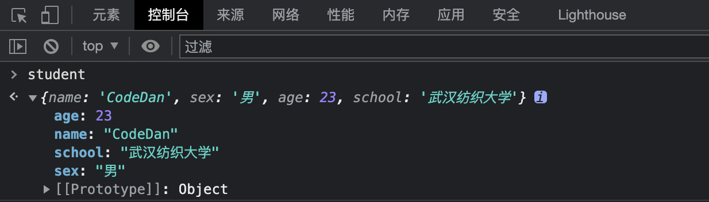
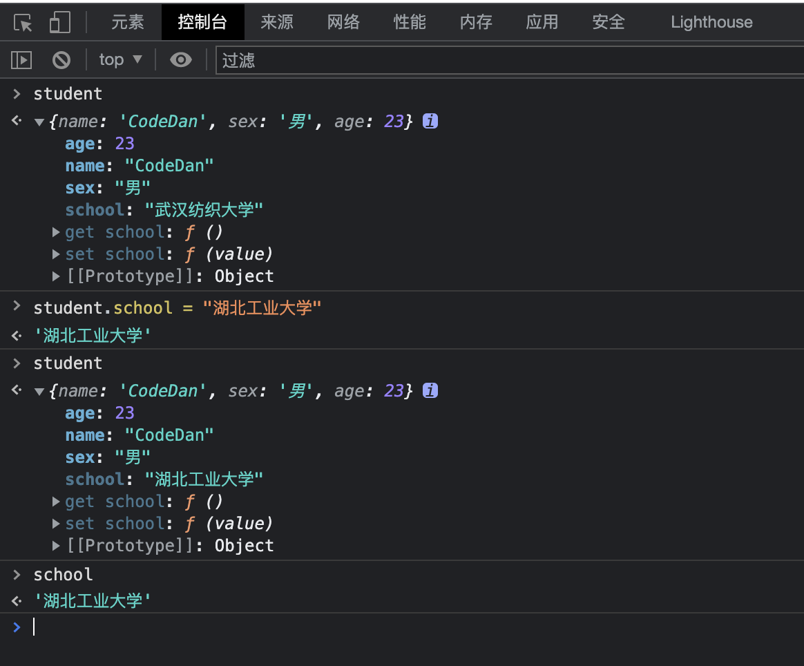
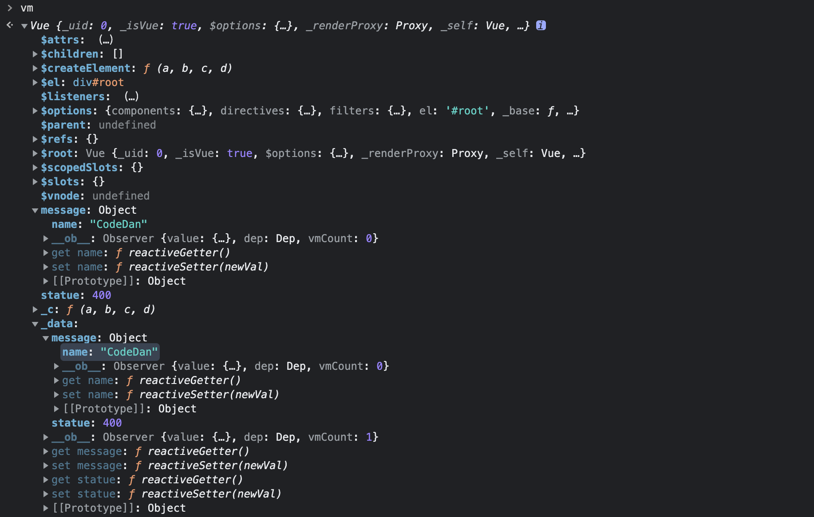
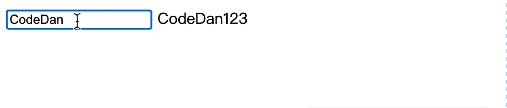

### 数据代理解析

> 在前端编程过程中，可能会动态添加和删除一个对象中的字段，那么如何做到这一点就是数据代理的作用。

在javaScript中，我们可以定义一个student对象，其拥有name，sex，age等字段，那么如何动态的往student对象中添加一个school字段呢？

<mark>(后端快速理解)</mark>首先我们可以确定student对象是一个`被代理对象`，school字段可以是为被代理对象新增的`业务逻辑`，那么我们还需要一个`代理方式`来将新增的业务逻辑增加到被代理对象中生成代理对象。

在JS中，这个代理对象的表达就是Object.defineProperty方法，通过这个`代理方式`就可以完成新增业务逻辑动态的添加到被代理对象，生成新的代理对象。

具体操作如下代码所示：

```html
<!DOCTYPE html>
<html>
    <head>
        <meta charset="utf-8">
        <title></title>
    </head>
    <body>

        <script type="application/javascript">
            let school = "武汉纺织大学";

            let student = {
                name:"CodeDan",
                sex:"男",
                age:23
            }

            Object.defineProperty(student,'school',{
                value:school,
                enumerable:true, //控制新增属性是否可以被枚举，true为允许枚举，默认是false
                writable:true, //控制属性是否可以被修改，true为允许修改，默认是false
                configurable:true //控制属性是否可以被删除，true为允许删除，默认是false
            })

        </script>
    </body>
</html>
```



可以看到school字段已经成功动态的加入到student对象中，**但是这样是有缺陷的，当我们修改student对象中的school字段时，只有student对象中的school会修改，原本的school依旧是原来的值**

所以我们需要优化一下代理对象中的代理操作，优化方式如下代码所示：

```html
<!DOCTYPE html>
<html>
    <head>
        <meta charset="utf-8">
        <title></title>
    </head>
    <body>

        <script type="application/javascript">
            let school = "武汉纺织大学";

            let student = {
                name:"CodeDan",
                sex:"男",
                age:23
            }

            Object.defineProperty(student,'school',{
                //调用时机：第一次获取数据的时候调用以及当依赖数据发生改变时调用
                //时机一：这里只有第一次获取数据的时候调用，其他只要不改变依赖字段，那么只读取缓存
                //时机二：这里也就是当school变量发生改变时，student中的school字段就会调用get
                get:function(){
                    return school;
                },
                //当修改student对象中school字段时调用
                set:function(value){
                    school = value;
                }
            })

        </script>
    </body>
</html>
```



上述就是JS原生数据代理的方式解析，知道这个之后就可以来看看Vue实例是如何封装了JS原生数据代理的。

------

### Vue潜在的数据代理

### data数据代理

当我们在Vue实例中定义data数据时，其实就是在给当前Vue实例添加单个或者多个字段，Vue实例就相当于一个被代理对象，data就相当于新增字段，他们通过Vue封装处理之后的Object.defineProperty方法自动完成代理关系的建立。

也就是说只要在data中添加了单条或者多条字段，那么就会动态的给Vue实例增加单挑或者多条字段。

**那么我们就可以知道原来不管是插值还是指令语法读取的js表达式均是Vue实例中自身的字段，而不是直接读取的data中的数据。**

通过下述代码来理解一下Vue中潜在的数据代理：

```html
<!DOCTYPE html>
<html>
    <head>
        <meta charset="utf-8" />
        <title></title>
        <script type="application/javascript" src="./js/vue.js"></script>
    </head>
    <body>
        <div id="root">
            <h1>Hello {{ message.name }}</h1>
            <h3>{{ statue }}</h3>
        </div>

        <script type="application/javascript">
        Vue.config.productionTip = false;
        const vm = new Vue({
            el:'#root',
            //对象式data
            data:{
                statue:400,
                message:{
                    name:"CodeDan"
                },
            }
        });
        </script>
    </body>
</html>
```



我们可以从console控制台中获取到Vue实例对象中动态添加的status字段和message对象以及包含在其中的name字段。并且还可以看到他们的get和set方法。

<mark>最关键！！！！！可以看到_data字段就是新增字段集合</mark>

也就是说，现在Vue数据代理的三大关键——`被代理对象(Vue实例)`,`新增字段(_data)`，`代理对象(被封装的defineProperty方法)`都被我们找到了，所以其实Vue数据代理就是这三个东西进行组成的。

&nbsp;

##### computed数据代理

computed数据代理与data数据代理不同，不再是单纯的自动封装代理。而是将主动权`set`和`get`交给了开发者，然后再去将此字段代理进代理对象中。

```html
<!DOCTYPE html>
<html>
    <head>
        <meta charset="utf-8">
        <title></title>
        <script type="application/javascript" src="js/vue.js"></script>

    </head>
    <body>
        <div id="root">
            <input type="text"  v-model="name" />
            <span>{{ result }}</span>
        </div>

        <script type="application/javascript">
            //自定义语句,vue.config.keyCodes.自定义别名 = 按键的KeyCode
            Vue.config.keyCodes.huiche=13;
            const vm1 = new Vue({
                el:'#root',
                data:{
                    name:"CodeDan"
                },
                computed:{
                    result:{
                        //调用时机：第一次获取数据的时候调用以及当依赖数据发生改变时调用
                        get(){
                            return this.name+"123";
                        },
                        //当修改student对象中school字段时调用
                        set(value){
                            return this.name = value;
                        }
                    },
                    //当只需要使用computed中的字段的get方式时，可以这样简写
                    // result(){
                    //     return this.name+"123";
                    // }
                }
            })
        </script>
    </body>
</html>
```



-------

### 开发小扩展

我们在原生数据代理时，被代理对象与新增字段之间存在修改均修改的关系。在Vue中也是相同。

不过在Vue中需要注意，被代理对象是Vue实例，新增字段是__data，由于__data和data存在映射关系，所以可以看成同一个东西。所以get和set方法成立。

**如果是直接在data中值是死数据的话，上述话语一点儿毛病没有，但是如果data中值是变量，那么就会发现，修改Vue实例中新增字段时，同时改变的只会是__data和data，变量的值不会随之改变。**
