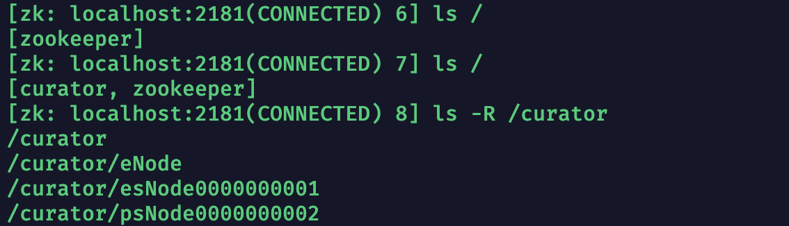
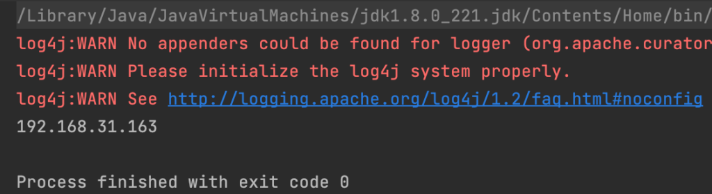
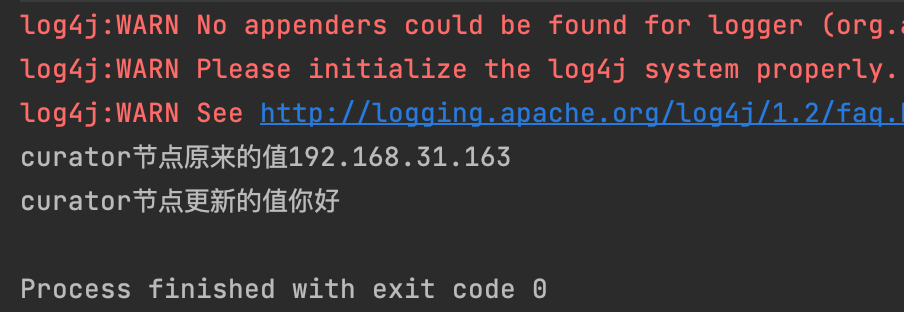

## 连接工具Curator

Curator是Neflix公司开源的一套zookeeper客户端框架，Curator是对Zookeeper支持最好的客户端框架，封装了绝大多数的Zookeeper功能。

```
坐标：
<!-- Curator-->
<!-- https://mvnrepository.com/artifact/org.apache.curator/curator-framework -->
<dependency>
    <groupId>org.apache.curator</groupId>
    <artifactId>curator-framework</artifactId>
    <version>2.12.0</version>
</dependency>

<!-- https://mvnrepository.com/artifact/org.apache.curator/curator-recipes -->
<dependency>
    <groupId>org.apache.curator</groupId>
    <artifactId>curator-recipes</artifactId>
    <version>2.12.0</version>
</dependency>
```

注意：Curator的坐标会让Maven自动去下载其所需要的依赖包，即Zookeeper3.4.8包，所以当我们服务器上ZK的版本不是3.4.8的时候，我们就需要干涉一下了，让Curator不在依赖这个3.4.8版本之后，我们再引入我们自己的版本。这里笔者的版本的是3.7.0。所以我下面引入的是ZK3.7.0。

```
    <!-- https://mvnrepository.com/artifact/org.apache.zookeeper/zookeeper -->
    <dependency>
      <groupId>org.apache.zookeeper</groupId>
      <artifactId>zookeeper</artifactId>
      <version>3.7.0</version>
      <!--    如果是boot项目，要排除掉zk中的日志文件，不然会和boot自带日志jar冲突        -->
      <exclusions>
         <exclusion>
             <artifactId>slf4j-log4j12</artifactId>
             <groupId>org.slf4j</groupId>
         </exclusion>
      </exclusions>
    </dependency>
    <!-- Curator-->
    <!-- https://mvnrepository.com/artifact/org.apache.curator/curator-framework -->
    <dependency>
      <groupId>org.apache.curator</groupId>
      <artifactId>curator-framework</artifactId>
      <version>2.12.0</version>
      <exclusions>
        <exclusion>
          <groupId>org.apache.zookeeper</groupId>
          <artifactId>zookeeper</artifactId>
        </exclusion>
      </exclusions>
    </dependency>
    
    <!-- https://mvnrepository.com/artifact/org.apache.curator/curator-recipes -->
    <dependency>
      <groupId>org.apache.curator</groupId>
      <artifactId>curator-recipes</artifactId>
      <version>2.12.0</version>
    </dependency>
```

------

## 如何配置Zookeeper

如果是使用java项目，那么创建一个resources目录后添加一个application.properties文件写入以下配置信息：

```
//连接重试的次数
curator.retryCount=5
//连接重试的时间
curator.elapsedTimeMs=5000
//zookeeper服务器所在的IP:PORT,如果存在集群，则使用,分开
curator.connectString=121.199.79.104:2181
//会话超时时间
curator.sessionTimeoutMs=60000
//连接超时时间
curator.connectionTimeoutMs=5000
```

[如果是普通java项目]创建一个ZK连接工具类，在其中利用之前的配置信息生成一个CuratorFrameWork对象并返回

```
public class ZkUtil {
    //静态对象保证并发单例
    private static CuratorFramework curatorFramework;

    static {
        //通过ResourceBuild对象获取到配置文件信息
        ResourceBundle zkResource = ResourceBundle.getBundle("application");
        //获取到连接重试次数
        int retryCount = Integer.parseInt(zkResource.getString("curator.retryCount"));
        //获取到重试间隔时间
        int elapsedTimeMs = Integer.parseInt(zkResource.getString("curator.elapsedTimeMs"));
        //获取到ZK服务器的地址
        String connectString = zkResource.getString("curator.connectString");
        //获取到会话超时时间
        int sessionTimeoutMs = Integer.parseInt(zkResource.getString("curator.sessionTimeoutMs"));
        //获取到连接超时时间
        int connectTimeoutMs = Integer.parseInt(zkResource.getString("curator.connectionTimeoutMs"));
        curatorFramework = CuratorFrameworkFactory.newClient(
                connectString,
                sessionTimeoutMs,
                connectTimeoutMs,
                new RetryNTimes(retryCount,elapsedTimeMs));
    }


    public static CuratorFramework getCuratorFramework(){
        return curatorFramework;
    }
}
```

------

[如果是Boot项目]创建一个WrapperZK配置类，使用@ConfigurationProperties(prefix = “curator”)配合@Component把此配置对象放入IOC容器中。

```
@Configuration
public class ZKConfig {
    
    @Autowired
    WrapperZK wrapperZK;

    @Bean(initMethod = "start")
    public CuratorFramework curatorFramework(){
        return CuratorFrameworkFactory.newClient(
                wrapperZK.getConnectString(),
                wrapperZK.getSessionTimeoutMs(),
                wrapperZK.getConectionTimeoutMs(),
                new RetryNTimes(wrapperZK.getRetryCount(),wrapperZK.getElapsedTimeMs()));
    }
}

@Data
@Component
@ConfigurationProperties(prefix = "curator")
public class WrapperZK {
    private int retryCount;
    private int elapsedTimeMs;
    private String connectString;
    private int sessionTimeoutMs;
    private int conectionTimeoutMs;
}
```

------

## Curator测试使用

#### 创建各种节点

测试方法：

```
    private CuratorFramework curatorFramework = ZkUtil.getCuratorFramework();
    @Test
    public void createNode(){
        //关键关键关键：使用之前先执行start方法，如果是boot则不需要，因为放入ioc之前就已经start了@bean(initMeth = "start")
        curatorFramework.start();
        try {
            /**CreateMode有四大类型
             * (1) PERSISTENT:即持久节点类型
             * (2) PERSISTENT_SEQUENTIAL:即持久序号类型
             * (3) EPHEMERAL:即临时节点类型
             * (4) EPHEMERAL_SEQUENTIAL:即临时序号类型
             * **/
            //添加持久性节点(默认使用CreateMode.PERSISTENT)
            curatorFramework.create().forPath("/curator");
            //创建临时节点
            curatorFramework.create().withMode(CreateMode.EPHEMERAL).forPath("/curator/eNode");
            //添加临时序号节点
            curatorFramework.create().withMode(CreateMode.EPHEMERAL_SEQUENTIAL).forPath("/curator/esNode");
            //添加持久顺序节点
            curatorFramework.create().withMode(CreateMode.PERSISTENT_SEQUENTIAL).forPath("/curator/psNode");

            //为了可以看到临时节点和临时顺序节点
            TimeUnit.SECONDS.sleep(20);
            //使用完，记得关闭客户端
            curatorFramework.close();
        } catch (Exception e) {
            e.printStackTrace();
        }

    }
```

**在create().creatingParentsIfNeeded().forPath(“url”)可以完成递归创建。**

结果：



休眠2两秒之后，等待连接关闭之后，再次查看：


------

#### 获取到节点数据

测试方法：

```
    private CuratorFramework curatorFramework = ZkUtil.getCuratorFramework();
    @Test
    public void getNode(){
        curatorFramework.start();
        try {
            //获取到节点的数据
            byte[] bytes = curatorFramework.getData().forPath("/curator");
            System.out.println(new String(bytes));

            curatorFramework.close();
        } catch (Exception e) {
            e.printStackTrace();
        }
    }
```

结果：




------

#### 更新节点数据

测试方法：

```
    private CuratorFramework curatorFramework = ZkUtil.getCuratorFramework();
    @Test
    public void setNode(){
        curatorFramework.start();
        try {
            byte[] bytes = curatorFramework.getData().forPath("/curator");
            System.out.println("curator节点原来的值"+new String(bytes));
            curatorFramework.setData().forPath("/curator","你好".getBytes(StandardCharsets.UTF_8));
            byte[] bytes2 = curatorFramework.getData().forPath("/curator");
            System.out.println("curator节点更新的值"+new String(bytes2));
            curatorFramework.close();
        } catch (Exception e) {
            e.printStackTrace();
        }
    }
```

结果：



------

#### 删除节点数据

测试方法：

```
    @Test
    public void deleteNode() throws Exception {
        curatorFramework.start();
        curatorFramework.delete().forPath("/curator/psNode0000000002");
        curatorFramework.close();
    }
```

结果：

