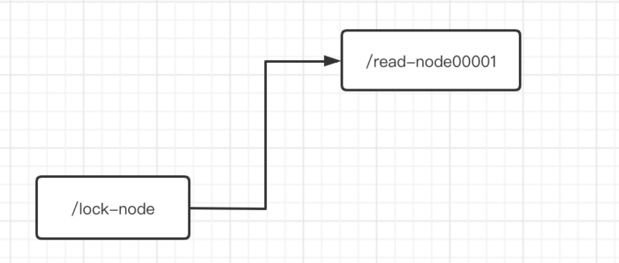

## ZK实现读写锁

(1)读锁：即对于读锁来说，被上了读锁的共享数据，依旧可以被其他线程加上读锁后获取到数据。但是已经被上了读锁的数据不能被加上写锁。

(2)写锁：即对于写锁来说，被上了写锁的共享数据，只能被当前上锁线程访问修改，无法被其他线程加上任何锁，即我无法获取/修改数据。

那么ZK如何实现读写锁呢？

**ZK实现读写锁的关键在于”临时序号节点”，节点的数据值只能为”read”或者”write”以及watch监听机制。**

**关于watch监听的作用就在于被监听节点一旦有指定操作发生，那么就会让监听节点执行指定操作。**

读锁的上锁流程：

1)当我们想对共享数据A加读锁时，首先当前欲加锁线程会使用ZK创建一个临时序号节点，节点数据为read，表示这是读锁节点。

2)检查此读锁之前是否有写锁或者自己是否是最小序号节点

3）若有先注册的写锁，则对该读锁的前一个写锁(最近的写锁)的监听，然后阻塞该读锁的获取。若监听到该读锁前一个写锁已释放，则该读锁打开阻塞后重新执行第二步。反之加锁成功。

------

写锁的上锁流程：

1）当我们想对共享数据A加写锁时，首先当前欲加锁现场会使用ZK创建一个临时序号节点，节点数据为write，表示这是写锁节点。

2）然后获取到ZK中比自己序号小的所有节点，判断一下最小的节点是不是自己。

3）如果是，则写锁添加成功，反之说明前面还有任意锁，写锁添加失败。使用watch去监听最小的节点，如果最小的节点有变化，再去执行第二步。

------

我们来模拟一下并发场景，让读者更容易理解上述过程，我们准备依次在/lock-node节点下插入/read-node00001，/read-node00002，/read-node00003，/write-node00004，/write-node00005，/read-node00006，/write-node00007。

1）线程1想要获取到共享数据A的读锁，ZK生成一个/read-node00001，数据为read。检测到自己为序号最小的节点，线程一获取到共享数据A的读所成功。ZK中结构如下所示：



2）线程2想要获取到共享数据A的读锁，ZK生成一个/read-node00002，数据为read。检测到自己不是序号最小的节点但是最小的序号节点/read-node00001数据为read，所以线程二获取到共享数据A的读所成功。ZK中结构如下所示：


3）线程3想要获取到共享数据A的读锁，ZK生成一个/read-node00003，数据为read。检测到自己不是序号最小的节点但是最小的序号节点/read-node00001数据为read，所以线程三获取到共享数据A的读所成功。ZK中结构如下所示：


4）线程4想要获取到共享数据A的写锁，ZK生成一个/write-node00004，数据为write。检测到自己不是序号最小的节点，所以当前线程阻塞，并使用watch监听序号最小的节点/read-node00001。ZK中结构如下所示：


5）线程5想要获取到共享数据A的写锁，ZK生成一个/write-node00005，数据为write。检测到自己不是序号最小的节点，所以当前线程阻塞，并使用watch监听序号最小的节点/read-node00001。ZK中结构如下所示：


6）线程6想要获取到共享数据A的读锁，ZK生成一个/read-node00006，数据为read。检测到自己不是序号最小的节点而且自己前面有写锁，线程6进入阻塞，并监听离自己最近的写锁节点/write-node00005。ZK中结构如下所示：


7）线程7想要获取到共享数据A的写锁，ZK生成一个/write-node00007，数据为write。检测到自己不是序号最小的节点，所以当前线程阻塞，并使用watch监听序号最小的节点/read-node00001。ZK中结构如下所示：


------

我们开始依次解锁：

1）线程1读取完共享数据A之后，释放锁节点/read-node00001。watch机制通知/write-node00004，/write-node00005，/write-node00007唤醒线程4，5，7。但是发现自己依然不是最小的序号节点，所以继续监听当前最小序号节点/read-node00002。ZK结构如下：


2）线程2，3读取完共享数据A之后，释放锁节点/read-node00002，/read-node00003。watch机制通知/write-node00004，/write-node00005，/write-node00007唤醒线程4，5，7。此时线程4发现自己是最小序号节点，获取到共享数据A的写锁，但是5和7发现自己依然不是最小的序号节点，所以继续监听当前最小序号节点/write-node00004。ZK结构如下：


3）线程4修改完共享数据A之后，释放锁节点/write-node00004。watch机制通知/write-node00005，/write-node00007唤醒线程5，7。此时5发现自己是当前最小序号节点，获取到共享数据A的写锁，但是线程7发现自己依然不是最小的序号节点，所以继续监听当前最小序号节点/write-node00005。ZK结构如下：


5）线程5修改完共享数据A之后，释放锁节点/write-node00005。watch机制通知/read-node00006，/write-node00007唤醒线程6，7。此时6发现自己是当前最小序号节点，获取到共享数据A的读锁，但是线程7发现自己依然不是最小的序号节点，所以继续监听当前最小序号节点/read-node00006。ZK结构如下：


6）线程6获取到共享数据A之后，释放锁节点/read-node00006。watch机制通知/write-node00007唤醒线程7。此时7发现自己是当前最小序号节点，获取到共享数据A的写锁，ZK结构如下：


7）线程7修改完共享数据A之后，释放锁节点/write-node00007。结束。

------

------

## 羊群效应

何为羊群效应？

我们来看看如果100个并发获取写锁请求下，ZK的结构：


此时，如果/write-node00001被释放，那么会发生什么事情，watch机制会把/write-node00002…00100所代表的线程全部唤醒，然后再次判断后进行阻塞并watch新的节点。

这要是发生在大并发环境下，会消耗ZK最大的性能，所以我们要避免这种情况。

**如果我们采用写锁的链式监听方式，不在统一监听当前最小序号节点的话，就可以避免羊群效应。**

写锁的链式监听即当自己不是最小序号节点的时候，不再监听当前最小序号节点，而是监听自己的上一个节点，无论这个节点是写锁还是读锁。如下图所示：


------

------

## Watch机制原理

可以把Watch机制理解为注册在特定Znode上的触发器，一旦这个Znode发生改变，[[在zkCli层面]也就是对此Znode使用create，delete，set指令时，将会触发此Znode上注册的对应事件，请求Watch的客户端会接收到异步通知。]

```
//zkCli客户端使用get指令使用watch，监听一个指定Znode
get -w 被监听节点路径

//zkCli客户端使用ls指令使用watch，监听指定目录，一旦这个目录中创建和删除子节点都会收到通知，但是这个目录的孙子节点被创建，不会触发watch。
ls -w 被监听节点路径

//如果你想在上一条ls指令中，完成孙子节点的创建/删除时触发watch的话，使用-R
ls -R -w 被监听节点路径
```

------

**Watch机制的底层原理：即在Znode节点中维护着一条Hash表，此HashTable记录这当前watch此节点的其他客户端key-value信息。一旦这个被watch的znode被调用了指定方法之后，ZK服务端就会去找到这个Znode维护的HashTable，获取到对应的所有Watcher，然后异步通知客户端。并且删除此哈希表中的所有Watcher。**

也就是说，当一个Znode的watch事件被触发之后，下次这个Znode再发生watch事件就不会被触发了。**除非你在异步事件中再次去watch此节点。**

**扩展：客户端的异步回调采用NIO思想实现**

------

## 使用Curator实现Watch机制

思路概述：使用curatorframework和指定Znode路径创建NodeCache对象后，使用NodeCache对象添加监听器后，放入我们编写好的监听器触发事件NodeCachaListener类对象后，启动NodeCache对象。

```
        curatorFramework.start();
        NodeCache nodeCache = new NodeCache(curatorFramework, "/curator");
        nodeCache.getListenable().addListener(new NodeCacheListener() {
            @Override
            public void nodeChanged() throws Exception {
                System.out.println("我被触发拉");
            }
        });
        nodeCache.start();
```

测试方法：


结果：手动使用zkCli进行触发


我们会发现，在程序执行的时候，首先会执行一次我们编写好的触发事件，然后等真正被触发的时候，才算是被触发调用了一次。**但是如果我们再多次触发的话，我们会发现还能触发！！！！但是在双方都是ZKCli时，不会被连续触发，除非触发后又进行了watch。**


**所以猜测编写的nodeChanged方法应该是在Curator中被封装为**“**注册一次，N次触发”的触发事件。**


------

------

## 使用Curator实现ZK读写锁

编写思路：编写两个方法，其中一个方法用以获取/lock1节点的读锁，其中一个方法用以获取/lock1节点的写锁。

```
    /**
     * testGetReadLock方法通过线程池，模拟多个线程获取同一个节点的读锁情况
     * */

    @Test
    public void testGetReadLock() throws IOException {
        //创建一个线程池对象，我们使用线程池来管理我们所需要的线程
        ExecutorService executorService = Executors.newFixedThreadPool(10);
        //开启连接ZK
        curatorFramework.start();
        //我们模拟10个线程来获取读锁
        for(int index = 0 ; index < 10 ; index++){
            //提交给线程池的事件
            executorService.execute(()->{
                function();
            });
        }
        //暂停程序，用来观察锁的释放情况
        System.in.read();
        //关闭ZK连接
        curatorFramework.close();
    }

    public void function() {
        SimpleDateFormat df = new SimpleDateFormat("HH:mm:ss");
        //获取到Curator封装的读写锁对象
        InterProcessReadWriteLock interProcessReadWriteLock =
                new InterProcessReadWriteLock(curatorFramework, "/lock1");
        //获取到读锁
        InterProcessLock interProcessLock = interProcessReadWriteLock.readLock();
        try {
            System.out.println(Thread.currentThread().getName() + "尝试到锁"+df.format(new Date()));
            interProcessLock.acquire();
            System.out.println(Thread.currentThread().getName() + "获取到锁"+df.format(new Date()));
            //休眠10秒，模拟读取数据所花费的时间，当一个线程获取读锁之后会占用这个锁10秒。
            TimeUnit.SECONDS.sleep(10);
            System.out.println(Thread.currentThread().getName() + "释放锁"+df.format(new Date()));
            interProcessLock.release();
        } catch (Exception e) {
            try {
                interProcessLock.release();
            } catch (Exception er) {
                er.printStackTrace();
            }
            e.printStackTrace();
        }
    }
```

我们先单独测试读锁：直接运行我们的testGetReadLock方法。


我们会发现几乎是同时我们的10个线程获取到读锁，如果过了10秒之后几乎同时释放了读锁，由此可见，读锁编写成功。

------

```
 /**
     * 此方法通过线程池，模拟多个线程获取同一个节点的写锁情况
     * */
    @Test
    public void testGetWriteLock() throws IOException {
        //创建一个线程池对象，我们使用线程池来管理我们所需要的线程
        ExecutorService executorService = Executors.newFixedThreadPool(10);
        //开启连接ZK
        curatorFramework.start();
        //我们模拟10个线程来获取写锁
        for(int index = 0 ; index < 10 ; index++){
            //提交给线程池的事件
            executorService.execute(()->{
                function2();
            });
        }
        //暂停程序，用来观察锁的释放情况
        System.in.read();
        //关闭ZK连接
        curatorFramework.close();
    }

    public void function2() {
        SimpleDateFormat df = new SimpleDateFormat("HH:mm:ss");
        //获取到Curator封装的读写锁对象
        InterProcessReadWriteLock interProcessReadWriteLock =
                new InterProcessReadWriteLock(curatorFramework, "/lock1");
        //获取到写锁
        InterProcessLock interProcessLock = interProcessReadWriteLock.writeLock();
        try {
            System.out.println(Thread.currentThread().getName() + "尝试到写锁"+df.format(new Date()));
            interProcessLock.acquire();
            System.out.println(Thread.currentThread().getName() + "获取到写锁"+df.format(new Date()));
            //休眠10秒，模拟修改数据所花费的时间，当一个线程获取写锁之后会占用这个锁10秒。
            TimeUnit.SECONDS.sleep(10);
            System.out.println(Thread.currentThread().getName() + "释放写锁"+df.format(new Date()));
            interProcessLock.release();
        } catch (Exception e) {
            try {
                interProcessLock.release();
            } catch (Exception er) {
                er.printStackTrace();
            }
            e.printStackTrace();
        }
    }
```

我们再单独测试写锁：直接运行我们的testGetWriteLock方法。


我们会发现几乎所有线程同时尝试获取锁，但是获取到锁的只有一个，之后只有等待上一个锁释放之后，其他线程才能获取到锁。

------

**当我们把两个方法一起运行的时候，就会出现之前模拟读写锁流程图的情况。当读锁被获取时，获取写锁线程被被阻塞，而注册了写锁节点之后的读锁节点并没有获取到读锁。而是等待获取读锁。**