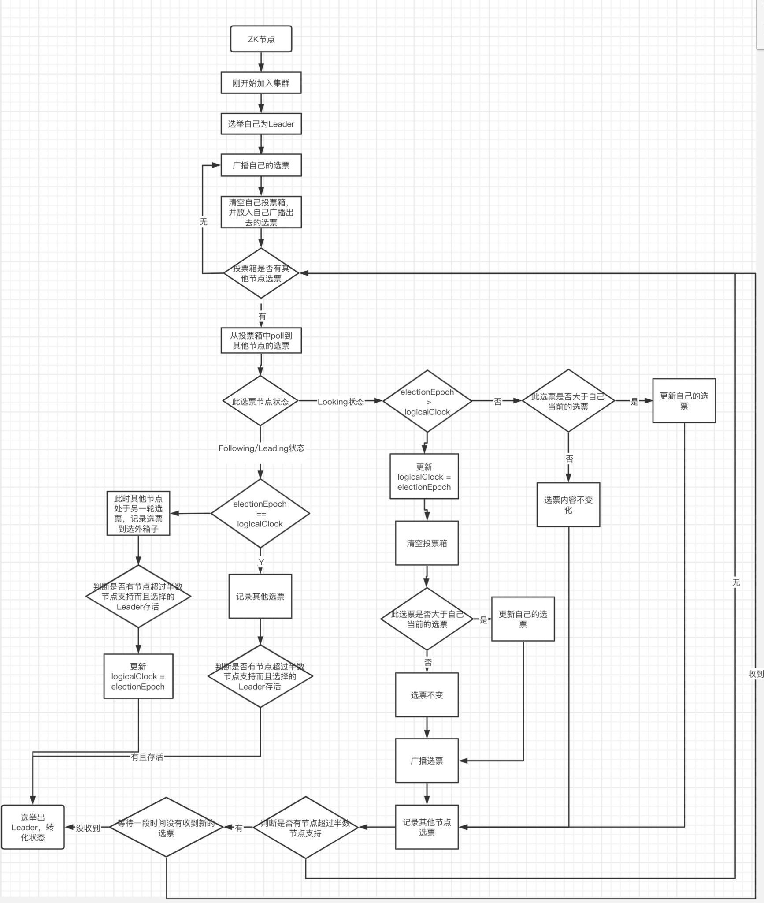

## ZK集群结构简介

**与Redis的多主多从集群结构不同，ZK的集群为一主多从结构。**

ZK集群主要由三种角色组成：

1）**Leader**：即处理集群中所有的事务请求，ZK集群中只有一个Leader。

2）**Follower**：只能处理读请求，参与Leader的选举。

3）**Observer**：只能处理读请求，且不参与Leader的选举。

综上所示：我们可以得到

当写请求到达ZK集群的时候，首先更新到Leader节点(此节点为ZK服务器)，然后再同步到Follower节点和Observer节点。

当读请求到达ZK集群的时候，从任意从节点获取数据。

------

## 搭建ZK集群步骤

环境：共搭建4台ZK服务器，一个Leader节点，两个Follower节点，一个Observer节点。

(1)我们首先在linux的zk安装目录下的zkdata目录中创建zk1….zk4四个子目录作为每个节点持久化数据的存储目录并分别创建myid文件，分别输入1，2，3，4作为ZK服务器ID。**必须不同**。

```
mkdir -p /usr/local/zookeeper-3.7.0/zkdata/zk1
mkdir -p /usr/local/zookeeper-3.7.0/zkdata/zk2
mkdir -p /usr/local/zookeeper-3.7.0/zkdata/zk3
mkdir -p /usr/local/zookeeper-3.7.0/zkdata/zk4
```

(2)编辑每个服务器对应的zoo.cfg文件，并把这些文件路径记好，最后启动指令需要使用。修改的内容如下：**[注意：server.myid=IP的IP，如果说你是云服务器而且准备在一台服务器上部署这四个ZK节点的话，IP使用云服务器提供的内网IP(因为不管是同步数据和选举信息在一台服务器上算是内部通信)，如果分开机器部署的话，写对外IP即可]**

```properties
#此为zookeeper-3.7.0/conf目录下的zoo1.cfg文件
dataDir=/usr/local/zookeeper-3.7.0/zkdata/zk1
clientPort=2181
#我们来解析一个server.1=121.199.79.104:2001:3001,其中server.1为每个ZK服务器的myId，121.199.79.104为ZK服务器节点所在服务器IP，2001端口为集群内部节点的信息同步端口，3001为集群内部节点的选举信息传递端口。
server.1=121.199.79.104:2001:3001
server.2=121.199.79.104:2002:3002
server.3=121.199.79.104:2003:3003
server.4=121.199.79.104:2004:3004:observer
```

```properties
#此为zookeeper-3.7.0/conf目录下的zoo2.cfg文件
dataDir=/usr/local/zookeeper-3.7.0/zkdata/zk2
clientPort=2182
server.1=121.199.79.104:2001:3001
server.2=121.199.79.104:2002:3002
server.3=121.199.79.104:2003:3003
server.4=121.199.79.104:2004:3004:observer
```

```properties
#此为zookeeper-3.7.0/conf目录下的zoo3.cfg文件
dataDir=/usr/local/zookeeper-3.7.0/zkdata/zk3
clientPort=2183
server.1=121.199.79.104:2001:3001
server.2=121.199.79.104:2002:3002
server.3=121.199.79.104:2003:3003
server.4=121.199.79.104:2004:3004:observer
```

```properties
#此为zookeeper-3.7.0/conf目录下的zoo4.cfg文件
dataDir=/usr/local/zookeeper-3.7.0/zkdata/zk4
clientPort=2184
server.1=121.199.79.104:2001:3001
server.2=121.199.79.104:2002:3002
server.3=121.199.79.104:2003:3003
server.4=121.199.79.104:2004:3004:observer
```

(3)分别启动不同配置文件所代表的ZK服务器，如果是云服务器记得设置端口安全组和开发linux防火墙端口号。

```
#在zookeeper-3.7.0/bin目录下执行如下指令
./zkServer.sh start ../conf/zoo1.zfg
./zkServer.sh start ../conf/zoo2.zfg
./zkServer.sh start ../conf/zoo3.zfg
./zkServer.sh start ../conf/zoo4.zfg
```

**注意：一定记得先全部启动之后，再使用stauts指令查看一下启动情况！！！可以从Mode信息中看出那台是Leader，那台是Follower，那台是observer。**

(4) zkCli连接集群的方式

```
./zkCli.sh -server 10.43.73.10:2181,10.43.73.10:2182,10.43.73.10:2183
```

------

------

## 从ZK集群选举与数据同步理解ZAB协议

通过上述操作，我们就可以建立起一个ZK集群，虽然我们大概知道ZK是通过主节点去同步从节点数据，来保证数据的一致性的。但是我们并不知道具体的方式是什么以及这个方式带来的数据一致性强弱怎么样？

ZK为了保证集群中节点的数据一致性，**使用了ZAB(Zookeeper Atomic[原子] Broadcast[广播])协议**，这个协议用以解决ZK集群的**崩溃恢复和主从数据同步**的问题。

ZAB协议的崩溃恢复和主从数据同步从选举出Leading开始，那么ZAB协议一共为选举定义了四种节点状态：

1）**Looking**：选举状态

2）**Following**：Follower节点所处状态

3）**Leading**：Leader节点所处状态

4）**ObServing**：观察者节点所处状态

还需要知道的选举关键知识点：

选举就要有选票和投票箱(recvset)，选票的主要字段如下所示：

1）**logicalClock字段**和**electionEpoch字段**：均为逻辑时钟，是本次选举的轮数，每次投票都会自增，本地节点称为logicalClock，别人发来的投票中被称为electionEpoch字段。

2）**epoch字段**：每台服务器给出投票中被推举为leader的逻辑时钟，epoch越大，成为leader的几率越大

3）**zxid字段**：ZK服务器节点的事务ID，每次对此节点增删改都会自增。

4）**sid字段**：也就是每个服务器节点对应的myid。

5）**leader字段**：代表此投票节点选的被投节点sid。

**投票之间比较的规则为：先比较epoch，然后比较zxid，最后比较sid。顺序下来那个大就停止比较。**

然后再来说说这个投票箱(recvset)的作用：**收集自己广播出去以及别的节点广播过来的选票**

**注意：投票箱(recvset)会在自己广播出去自己的选票时被清空。**

------

现在我们可以来看看崩溃恢复和主从数据同步的具体流程了，不直接贴出源码了，上程序流程图便于理解

**第一步：选举(Fast Leader Election)**



模拟环境：

server1的myid=1，zxid=9

server2的myid=2，zxid=8

server3的myid=3，zxid=8

模拟一下三个节点同时处于Looking状态下的选举过程：

(1)首先通过myid大的连接小的原理，Server3连接到Server2，Server2连接到Server1，保证集群的节点之间内部选举通信后，Server1，2，3均生成了自己的选票分为如下所示：

```
//server1
epoch = 1
zxid = 9
myid = 1
logicalock = 1
status=looking
//server2
epoch = 1
zxid = 8
myid = 2
logicalock = 1
status=looking
//server3
epoch = 1
zxid = 8
myid = 1
logicalock = 1
status=looking
```

均把各自生成的选票广播出去，此时各自节点的投票箱如下所示： **//投票显示主要内容{myid，zxid}**

```
//server1的投票箱
{1,9},{2,8},{3,8}
//server2的投票箱
{2,8},{1,9},{3,8}
//server3的投票箱
{3,8},{1,9},{3,8}
```

看到每个节点投票箱中投票内容之后，我们开始逐轮分析：

第一轮选票过程：

——1.当server1广播出自己的选票之后，首先清空server1节点的投票箱后，此选票也会进入到自己的投票箱中。然后投票箱记录到选票{2,8}，首先判断此选票节点状态为looking，那么继续发现logicalClock==electionEpoch，那么我们就要比较双方epoch的值，发现相同，那么继续比较zxid，发现自身的zxid大于选票中的zxid，那么不更新选票，继续等待记录其他选票。最后选票{3,8}到来，还是老样子，判断状态是否为looking，比较logicalClock与electionEpoch的值后，再去比较选票大小，最后结果是继续不更新选票。检查投票箱中是否有被选举节点选票数量超过了节点总数的一半，发现没有，等待投票箱记录新的选票。

——2.当server2广播出自己的选票之后，首先清空server2节点的投票箱后，此选票也会进入到自己的投票箱中。然后投票箱记录到选票{1,9}，首先判断此选票节点状态为looking，那么继续发现logicalClock==electionEpoch，那么我们就要比较双方epoch的值，发现相同，那么继续比较zxid，发现自身的zxid小于选票中的zxid，更新自己的选票为{1,9}（注意只是更新还未广播出去）。最后选票{3,8}到来，还是老样子，判断状态是否为looking，比较logicalClock与electionEpoch的值后，再去比较选票大小，最后结果是不更新选票。检查投票箱中是否有被选举节点选票数量超过了节点总数的一半，发现没有，等待投票箱记录新的选票。

——3.当server2广播出自己的选票之后，首先清空server2节点的投票箱后，此选票也会进入到自己的投票箱中。然后投票箱记录到选票{1,9}，首先判断此选票节点状态为looking，那么继续发现logicalClock==electionEpoch，那么我们就要比较双方epoch的值，发现相同，那么继续比较zxid，发现自身的zxid小于选票中的zxid，更新自己的选票为{1,9}（注意只是更新还未广播出去）。最后选票{2,8}到来，还是老样子，判断状态是否为looking，比较logicalClock与electionEpoch的值后，再去比较选票大小，最后结果是不更新选票。检查投票箱中是否有被选举节点选票数量超过了节点总数的一半，发现没有，等待投票箱记录新的选票。

各节点等待多时发现没有新的选票，开启下一轮投票。

第二轮选票过程：

此时各自选票为：

```
//server1
epoch = 2
zxid = 9
myid = 1
logicalock = 2
status=looking
//server2
epoch = 2
zxid = 9
myid = 1
logicalock = 2
status=looking
//server3
epoch = 2
zxid = 9
myid = 1
logicalock = 2
status=looking
```

——1.当server1广播出自己的选票{1,9}之后，首先清空server1节点的投票箱后，此选票也会进入到自己的投票箱中。然后投票箱记录到选票{1,9}，首先判断此选票节点状态为looking，那么继续发现logicalClock==electionEpoch，那么我们就要比较双方epoch的值，发现相同，那么继续比较zxid，发现值相同，选票步改变，继续等待其他选票到来，最后选票{1,9}到来。还是老样子，判断状态是否为looking，比较logicalClock与electionEpoch的值后，再去比较选票大小，最后结果是不更新选票。检查投票箱中是否有被选举节点选票数量超过了节点总数的一半，发现有，为myid=1的节点，那么选举此节点为准Leader，自身状态变为Leading。

——2.当server2广播出自己的选票{1,9}之后，首先清空server2节点的投票箱后，此选票也会进入到自己的投票箱中。然后投票箱记录到选票{1,9}，首先判断此选票节点状态为looking，那么继续发现logicalClock==electionEpoch，那么我们就要比较双方epoch的值，发现相同，那么继续比较zxid，发现值相同，选票步改变，继续等待其他选票到来，最后选票{1,9}到来。还是老样子，判断状态是否为looking，比较logicalClock与electionEpoch的值后，再去比较选票大小，最后结果是不更新选票。检查投票箱中是否有被选举节点选票数量超过了节点总数的一半，发现有，为myid=1的节点，那么选举此节点为准Leader，自身状态变为Following。

——2.当server3广播出自己的选票{1,9}之后，首先清空server3节点的投票箱后，此选票也会进入到自己的投票箱中。然后投票箱记录到选票{1,9}，首先判断此选票节点状态为looking，那么继续发现logicalClock==electionEpoch，那么我们就要比较双方epoch的值，发现相同，那么继续比较zxid，发现值相同，选票步改变，继续等待其他选票到来，最后选票{1,9}到来。还是老样子，判断状态是否为looking，比较logicalClock与electionEpoch的值后，再去比较选票大小，最后结果是不更新选票。检查投票箱中是否有被选举节点选票数量超过了节点总数的一半，发现有，为myid=1的节点，那么选举此节点为准Leader，自身状态变为Following。

**扩展：**

(1)**当一个正常运行的集群突然由于网络等原因导致leader节点挂掉或者彼此之前无法通讯(当集群初始搭建成功并选举完成之后，Leader会使用心跳机制联系所有Follower)，此时会重新进行选举，所有的节点又会恢复到looking状态。当leader节点选举出来之后，所有的节点就会被更新成leading或者following**

(2)**leader选举只会发生在looking状态，也就是集群启动时，或者leader节点挂掉后这两种情况。**

------

**第二步：恢复(Recovery Phase)**

**此阶段的作用主要是去掉上一步中可能由于网络原因产生的多个准Leading节点以及数据的同步恢复。**

恢复阶段也被分为两个小阶段，分别为发现(Discovery)阶段和同步(Synchronization)阶段。

发现阶段：

(1)准Leader会收集其所连接的全部Follower节点中的各自最新epoch值，然后准Leader选出最大的epoch值后进行加1操作并广播给各个Follower。

(2)各个Follower收到最新的epoch值后，返回一个携带各自最大ZXID和历史事务日志的ACK报文给连接的准Leader节点。

同步阶段：

(1)准Leading接收到连接到其他Follower节点发来的ACK报文后，就把刚刚收集到最新历史事务日志同步给与其连接的所有Follower节点，只有当集群中半数Follower同步成功，此准Leader才会变成真正的Leading。

(2)至于可能出现的其他准Leader节点，同步不到半数的Follower后，自我转变状态为looking，其所连接的Follower们，由于通信不到这个之前为leading的节点，也纷纷变为looking去寻找真正的Leader了。

自此崩溃故障恢复完成，第三步为主从数据同步阶段。

------

**第三步：广播(BroadCast Phase)**

简单来说，就是Zookeeper常规情况下更新数据的时候，由Leader广播到所有的Follower。其过程如下：

1.客户端发出写入数据请求给任意Follower。

2.Follower把写入数据请求转发给Leader。

3.Leader采用二阶段提交方式，先发送Propose广播给Follower。

4.Follower接到Propose消息，写入日志成功后，返回ACK消息给Leader。

5.Leader接到半数以上ACK消息，返回成功给客户端，并且广播Commit请求给Follower。

**通过广播的步骤，我们会发现ZK集群的数据一致性也就是Zab协议既不是强一致性，也不是弱一致性，而是处于两者之间的单调一致性。它依靠事务ID和版本号，保证了数据的更新和读取是有序的。**