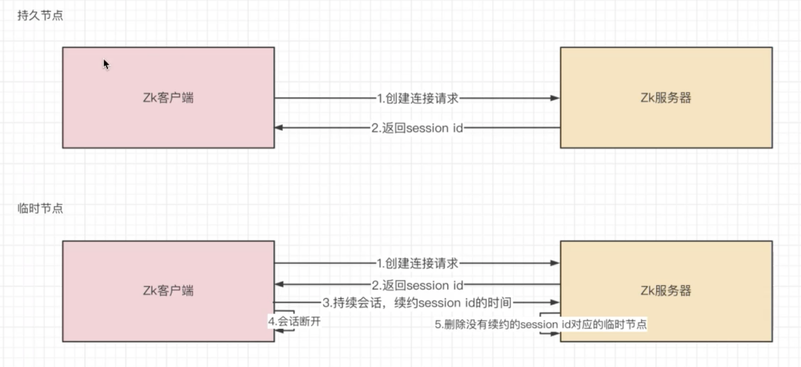

## Zookeeper如何保存数据的？

如下图所示：


**数据在Zookeeper上是使用节点的进行保存的，此节点也被称为Znode，多个Znode之间构成一颗树的目录结构**。

这颗树由数据为/的根节点开始，一颗完整的由Znode组成的树就为Zookeeper的数据存储结构。

这样的层级结构，让每一个Znode节点拥有唯一的路径，哪怕奔驰Znode在别的子树中存在，也属于不同的数据。

------

------

## zNode节点基本的操作方式(权限等操作具体章节解析)

1）获取到指定路径的Znode各种数据信息

还是以上图为例子。如果我们想要获取到奔驰的Znode，那么我们获取数据的方式为：

```
//获取到指定路径下Znode的下级所有Znode子节点信息,使用-R之后就是递归查询，一直查询到底部为止。
ls [-R] /指定路径/指定Znode名称
```


我们想要获取到汽车Znode节点中的数据的话

```
//获取指定路径下Znode节点中的数据,-s为stat效果
get [-s] /指定路径/指定Znode名称
```


我们想要获取到这个节点的具体信息

```
//获取指定路径下Znode节点的具体信息
stat /指定路径/指定Znode名称
```


我们解读一下这些参数都是什么含义：

(a)**cZxid参数**：*该数据节点被创建时的事务id*

(b)**cTime参数**：*节点的创建时间*

(c)**mZxid参数**：*该数据节点被修改时最新的事务id*

(d)**mTime参数**：*该数据节点最后被修改的时间*

(e)**pZxid参数**：*删除/添加子节点的事务id*

(f)**cversion参数**：*子节点的版本号*

(g)**version参数**：*当前节点的版本号*

(h)**dataVersion参数**：*当前节点数据的版本号*，每次修改一次数据，这个版本号就会自增1

(i)**aclVersion参数**：*权限的版本号*

(j)**ephemeralOwner参数**：*判断是否是临时节点，如果不是为0x0，反之就显示当前节点所有者的sessionID。*

(k)**dataLength参数**：*数据的长度*

(l)**numChildren参数**：*子节点的数量*

------

2）创建指定路径的Znode节点指令Create使用

**格式：create [-s] [-e] path data acl，其中path是路径，data是数据，acl是权限。**

```
//在指定路径下创建一个Znode，注意指定路径必须存在，如果不存在创建失败。
create /Znode名称
//在指定路径下创建一个Znode并写入数据，注意指定路径必须存在，如果不存在创建失败。
create /Znode名称 数据
//创建临时节点
create -e /Znode路径/Znode名称 数据 
//创建顺序节点
create -s /Znode路径/Znode名称
```


------

3）修改/设置节点的信息Set指令，**-v version相当于修改指定数据版本的节点数据。一旦数据版本不存在，那就会抛出异常。**

**格式：set \**[-v version]\** path data 修改节点**

```
//修改已存在的节点中数据
set /path data
```


数据版本自增1，现在数据版本从0变成了1，那么试试修改数据版本为0的此节点数据

```
//修改指定版本的已存在的节点中数据
set -v version /path data
```


我们会发现修改数据版本为0此节点数据失败，之后我们再修改版本为1的数据成功后，此数据版本再自增1。

------

4）删除指定路径下节点指令Delete，**-v version相当于删除指定数据版本的节点。一旦数据版本不存在，那就会抛出异常。**

**格式：delete [-v version] path 删除节点**

```
//删除已存在的节点
delete /path data
```


再来试试在狗狗数据版本为1的时候，删除数据版本为0的狗狗节点的话，能不能删除成功。

```
//删除指定版本下已存在的节点
delete -v version /path data
```


我们会发现删除数据版本为0的狗狗节点失败，只有当删除数据版本为1的狗狗节点才能删除成功。

```
//删除指定版本下已存在的节点
delete -v version /path data
```


我们会发现删除数据版本为0的狗狗节点失败，只有当删除数据版本为1的狗狗节点才能删除成功。

------

## 扩展：ZK中的版本号的作用

如果了解过Redis乐观锁和MySQL的MVCC机制实现的话，看到Zk的版本号就会有熟悉感。因为ZK也是使用版本号来实现乐观锁机制的。

即在并发环境下，大量修改请求会可能会获取到同一个版本的数据，但是修改提交的时候发现这个数据的版本已经被其他请求抢先更新过，那么这是大量的并发请求就会放弃此次修改。借此来保证并发环境下的共享数据的线程安全。

**但是同时也会体现出乐观锁的通病，也就是仅仅适合于读多写少的高并发环境。如果在写多读少的高并发环境下，还是建议使用悲观锁来优化并发性能。**

------

------

## Znode内部结构组成


Znode节点的内部组成如上图所示。分为存放节点数据的Data区域，存放节点各种信息的stat区域，记录Znode的访问权限，即哪些人或哪些IP可以访问本节点的ACL区域以及当前节点的子节点引用，类似于二叉树的左孩子右孩子的Child区域。

我们重点来看看ACL权限区域存放的内容：

(1)**c权限**：即create权限，允许在此节点下创建子节点

(2)**w权限**：即write权限，允许修改此节点的数据

(3)**r权限**：即read权限，允许访问获取这个节点的数据以及其本身和其子节点列表的各种信息的权限

(4)**d权限**：即delete权限，允许删除此节点

(5)**a权限**：即admin权限，允许对此节点进行权限设置/修改

------

#### 实操ZK权限展示

```
//给当前会话添加一个账号和密码
addauth digest username:password
//使用上述添加的账号来创建一个节点,并赋予全权限,权限可根据业务情况选择给予
create path data auth:username:password:cwrda
```


此时我们使用其他客户端连接，再试试查询/zld节点的数据


我们发现只有指定的会话才能对其进行acwrd操作。

------

------

## Znode的种类以及各自作用介绍

第一种：持久化节点：即创建此节点之后，哪怕客户端连接关闭，此节点依旧存在于Zookeeper服务器中。

```
创建指令：create path data
```

------

第二种：持久化顺序节点：即根据创建节点的先后顺序，会在节点名称后加上顺序号，越晚创建的顺序节点顺序号越大。

```
创建指令：create -s path [data]
```

------

第三种：临时节点：即创建此节点之后，客户端连接关闭，那么在Zookeeper服务器端就会把这个节点删除掉

```
创建指令：create -e path [data]
```

------

第四种：临时顺序节点：即顺序节点特性上加上临时节点的特性

```
创建指令：create -e -s path [data]
```

------

#### 扩展：临时节点的运作原理



正如上图所示：当客户端创建临时节点的时候，会在节点的stat区域中的ephemeralOwner字段上留下客户端的SessionId，一旦此客户端和服务器端断开，等ZK服务器内部存在的每隔一段时间定期清理的一个任务准备就绪，就会就查看当前有没有已经断开的sessionId，如果有，就会去检查节点中有没有拥有其sessionId的节点，有就进行删除。没有就把sessionId删除掉即可。

------

第五种：TTL节点：即设置了过期时间的节点，一旦超过过期时间，节点会被删除

```
创建指令：create -t /path [data]
```

------

第六种：container节点：为Zookeeper3.5版本新增节点，即容器节点，如果该容器节点下没有任何的子节点，那么会被每隔60s定期任务清除掉。

```
创建指令：create -c /path [data]
//注意：其子节点创建不再使用-c
```