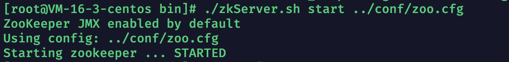

## Zookeeper是什么中间件？

ZooKeeper 是基于java开发的一个开源的分布式协调服务。它是一个为分布式应用提供一致性服务的中间件。

**分布式应用程序可以基于 Zookeeper 实现诸如数据发布/订阅、负载均衡、命名服务、分布式协调/通知、集群管理、Master 选举、分布式锁和分布式队列等功能。**

ZooKeeper 的目标就是封装好复杂易出错的关键服务，将简单易用的接口和性能高效、功能稳定的系统提供给用户。

------

------

## 浅谈Zookeeper的应用场景

### 作为分布式协调组件

就拿nginx搭建的反向代理多服务器集群环境来说。这些被反向代理的服务器集群上每个服务器中数据都是冗余的数据，我们假设其中一个数据为boolean flag = true。但是此时有一个请求被nignx负载均衡策略转发到服务器集群中的其中一台服务器上并修改了这个服务器上的flag = false，那么其他服务器的flag怎么办呢？如果不做任何措施，那么其他服务器上flag肯定还是true。

**那么zookeeper就可以作为这些冗余数据的监听器，一旦某个服务器上的冗余数据被修改，那么其就会去修改集群之后其他的所有服务器上的此数据。保证分布式系统下的数据一致性。**

------

### **作为分布式锁**

和redis一致，zookeeper也可以实现分布式锁的功能，两者的区别之一就在于如果锁位于两者的集群之中时，Redis分布式锁是属于AP体系，Zookeeper分布式锁属于CP体系。

------

### 作为无状态化的实现(kafka就是使用ZK做的去状态化)

关于无状态和有状态理解可以借助HTTP协议的无状态和TCP协议的有状态理解。在登录微服务的分布式部署下，如果说每个节点都是有状态的，那么每次被分发的请求不一定可以分发到拥有对应状态的节点中。所以我们需要实现所有节点去状态化，也就是把状态化信息存放到某个DB(Zookeeper)中，然后登录微服务去访问DB(Zookeeper)来判断此用户的状态。

------

------

## Zookeeper在Centos7下的安装

1）到[官网](https://zookeeper.apache.org/releases.html)中下载Zookeeper3.7.0版本的安装包（默认认为你的Centos7安装了java环境）


2）通过远程传输工具或者scp指令传输此安装包到指定Centos7安装服务器上

```
scp -r -p 22 /文件路径/apache-zookeeper-3.7.0-bin.tar.gz root@IP:/存放路径
```


3）使用tar指令解压apache-zookeeper-3.7.0-bin.tar.gz包

```
tar -zxvf ./apache-zookeeper-3.7.0-bin.tar.gz
```

4）进入到解压目录的conf目录下，使用mv指令通过zoo_sample.cfg配置文件模版创建一个zoo.cfg文件


```
//tickTime字段，用以配置zookeeper中的统一时间参数单位(毫秒)，下述也就是基本单位为2000毫秒也即是2秒
tickTime=2000
//initLimit字段，允许follower从节点初始化连接到Leader主节点的最大时长，使用tickTime做基本单位，也就是initLimit*tickTime为最后的时间，下述也就是10*2000为20秒。
initLimit=10
//syncLimit字段，允许follower从节点与Leader主节点数据同步的最长时间，使用tickTime做基本单位也就是initLimit*tickTime为最后的时间，下述也就是5*2000为10秒。
syncLimit=5
//dataDir字段，指明数据文件以及日志文件保存的地址
dataDir=/tmp/zookeeper
//clientPort字段，监听的端口
clientPort=2181
//maxClientCnxns字段，单个客户端与zookeeper的最大并发连接数量
maxClientCnxns=60
//autopurge.snapRetainCount字段，保存的数据快照数量，超过删除
autopurge.snapRetainCount=3
//autopurge.purgeInterval字段，自动触发清除任务时间间隔，小时为单位。默认为0，也就是不自动清除
autopurge.purgeInterval=1
```

使用mv指令创建zoo.cfg文件

```
mv zoo_sample.cfg ./zoo.cfg
```


5）回到bin目录下，启动zookeeper服务器

```
./zkServer.sh start ../conf/zoo.cfg
```



------

------

## Zookeeper服务器端的操作指令

(1)启动zk服务器

```
./zkServer.sh start ../conf/zoo.conf
```

(2)查看zk服务器状态

```
./zkServer.sh status ../conf/zoo.conf
```

(3)停止zk服务器

```
./zkServer.sh stop ../conf/zoo.conf
```