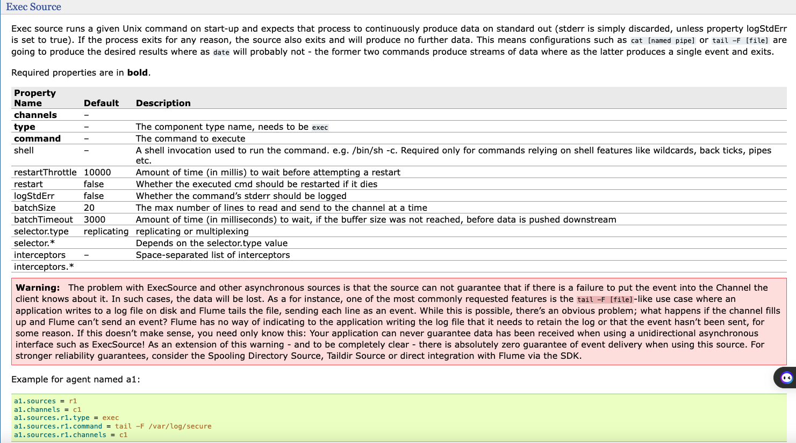
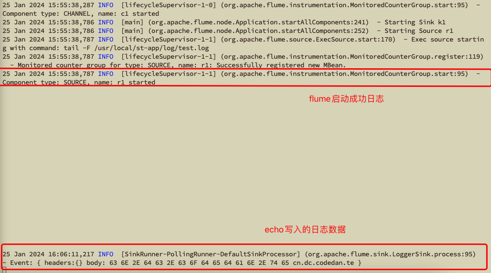
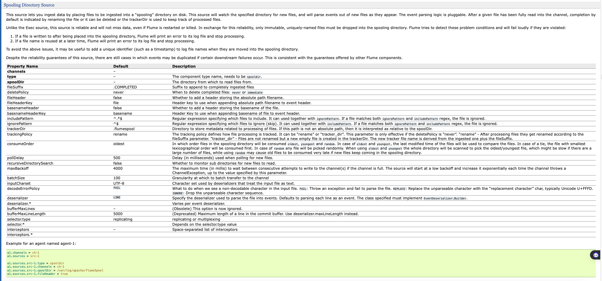
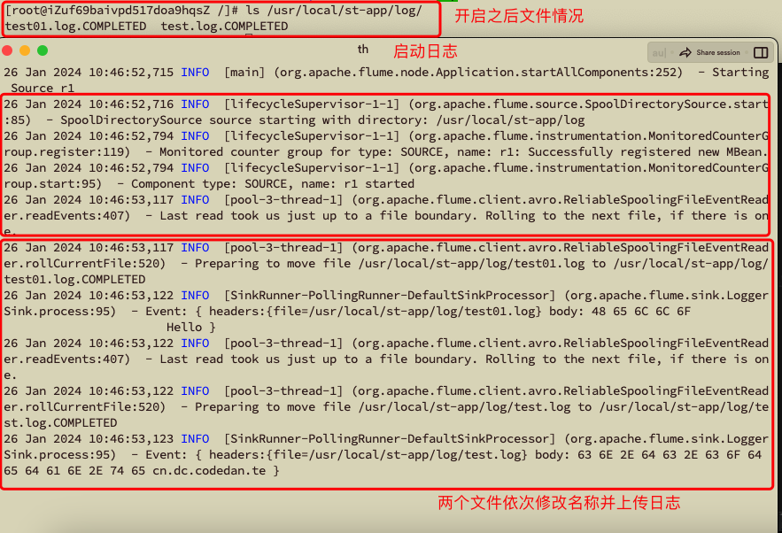
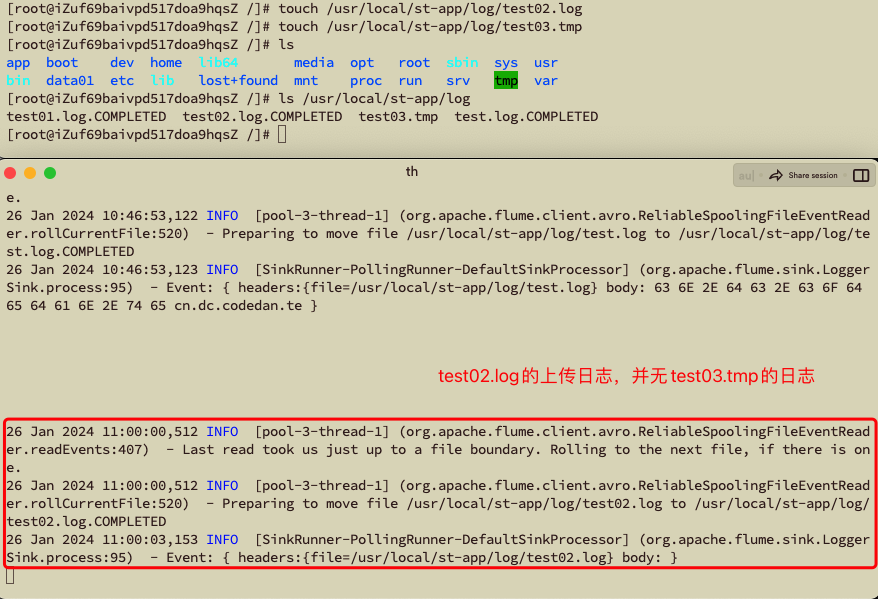
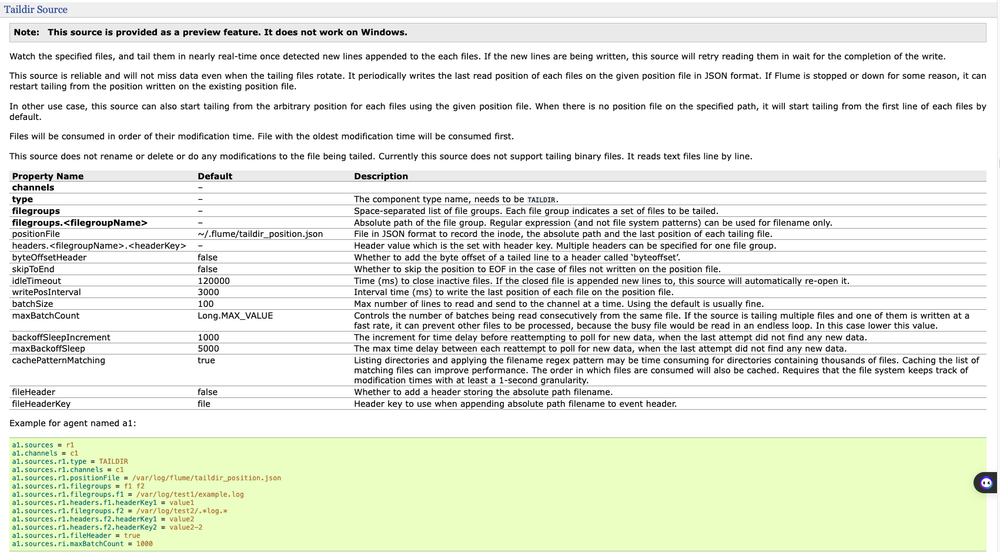
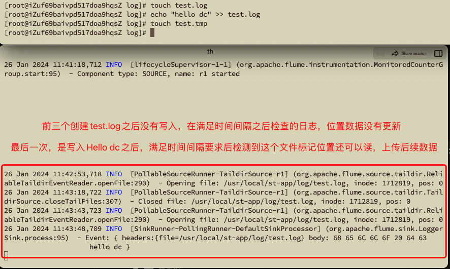
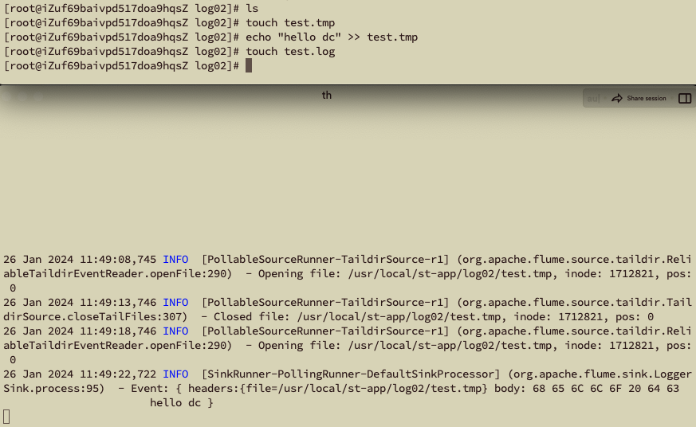
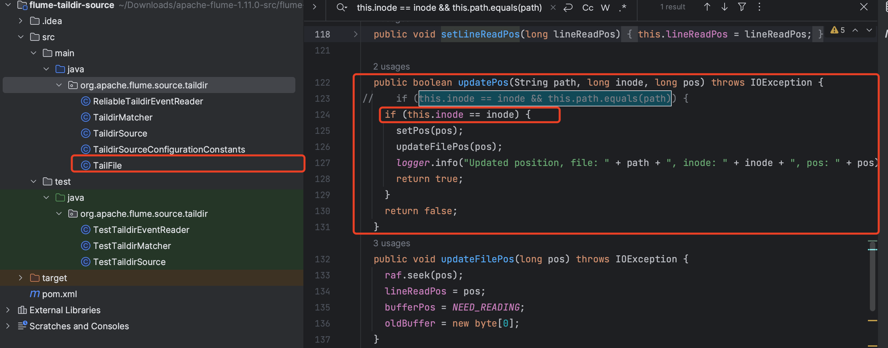
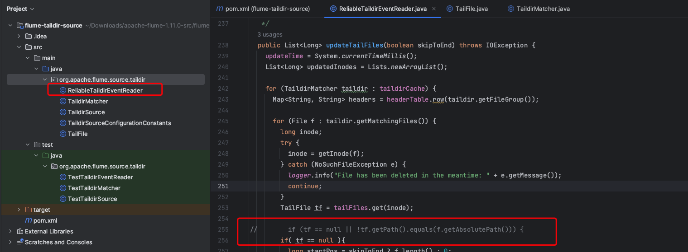

# Flume文件Source

### 单个文件监听Exec Source

> 背景：监听制定日志文件，并通过内存Channel写入到日志SInk中

**第一步：**在linux系统的目录/usr/local/st-app/log目录下创建名称为test.log的日志文件，后续使用

```tex
> mkdir -p /usr/local/st-app/log
> cd /usr/local/st-app/log
> touch test.log
```


**第二步：**在fume的安装目录下找到job目录，并且在其中创建`exec-flume-logger.conf`文件，快速启动中是/opt/software/flume目录。

```tex
> cd /opt/software/flume/job
> touch exec-flume-logger.conf
```


**第三步**：在官网组件文档中，找到`exec source`组件，并查看其的必填属性与其他·1非必填属性后，根据其例子配置进行相应配置并写入到`exec-flume-logger.conf`文件中。



```tex
# example.conf: A single-node Flume configuration

# Name the components on this agent
a1.sources = r1
a1.sinks = k1
a1.channels = c1

# Describe/configure the source
a1.sources.r1.type = exec
a1.sources.r1.command = tail -F /usr/local/st-app/log/test.log

# Describe the sink
a1.sinks.k1.type = logger

# Use a channel which buffers events in memory
a1.channels.c1.type = memory
a1.channels.c1.capacity = 1000
a1.channels.c1.transactionCapacity = 100

# Bind the source and sink to the channel
a1.sources.r1.channels = c1
a1.sinks.k1.channel = c1
```


**第四步：**根据新的配置文件，启动flume

```tex
> bin/flume-ng agent -n a1 -c conf -f job/exec-flume-logger.conf
```


**第五步：**模拟日志写入，查看flume日志变化（flume日志在安装路径下flume.log文件内）

```tex
> echo "cn.dc.codedan.testApplication:07 - Initalizing started" >> /usr/local/st-app/log/test.log
```



**注意：exec source无法断点续传，也就是每次重新启动flume，都会从目标日志的头读到尾在获取一次！！！！！**


### 多文件新增监听Spooling Directory Source

> 环境：
>
> 监听日志目录文件夹，并通过内存Channel写入到日志SInk中
>
> 重复使用单文件监听的日志记录地址/usr/local/st-app/log

**第一步**：在fume的安装目录下找到job目录，并且在其中创建`spooling-flume-logger.conf`文件，快速启动中是/opt/software/flume目录。

```tex
> cd /opt/software/flume/job
> touch spooling-flume-logger.conf
```


**第二步**：在官网组件文档中，找到`spooling directory source`组件，并查看其的必填属性与其他·1非必填属性后，根据其例子配置进行相应配置并写入到`spooling-flume-logger.conf`文件中。



```tex
# example.conf: A single-node Flume configuration
# Name the components on this agent
a1.sources = r1
a1.sinks = k1
a1.channels = c1

# Describe/configure the source
a1.sources.r1.type = spooldir
# 监听目录地址
a1.sources.r1.spoolDir = /usr/local/st-app/log
# 在Header中添加文件的绝对地址
a1.sources.r1.fileHeader = true
# 监听获取之后修改文件名称追加后缀（带此后缀的也会被忽略，防止重复上传）
a1.sources.r1.fileSuffix = .COMPLETED
# 忽略的文件类型
a1.sources.r1.ignorePattern = ([^ ]*\.tmp)

# Describe the sink
a1.sinks.k1.type = logger
# Use a channel which buffers events in memory
a1.channels.c1.type = memory
a1.channels.c1.capacity = 1000
a1.channels.c1.transactionCapacity = 100

# Bind the source and sink to the channel
a1.sources.r1.channels = c1
a1.sinks.k1.channel = c1
```


**第三步：**根据新的配置文件，启动flume

```tex
> bin/flume-ng agent -n a1 -c conf -f job/spooling-flume-logger.conf
```


**第四步**：查看监听目录情况



目前监听目录下存在test.log和test01.log，通过当前文件状态和启动后日志可看出在flume启动时这两个文件被修改名称并上传。


第五步：在目标目录中创建文件test02.log以及test03.tmp，查看日志情况

```tex
> touch /usr/local/st-app/log/test02.log
```




**注意：Spooling Directory Source只能监听目录下是否新增符合条件的文件，而不能监听目录下文件是否改变**


### 多目录多文件监听Taildir Source

> 环境：
>
> 监听多个日志目录文件夹并对其进行新增和原有数据追加，并通过内存Channel写入到日志SInk中
>
> 重复使用单文件监听的日志记录地址/usr/local/st-app/log和新地址/usr/local/st-app/log02

**第一步**：在fume的安装目录下找到job目录，并且在其中创建`tailder-flume-logger.conf`文件，快速启动中是/opt/software/flume目录。

```tex
> mkdir -p /usr/local/st-app/log02
> cd /opt/software/flume/job
> touch taildir-flume-logger.conf
```


**第二步**：在官网组件文档中，找到`taildir source`组件，并查看其的必填属性与其他·1非必填属性后，根据其例子配置进行相应配置并写入到`taildir-flume-logger.conf`文件中。



```tex
# example.conf: A single-node Flume configuration

# Name the components on this agent
a1.sources = r1
a1.sinks = k1
a1.channels = c1

# Describe/configure the source
a1.sources.r1.type = TAILDIR
# 断电续传的文件地址
a1.sources.r1.spoolDir = /opt/software/flume/taildir_position.json
# 监听的多目录别名，多个用空格分割
a1.sources.r1.filegroups = f1 f2
# 监听f1的具体目录，这个配置作用时监听log目录下文件名称包含log的日志
a1.sources.r1.filegroups.f1 = /usr/local/st-app/log/.*log.*
# 监听f2的具体目录，这个配置作用时监听log02目录下文件名称包含tmp的日志
a1.sources.r1.filegroups.f2 = /usr/local/st-app/log02/.*tmp.*
a1.sources.r1.fileHeader = true
# 即同一文件中读取的多大批量数量
a1.sources.ri.maxBatchCount = 1000

# Describe the sink
a1.sinks.k1.type = logger

# Use a channel which buffers events in memory
a1.channels.c1.type = memory
a1.channels.c1.capacity = 1000
a1.channels.c1.transactionCapacity = 100

# Bind the source and sink to the channel
a1.sources.r1.channels = c1
a1.sinks.k1.channel = c1
```


**第三步：**根据新的配置文件，启动flume

```tex
> bin/flume-ng agent -n a1 -c conf -f job/taildir-flume-logger.conf
```


**第四步**：分别在log和log2文件下创建不同文件，查看效果



可以发现log目录下并没有检测并上传tmp后缀的文件，同理在log2中也没有检测并上传log后缀的文件



**注意：tailder有个致命的问题，那就是如果将原有文件替换掉，虽然其json文件中唯一标识不变，但是绝对路径却改变了，以至于无法让tailder认为其是同一个文件，导致数据重新从头上传。**


### Tailder Source源码修改过程

> 为了解决上述Tailder Source问题，需要进行源码中关于tailder Source判断是否为同一个文件的逻辑上进行修改，将其原本通过唯一标识和绝对路径的''与''判断代码改为仅仅通过唯一标识进行判断即可。

**第一步**：[官网下载源码包](https://flume.apache.org/download.html)下载源码包，并解压后找到`fulume-ng-sources/flume-taildir-source`，使用idea将其打开,并求改其中两处代码






**第二步**：mvn package指令将其重新打包，将生成`flume-taildir-source-1.11.0.jar`放入/opt/software/flume/lib下（要不替换要不将原来这个jar包换到别的位置）

```tex
> mkdir /opt/software/flume/backupLib
> mv /opt/software/flume/lib/flume-taildir-source-1.11.0.jar  /opt/software/flume/backupLib
# 传输指令（或者使用文件传输工具，将打包好的jar包放入lib目录下）
> cd /opt/software/flume
> bin/flume-ng agent -n a1 -c conf -f job/taildir-flume-logger.conf
```


**第三步**：在log目录下创建test.log文件并写入hello dc后，改名为test20240126.log并新建一个test.log


**注意：日志可看出虽然解决了改名问题，但是标头没有变化，但是如果sink是hdfs其可以判断出来**
