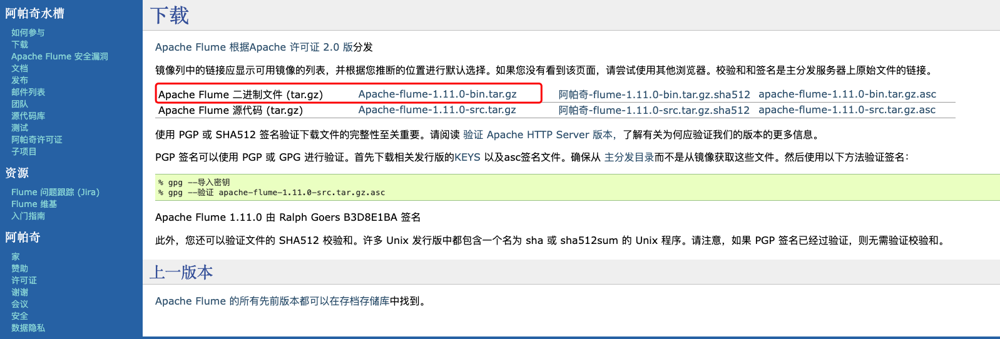
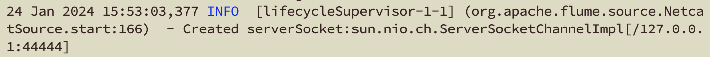

# 初识Flume

> Flume是一个高可用、高并发的分布式日志采集中间件。其可以通过监听网络接口、文件位置动态等方式进行数据的采集并输出为不同格式的数据。

### Flume架构讲解


这是[官方文档](https://flume.apache.org/releases/content/1.11.0/FlumeUserGuide.html#a-simple-example)给出的架构图，其中Flume的核心就是Agent，通常我们也是通过定义好的Agent让Flume进行工作。

+ **Source**：Agent中用来进行数据监听的组件，其实现类的种类繁多，比如监听网络接口的Source、监听netcat的Source、监听文件的Source等等
+ **Channel**：顾名思义传输流通道，是暂存被Source监听的信息的。预防Source监听的速度太快，而Sink写出的速度较慢导致的程序异常。其实现类也很多，比如基于内存的Channel、JDBC的Channel、File的Channel等等
+ **Sink**：即Agent中用将Channel中的数据进行写出的组件，其实现类的种类繁多，比如HDFS格式的文件Sink、控制台日志输出Sink等等
+ **Event**：即数据在Agent中流动的封装数据类型，基本为Header + Body组成。其中Header中存在key-value键值对形势的标头信息，Body则是一串字节流。


### 快速启动Flume

**快速启动使用Netcat作为向接口发送数据的客户端，所以Flume采用netcat实现的Source进行监听，并输出到日志Sink中**

**第一步**：开启魔法，到[官方下载地址](https://flume.apache.org/download.html)中下载一份二进制源码包(没有魔法，去物料中提取也可)




**第二步：**将下载好的tar包传输到linux服务器中（**已存在java环境**），目标地址可为/usr/local/tar并解压到 /opt/software目录下并改名为flume

```tex
> mkdir /usr/local/tar
> cd /usr/local/tar
> tar -zxvf apache-flume-1.11.0-bin.tar.gz -C /opt/software
> mv apache-flume-1.11.0-bin flume
```


**第三步：**进入flume目录下创建jor目录，并创建文件`net-flume-logger.conf`，并写入官方文档中给出的基础配置。

```tex
> cd /opt/software/flume
> mkdir job
> touch net-flume-logger.conf
> vim net-flume-logger.conf
```

```properties
# example.conf: A single-node Flume configuration
# Name the components on this agent(定一个Agent的名字，这里定义为a1)
# 定义a1中的sources中其中一个source的名字为r1（一个Agent中可以存在多个Source）
a1.sources = r1
# 定义a1中的sinks中其中一个sink的名字为k1（一个Agent中可以存在多个sink）
a1.sinks = k1
# 定义a1中的channels中其中一个channel的名字为c1（一个Agent中可以存在多个channel）
a1.channels = c1

# Describe/configure the source
# 指定a1中sources下的名称为r1的sources的各种配置，这里使用的实现类为netcat，并且监听本地环境中的44444端口
a1.sources.r1.type = netcat
a1.sources.r1.bind = localhost
a1.sources.r1.port = 44444

# Describe the sink
# 指定a1中sinks下的名称为k1的sink的各种配置，这里是指定k1的实现类为日志类型
a1.sinks.k1.type = logger

# Use a channel which buffers events in memory
# 指定a1中channels下的名称为c1的channel的各种配置，这里是指定c1的实现类为内存类型，并设置容量为1000，其中一次事务所能包含的数据大小为100
a1.channels.c1.type = memory
a1.channels.c1.capacity = 1000
a1.channels.c1.transactionCapacity = 100

# Bind the source and sink to the channel
# 将配置好的source、channel、sink进行组合，形成自定义类型的Agent。这里是将r1与c1、k1与c1相连。
a1.sources.r1.channels = c1
a1.sinks.k1.channel = c1
```

扩展：由于Agent中可以包含多个Source、多个Channel、多个Sink的特性，其可以组成各种不同的Agent，比如多个Sink监听一个Channel，将其内容输出为不同格式的数据。


**第四步**：启动flume

```tex
> cd /opt/software/flume
> bin/flume-ng agent -n a1 -c conf/ -f job/net-flume-logger.conf -Dflume.root.logger=INFO,console
```

（这里存在可能启动成功之后，无法显示日志的情况，可以到**flume目录下的flume.log或者/flume/log目录**下查看日志）

```tex
> tail -100f /opt/software/flume/flume.log
```




**第五步：**再开一个连接客户端，使用yum安装netcat组件(建议把yum源换成阿里等国内其他的源)

```tex
> sudo yum install netcat
```


**第六步：**启动netcat，并向44444端口发送信息

```tex
> nc localhost 44444
```

Client:

```tex
> 123
> OK
>Hello
> OK
```

Flume:

```tex
24 Jan 2024 15:53:08,849 INFO  [SinkRunner-PollingRunner-DefaultSinkProcessor] (org.apache.flume.sink.LoggerSink.process:95)  - Event: { headers:{} body: 31 32 33                                        123 }

24 Jan 2024 16:04:12,701 INFO  [SinkRunner-PollingRunner-DefaultSinkProcessor] (org.apache.flume.sink.LoggerSink.process:95)  - Event: { headers:{} body: 48 65 6C 6C 6F                                  Hello }
```


### 实际运用Demo

背景：监听Hive实时日志并写出HDFS文件

