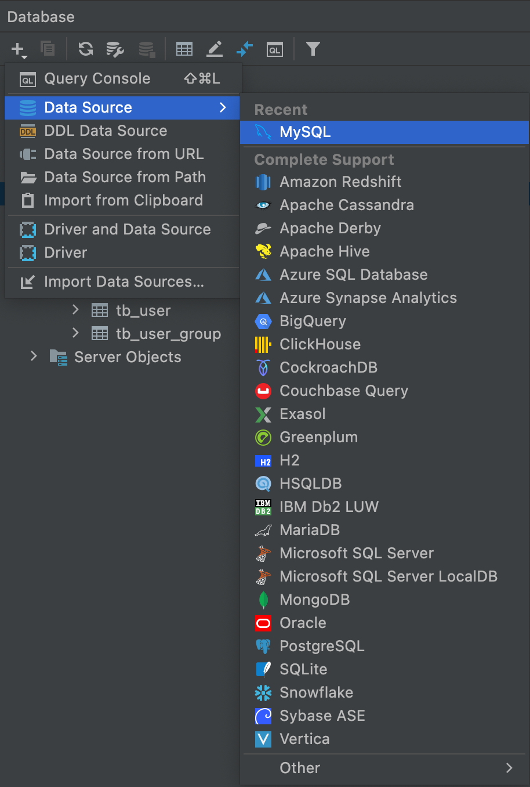
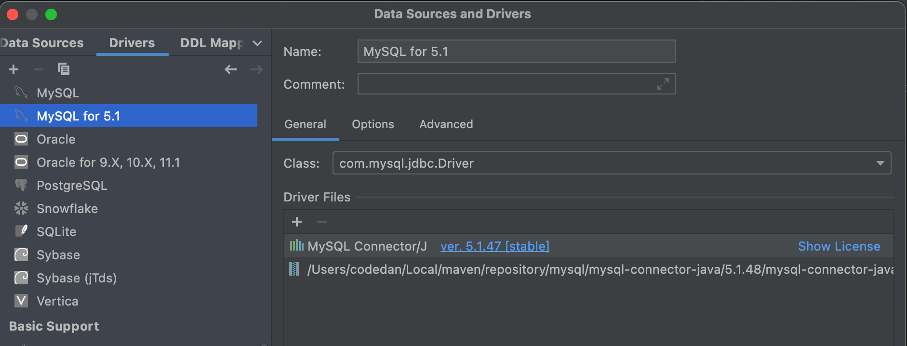
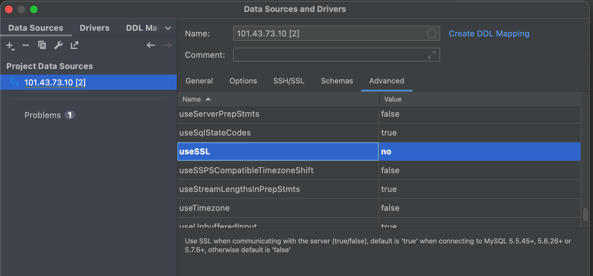
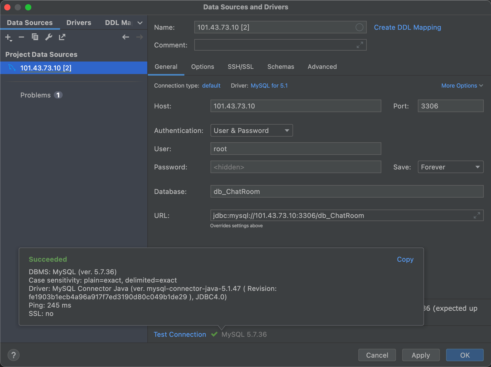
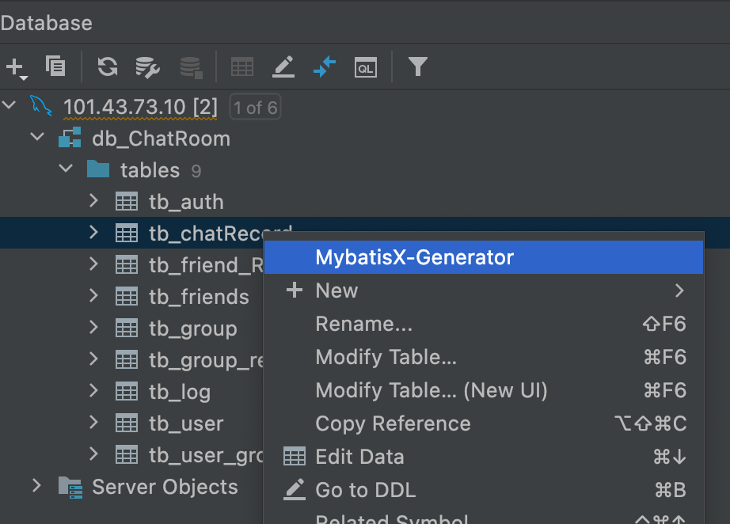
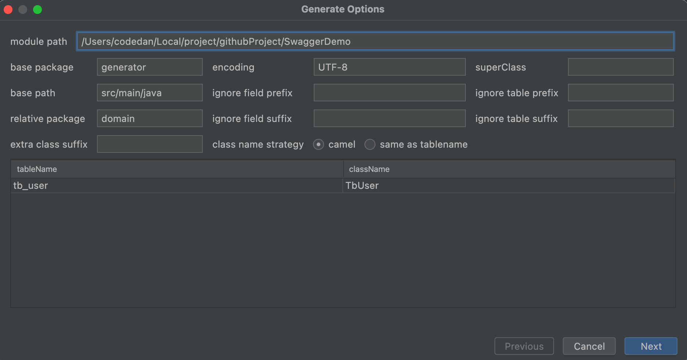
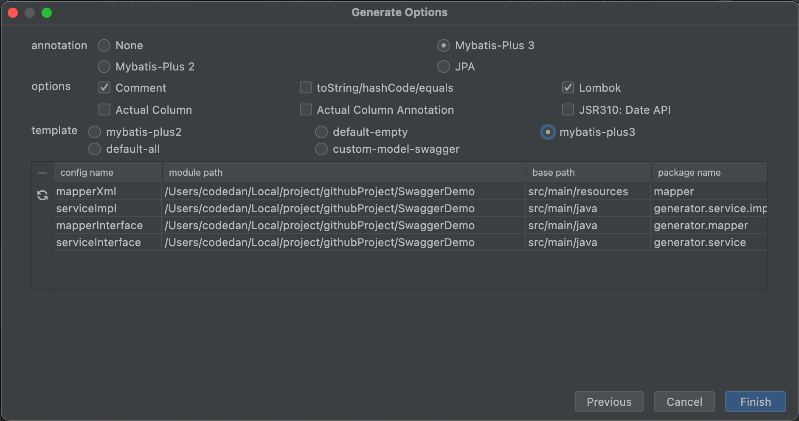

### MybatisX插件

使用MybatisX插件首先我们需要先在Idea集成开发工具中使用DataBase连接到数据库，所以得先完成这一步，下面是教程，主要是第一次连接会踩的坑：

##### 前置---idea连接MySQL数据库

**第一：首先我们需要找到连接MySQL的按钮在那，如下图所示**

&nbsp;

**第二：修改MySQL的连接方式为5版本，而不是默认的8版本**

正常会让你下载MySQL Connect/J 5版本，直接下就行，然后回到连接界面输入MySQL所在IP、username、password即可。

&nbsp;

**第三：输入连接必要参数，并修改useSSL设置为no**

那么连接好数据库之后，我们开始展示如何使用MyBaitsX插件，下载安装过程就不说了，上使用教程。

&nbsp;

##### 使用---MyBatisX插件

**首先：我们向需要生成实体类的表右键选择插件,然后输入各种参数，下面跟着图片进行解释。**

来讲解一下参数：

1. module path：即是生成实体类所在项目路径，选择当前项目路径即可

2. base package：即是生成实体类放入包名称，这里随便写就行，反正生成之后在复制粘贴生成实体类中的内容，而不是依靠直接生成到位。

3. base path：即是生成实体类所在包路径，默认即可

4. class name strategy：重点所在，值camel代表类和表名之间使用驼峰映射创建，same as tablename代表和表名相同创建

&nbsp;

**然后：点击next之后进行相应xml的生成**

这里面参数没啥好说的，仔细看看都能看懂，annotation和template用什么选什么就行，options看个人意愿就行，注意一下Actual Column 和Actual Column Annotation的区别。

其中Actual Column是生成实体类字段和数据库表字段名称保持一致，而Actual Column Annotation则是使用@TableField进行处理。

&nbsp;

-----

### Auto Filling Java call arguments插件

此插件主要是给一些方法在被调用时，参数过多填写麻烦，自动填充形参的名称。使用方式：

对着没有填写参数的方法使用alt➕ender即可
