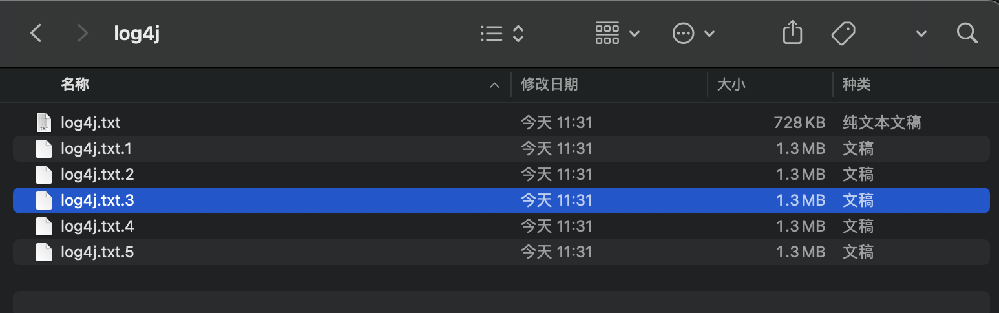
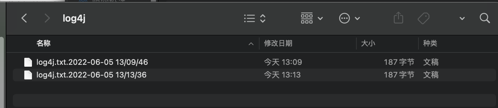

### log4j输出到文件

### FileAppender方式

```properties
log4j.rootLogger=all,fileAppend
#控制台配置
log4j.appender.console=org.apache.log4j.ConsoleAppender
log4j.appender.console.layout=org.apache.log4j.PatternLayout
log4j.appender.console.layout.conversionPattern=[%6p] %r  %c %t %d{yyyy-mm-dd HH:mm:ss:SSS} %m%n

#FileAppend配置
log4j.appender.fileAppend=org.apache.log4j.FileAppender
log4j.appender.fileAppend.file=/Users/zld/Desktop/log4j/log4j_01.txt
log4j.appender.fileAppend.encoding=utf-8
log4j.appender.fileAppend.layout=org.apache.log4j.PatternLayout
log4j.appender.fileAppend.layout.conversionPattern=[%6p] %r  %c %t %d{yyyy-mm-dd HH:mm:ss:SSS} %m%n
```

```java
public class Log4jTest01 {

    public static void main(String[] args) {
        //设置其DebugEnable参数为true，开启详细日志记录,一定要在配置Logger组件之前开启
        LogLog.setInternalDebugging(true);
        //创建Logger组件
        Logger logger = Logger.getLogger(Log4jTest01.class);
        logger.fatal("测试fatal级别日志信息");
        logger.info("测试info级别日志信息");
    }

}
```


**注意：如果不记得FileAppender需要配置的key值，就去看看FileAppender的源码中字段即可。**

&nbsp;

##### RollingFileAppender方式

```properties
log4j.rootLogger=all,rollingFileAppender

#RollingFileAppender配置
log4j.appender.rollingFileAppender=org.apache.log4j.RollingFileAppender
log4j.appender.rollingFileAppender.maxFileSize=1MB
log4j.appender.rollingFileAppender.maxBackupIndex=5
log4j.appender.rollingFileAppender.file=/Users/zld/Desktop/log4j/log4j.txt
log4j.appender.rollingFileAppender.encoding=utf-8
log4j.appender.rollingFileAppender.layout=org.apache.log4j.PatternLayout
log4j.appender.rollingFileAppender.layout.conversionPattern=[%6p] %r  %c %t %d{yyyy-mm-dd HH:mm:ss:SSS} %m%n
```

```java
public class Log4jTest01 {

    public static void main(String[] args) {
        //创建Logger组件
        Logger logger = Logger.getLogger(Log4jTest01.class);
        for (int i = 0; i < 50000; i++) {
            logger.fatal("测试fatal级别日志信息");
            logger.info("测试info级别日志信息");
        }
    }

}
```



**注意：如果不记得RollingFileAppender需要配置的key值，就去看看RollingFileAppender的源码中字段即可。**

&nbsp;

##### DailyRollingFileAppender方式

```properties
log4j.rootLogger=all,dailyRollingFileAppender

#DailyRollingFileAppender配置
log4j.appender.dailyRollingFileAppender=org.apache.log4j.DailyRollingFileAppender
log4j.appender.dailyRollingFileAppender.file=/Users/zld/Desktop/log4j/log4j.txt
log4j.appender.dailyRollingFileAppender.encoding=utf-8
log4j.appender.dailyRollingFileAppender.datePattern='.'yyyy-MM-dd HH:mm:ss
log4j.appender.dailyRollingFileAppender.layout=org.apache.log4j.PatternLayout
log4j.appender.dailyRollingFileAppender.layout.conversionPattern=[%6p] %r  %c %t %d{yyyy-mm-dd HH:mm:ss:SSS} %m%n
```

```java
public class Log4jTest01 {

    public static void main(String[] args) {
        //创建Logger组件
        Logger logger = Logger.getLogger(Log4jTest01.class);
        logger.fatal("测试fatal级别日志信息");
        logger.info("测试info级别日志信息");
    }

}
```



**注意：如果不记得DailyRollingFileAppender需要配置的key值，就去看看DailyRollingFileAppender的源码中字段即可。**

&nbsp;

##### JDBCAppender方式

```properties
log4j.rootLogger=all,jdbcAppender


#JDBCAppender配置
log4j.appender.jdbcAppender=org.apache.log4j.jdbc.JDBCAppender
log4j.appender.jdbcAppender.Driver=com.mysql.jdbc.Driver
log4j.appender.jdbcAppender.URL=jdbc:mysql://101.43.73.10:3306/db_ChatRoom?useSSL=false&useUnicode=true&characterEncoding=UTF-8&useJDBCCompliantTimezoneShift=true&useLegacyDatetimeCode=false&serverTimezone=Asia/Shanghai
log4j.appender.jdbcAppender.User=root
log4j.appender.jdbcAppender.Password=zld19981016
log4j.appender.jdbcAppender.Sql=INSERT INTO tb_log(log_content) VALUE('%6p %r %c %t %d{yyyy-MM-dd hh:mm:ss} %m')
log4j.appender.jdbcAppender.layout=org.apache.log4j.PatternLayout
log4j.appender.jdbcAppender.layout.conversionPattern=[%6p] %r  %c %t %d{yyyy-mm-dd HH:mm:ss:SSS} %m%n

```

```java
public class Log4jTest01 {

    public static void main(String[] args) {
        //创建Logger组件
        Logger logger = Logger.getLogger(Log4jTest01.class);
        logger.fatal("测试fatal级别日志信息");
        logger.info("测试info级别日志信息");
    }

}
```


