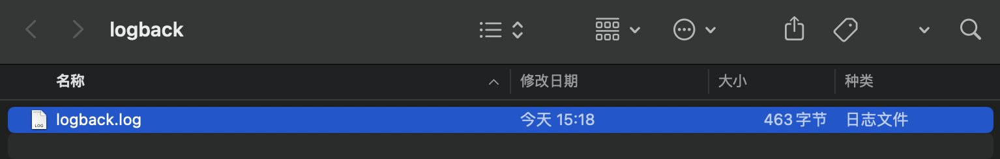
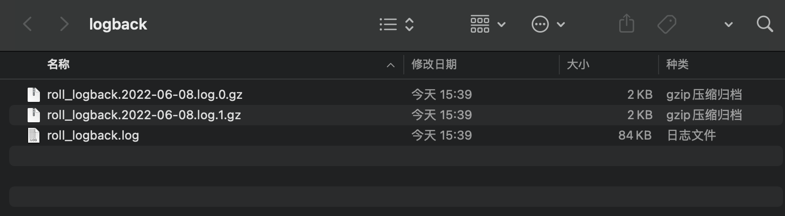

### logback日志

> logback日志是log4j作者在SLF4J日志门面出现之后，重新编写的一个日志系统，其功能要远远超过log4j。并严格按照SLF4J日志门面API规则进行功能实现，能无缝搭配SLF4J进行使用。

logback日志系统拥有三个包，分别是`logback-core`、`logback-classic`以及`logback-access`包，其中logback-classic是功能核心包，logback-core是功能基本包，logback-access是功能扩展包。

基本logback日志的关键组件和log4j一致，均为Logger、Appender、Layout(Encoder)组件，只是分布于不同的包中。

+ Appender组件的实现类位于logback-core包中

+ Encoder组件的实现类位于logback-classic包中

当然和log4j也有明显的区别：

+ 日志级别只有trace、debug、info、warn、error级别，和SLF4J对应。

+ 配置文件从properties变换为xml形式

+ pattern的表达式有变化，比如%p变为%level，%t变为%thread

-----

### logback日志使用大全

##### 使用ConsoleAppender搭配PatternLayoutEncoder使用


```xml
这是logback.xml文件内容：
<?xml version="1.0" encoding="UTF-8" ?>
<configuration>


    <property name="pattern" value="[%-6level] %d{yyyy-MM-dd hh:mm:ss.SSS} %c %M %L %thread %m%n"></property>

    <appender class="ch.qos.logback.core.ConsoleAppender" name="consoleAppender">
        <target>
            System.err
        </target>
        <encoder class="ch.qos.logback.classic.encoder.PatternLayoutEncoder">
            <pattern>${pattern}</pattern>
        </encoder>


    </appender>

    <root level="ALL">
        <appender-ref ref="consoleAppender"></appender-ref>
    </root>
</configuration>
```

```java
public class LogbackDemo {


    public static void main(String[] args) {
        Logger logger = LoggerFactory.getLogger(LogbackDemo.class);
        logger.trace("测试trace日志记录");
        logger.debug("测试debug日志记录");
        logger.info("测试info日志记录");
        logger.warn("测试warn日志记录");
        logger.error("测试error日志记录");
    }
}
```

```tex
[TRACE ] 2022-06-08 03:09:47.159 cn.wtu.zld.LogbackDemo main 11 main 测试trace日志记录
[DEBUG ] 2022-06-08 03:09:47.163 cn.wtu.zld.LogbackDemo main 12 main 测试debug日志记录
[INFO  ] 2022-06-08 03:09:47.163 cn.wtu.zld.LogbackDemo main 13 main 测试info日志记录
[WARN  ] 2022-06-08 03:09:47.163 cn.wtu.zld.LogbackDemo main 14 main 测试warn日志记录
[ERROR ] 2022-06-08 03:09:47.163 cn.wtu.zld.LogbackDemo main 15 main 测试error日志记录
```

&nbsp;

##### 使用FileAppender搭配PatternLayoutEncoder使用

```xml
<?xml version="1.0" encoding="UTF-8" ?>
<configuration>


<!--    <property name="pattern" value="[%-6level] %d{yyyy-MM-dd hh:mm:ss.SSS} %c %M %L %thread %m%n"></property>-->

<!--    <appender class="ch.qos.logback.core.ConsoleAppender" name="consoleAppender">-->
<!--        <target>-->
<!--            System.err-->
<!--        </target>-->
<!--        <encoder class="ch.qos.logback.classic.encoder.PatternLayoutEncoder">-->
<!--            <pattern>${pattern}</pattern>-->
<!--        </encoder>-->
<!--        -->
<!--    </appender>-->

    <property name="file" value="/Users/zld/Desktop/logback/logback.log"></property>
    <appender class="ch.qos.logback.core.FileAppender" name="fileAppender">
        <file>${file}</file>
        <encoder class="ch.qos.logback.classic.encoder.PatternLayoutEncoder">
            <pattern>${pattern}</pattern>
        </encoder>
    </appender>


    <root level="ALL">
<!--        <appender-ref ref="consoleAppender"></appender-ref>-->
        <appender-ref ref="fileAppender"></appender-ref>
    </root>
</configuration>
```

```java
public class LogbackDemo {


    public static void main(String[] args) {
        Logger logger = LoggerFactory.getLogger(LogbackDemo.class);
        logger.trace("测试trace日志记录");
        logger.debug("测试debug日志记录");
        logger.info("测试info日志记录");
        logger.warn("测试warn日志记录");
        logger.error("测试error日志记录");
    }
}
```



&nbsp;

##### 使用RollingAppender搭配PatternLayoutEncoder使用

```xml
<configuration>


    <property name="pattern" value="[%-6level] %d{yyyy-MM-dd hh:mm:ss.SSS} %c %M %L %thread %m%n"></property>

<!--    <appender class="ch.qos.logback.core.ConsoleAppender" name="consoleAppender">-->
<!--        <target>-->
<!--            System.err-->
<!--        </target>-->
<!--        <encoder class="ch.qos.logback.classic.encoder.PatternLayoutEncoder">-->
<!--            <pattern>${pattern}</pattern>-->
<!--        </encoder>-->
<!--        -->
<!--    </appender>-->

<!--    <property name="file" value="/Users/zld/Desktop/logback/logback.log"></property>-->
<!--    <appender class="ch.qos.logback.core.FileAppender" name="fileAppender">-->
<!--        <file>${file}</file>-->
<!--        <encoder class="ch.qos.logback.classic.encoder.PatternLayoutEncoder">-->
<!--            <pattern>${pattern}</pattern>-->
<!--        </encoder>-->
<!--    </appender>-->

    <appender class="ch.qos.logback.core.rolling.RollingFileAppender" name="rollingFileAppender">
        <file>/Users/zld/Desktop/logback/roll_logback.log</file>
        <!--    选择拆分规则    -->
        <rollingPolicy class="ch.qos.logback.core.rolling.SizeAndTimeBasedRollingPolicy">
            <!--    完善拆分规则，按照下属的时间规格（%d{...}）和下标规则（%i）来命名拆分文件    -->
            <fileNamePattern>/Users/zld/Desktop/logback/roll_logback.%d{yyyy-MM-dd}.log.%i.gz</fileNamePattern>
            <!--    实际开发，不需要按照大小进行拆分，而是通过时间的文件的拆分和归档，所以采用上面fileNamePattern中定义即可    -->
            <maxFileSize>100kb</maxFileSize>
        </rollingPolicy>

        <encoder class="ch.qos.logback.classic.encoder.PatternLayoutEncoder">
            <pattern>${pattern}</pattern>
        </encoder>
    </appender>

    <root level="ALL">
<!--        <appender-ref ref="consoleAppender"></appender-ref>-->
<!--        <appender-ref ref="fileAppender"></appender-ref>-->
        <appender-ref ref="rollingFileAppender"></appender-ref>
    </root>
</configuration>
```

```java
public class LogbackDemo {


    public static void main(String[] args) {

        Logger logger = LoggerFactory.getLogger(LogbackDemo.class);
        for (int i = 0; i < 1000; i++) {
            logger.trace("测试trace日志记录");
            logger.debug("测试debug日志记录");
            logger.info("测试info日志记录");
            logger.warn("测试warn日志记录");
            logger.error("测试error日志记录");
        }

    }
}
```



&nbsp;

-----

### logback异步日志记录使用

```xml
<?xml version="1.0" encoding="UTF-8" ?>
<configuration>


    <property name="pattern" value="[%-6level] %d{yyyy-MM-dd hh:mm:ss.SSS} %c %M %L %thread %m%n"></property>

    <appender class="ch.qos.logback.core.ConsoleAppender" name="consoleAppender">
        <target>
            System.err
        </target>
        <encoder class="ch.qos.logback.classic.encoder.PatternLayoutEncoder">
            <pattern>${pattern}</pattern>
        </encoder>

<!--        <filter class="ch.qos.logback.classic.filter.LevelFilter">-->
<!--            <!–      当前过滤器设置的过滤级别      –>-->
<!--            <level>ERROR</level>-->
<!--            <!–    在过滤器设置过滤级别以及之上的级别日志被记录        –>-->
<!--            <onMatch>ACCEPT</onMatch>-->
<!--            <!–     在过滤器设置过滤级别之下的级别日志不被记录       –>-->
<!--            <onMismatch>DENY</onMismatch>-->
<!--        </filter>-->
    </appender>

<!--    <property name="file" value="/Users/zld/Desktop/logback/logback.log"></property>-->
<!--    <appender class="ch.qos.logback.core.FileAppender" name="fileAppender">-->
<!--        <file>${file}</file>-->
<!--        <encoder class="ch.qos.logback.classic.encoder.PatternLayoutEncoder">-->
<!--            <pattern>${pattern}</pattern>-->
<!--        </encoder>-->
<!--    </appender>-->

<!--    <appender class="ch.qos.logback.core.rolling.RollingFileAppender" name="rollingFileAppender">-->
<!--        <file>/Users/zld/Desktop/logback/roll_logback.log</file>-->
<!--        <!–    选择拆分规则    –>-->
<!--        <rollingPolicy class="ch.qos.logback.core.rolling.SizeAndTimeBasedRollingPolicy">-->
<!--            <!–    完善拆分规则，按照下属的时间规格（%d{...}）和下标规则（%i）来命名拆分文件    –>-->
<!--            <fileNamePattern>/Users/zld/Desktop/logback/roll_logback.%d{yyyy-MM-dd}.log.%i.gz</fileNamePattern>-->
<!--            <!–    实际开发，不需要按照大小进行拆分，而是通过时间的文件的拆分和归档，所以采用上面fileNamePattern中定义即可    –>-->
<!--            <maxFileSize>100kb</maxFileSize>-->
<!--        </rollingPolicy>-->

<!--        <encoder class="ch.qos.logback.classic.encoder.PatternLayoutEncoder">-->
<!--            <pattern>${pattern}</pattern>-->
<!--        </encoder>-->
<!--    </appender>-->


    <appender class="ch.qos.logback.classic.AsyncAppender" name="asyncAppender">
        <appender-ref ref="consoleAppender"></appender-ref>
        <!--   设置线程池中丢弃策略，0表示队列满时，不丢弃任何级别的日志记录     -->
        <discardingThreshold>0</discardingThreshold>
        <!--   设置线程池中队列的长度     -->
        <queueSize>256</queueSize>
    </appender>
    <root level="ALL">
        <appender-ref ref="asyncAppender"></appender-ref>
<!--        <appender-ref ref="fileAppender"></appender-ref>-->
<!--        <appender-ref ref="rollingFileAppender"></appender-ref>-->
    </root>
</configuration>
```

```java
public class LogbackDemo {


    public static void main(String[] args) {

        Logger logger = LoggerFactory.getLogger(LogbackDemo.class);

            logger.trace("测试trace日志记录");
            logger.debug("测试debug日志记录");
            logger.info("测试info日志记录");
            logger.warn("测试warn日志记录");
            logger.error("测试error日志记录");

        System.out.println("1.....................");
        System.out.println("2.....................");
        System.out.println("3.....................");
        System.out.println("4.....................");
        System.out.println("5.....................");

    }
}
```

```tex
1.....................
2.....................
3.....................
4.....................
5.....................
[TRACE ] 2022-06-08 04:20:15.395 cn.wtu.zld.LogbackDemo ? ? main 测试trace日志记录
[DEBUG ] 2022-06-08 04:20:15.396 cn.wtu.zld.LogbackDemo ? ? main 测试debug日志记录
[INFO  ] 2022-06-08 04:20:15.396 cn.wtu.zld.LogbackDemo ? ? main 测试info日志记录
[WARN  ] 2022-06-08 04:20:15.396 cn.wtu.zld.LogbackDemo ? ? main 测试warn日志记录
[ERROR ] 2022-06-08 04:20:15.396 cn.wtu.zld.LogbackDemo ? ? main 测试error日志记录

Process finished with exit code 0
```

&nbsp;

------

### logback过滤器使用

```xml
<?xml version="1.0" encoding="UTF-8" ?>
<configuration>


    <property name="pattern" value="[%-6level] %d{yyyy-MM-dd hh:mm:ss.SSS} %c %M %L %thread %m%n"></property>

    <appender class="ch.qos.logback.core.ConsoleAppender" name="consoleAppender">
        <target>
            System.err
        </target>
        <encoder class="ch.qos.logback.classic.encoder.PatternLayoutEncoder">
            <pattern>${pattern}</pattern>
        </encoder>

        <filter class="ch.qos.logback.classic.filter.LevelFilter">
            <!--      当前过滤器设置的过滤级别      -->
            <level>ERROR</level>
            <!--    在过滤器设置过滤级别以及之上的级别日志被记录        -->
            <onMatch>ACCEPT</onMatch>
            <!--     在过滤器设置过滤级别之下的级别日志不被记录       -->
            <onMismatch>DENY</onMismatch>
        </filter>
    </appender>

<!--    <property name="file" value="/Users/zld/Desktop/logback/logback.log"></property>-->
<!--    <appender class="ch.qos.logback.core.FileAppender" name="fileAppender">-->
<!--        <file>${file}</file>-->
<!--        <encoder class="ch.qos.logback.classic.encoder.PatternLayoutEncoder">-->
<!--            <pattern>${pattern}</pattern>-->
<!--        </encoder>-->
<!--    </appender>-->

<!--    <appender class="ch.qos.logback.core.rolling.RollingFileAppender" name="rollingFileAppender">-->
<!--        <file>/Users/zld/Desktop/logback/roll_logback.log</file>-->
<!--        <!–    选择拆分规则    –>-->
<!--        <rollingPolicy class="ch.qos.logback.core.rolling.SizeAndTimeBasedRollingPolicy">-->
<!--            <!–    完善拆分规则，按照下属的时间规格（%d{...}）和下标规则（%i）来命名拆分文件    –>-->
<!--            <fileNamePattern>/Users/zld/Desktop/logback/roll_logback.%d{yyyy-MM-dd}.log.%i.gz</fileNamePattern>-->
<!--            <!–    实际开发，不需要按照大小进行拆分，而是通过时间的文件的拆分和归档，所以采用上面fileNamePattern中定义即可    –>-->
<!--            <maxFileSize>100kb</maxFileSize>-->
<!--        </rollingPolicy>-->

<!--        <encoder class="ch.qos.logback.classic.encoder.PatternLayoutEncoder">-->
<!--            <pattern>${pattern}</pattern>-->
<!--        </encoder>-->
<!--    </appender>-->

    <root level="ALL">
        <appender-ref ref="consoleAppender"></appender-ref>
<!--        <appender-ref ref="fileAppender"></appender-ref>-->
<!--        <appender-ref ref="rollingFileAppender"></appender-ref>-->
    </root>
</configuration>
```

```java
public class LogbackDemo {


    public static void main(String[] args) {

        Logger logger = LoggerFactory.getLogger(LogbackDemo.class);

            logger.trace("测试trace日志记录");
            logger.debug("测试debug日志记录");
            logger.info("测试info日志记录");
            logger.warn("测试warn日志记录");
            logger.error("测试error日志记录");
        try {
            TimeUnit.SECONDS.sleep(5);
        } catch (InterruptedException e) {
            e.printStackTrace();
        }

    }
}
```

```tex
[ERROR ] 2022-06-08 03:56:55.736 cn.wtu.zld.LogbackDemo main 17 main 测试error日志记录

Process finished with exit code 0
```

&nbsp;

------

### logback自定义logger使用

```xml
    <!--  additivity表达是否继承父类Logger的appender列表  -->
    <logger name="cn.wtu.zld.LogbackDemo" level="ALL" additivity="false">
        <appender-ref ref="asyncAppender"></appender-ref>
    </logger>
```
