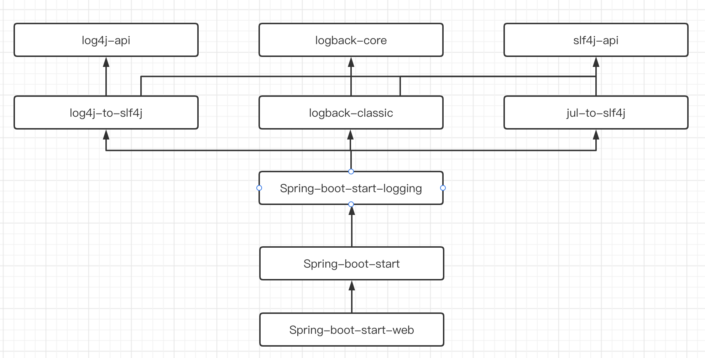

### Spring boot整合日志系统

> Spirng boot框架默认搭配SLF4J作为日志门面，Logback作为底层日志框架实现。

   下述是Spring boot的日志结构图：



从上图我们得出，Spring boot默认采用logback作为日志实现，slf4j作为日志门面进行使用。

但是需要注意`log4j-to-slf4j`这个桥接器，这条线意味着我们可以在Spring boot中使用log4j2的语法来通过slf4j日志门面去使用logback去进行日志实现。

效果如下所示：

##### Spring boot默认采用logback简单使用

```java
import org.junit.jupiter.api.Test;
import org.slf4j.Logger;
import org.slf4j.LoggerFactory;
import org.springframework.boot.test.context.SpringBootTest;

@SpringBootTest
class LogBootDemoApplicationTests {

    @Test
    void contextLoads() {

        Logger logger = LoggerFactory.getLogger(LogBootDemoApplicationTests.class);
        logger.error("测试error级别");
        logger.warn("测试warn级别");
        logger.info("测试info级别");
        logger.debug("测试debug级别");
        logger.trace("测试trace级别");

    }

}
```

```tex
结果：
2022-06-21 08:54:18.695 ERROR 61565 --- [           main] c.s.z.l.LogBootDemoApplicationTests      : 测试error级别
2022-06-21 08:54:18.695  WARN 61565 --- [           main] c.s.z.l.LogBootDemoApplicationTests      : 测试warn级别
2022-06-21 08:54:18.696  INFO 61565 --- [           main] c.s.z.l.LogBootDemoApplicationTests      : 测试info级别
```

<mark>我们通过上述例子还发现Spring boot默认使用logback时，日志记录级别是`info`。</mark>

&nbsp;

##### Spring boot采用log4j2语法进行日志记录

```java
import org.apache.logging.log4j.LogManager;
import org.apache.logging.log4j.Logger;
import org.junit.jupiter.api.Test;
import org.springframework.boot.test.context.SpringBootTest;

@SpringBootTest
class LogBootDemoApplicationTests {

    @Test
    void contextLoads() {
        Logger logger = LogManager.getLogger(LogBootDemoApplicationTests.class);
        logger.error("测试error");
        logger.warn("测试warn");
        logger.info("测试info");
        logger.debug("测试debug");
        logger.trace("测试trace");
    }

}
```

```tex
结果：
2022-06-21 09:49:15.750 ERROR 61875 --- [           main] c.s.z.l.LogBootDemoApplicationTests      : 测试error
2022-06-21 09:49:15.751  WARN 61875 --- [           main] c.s.z.l.LogBootDemoApplicationTests      : 测试warn
2022-06-21 09:49:15.751  INFO 61875 --- [           main] c.s.z.l.LogBootDemoApplicationTests      : 测试info
```

我们可以发现哪怕使用了`log4j`的`logger`，但是底层依旧是以`info`作为日志记录级别的Logback日志框架。

-----

### Spring boot完整的使用日志框架

虽然Spring boot框架通过项目管理工具建立了完整的项目结构，我们的配置文件均可以通过`application.properties`文件进行配置，但是日志系统在此文件中只能进行简单的配置，所以开发规定统一在`resources`文件新建对应的专属配置文件，比如logback的logback.xml以及log4j2的log4j2.xml。

##### Spring boot完整使用SLF4j搭配Logback

第一步：由于Spring boot默认采用slf4j➕logback作为日志实现，所以无需处理jar包，直接进行配置文件的创建以及内容添加即可。

```java
import org.junit.jupiter.api.Test;
import org.slf4j.Logger;
import org.slf4j.LoggerFactory;
import org.springframework.boot.test.context.SpringBootTest;

@SpringBootTest
class LogBootDemoApplicationTests {

    @Test
    void contextLoads() {
        Logger logger = LoggerFactory.getLogger(LogBootDemoApplicationTests.class);
        logger.error("测试error");
        logger.warn("测试warn");
        logger.info("测试info");
        logger.debug("测试debug");
        logger.trace("测试trace");
    }

}
```

```xml
<?xml version="1.0" encoding="UTF-8" ?>
<configuration>

    <property name="pattern" value="[ %-6level ] %d{yyyy-MM-dd hh:mm:ss:SSS} %c %thread %m%n"></property>

    <appender name="consoleAppender" class="ch.qos.logback.core.ConsoleAppender">
        <target>
            System.err
        </target>
        <encoder class="ch.qos.logback.classic.encoder.PatternLayoutEncoder">
            <pattern>${pattern}</pattern>
        </encoder>
    </appender>

    <root  level="error" >
        <appender-ref ref="consoleAppender"></appender-ref>
    </root>

</configuration>
```

```tex
结果：
[ ERROR  ] 2022-06-21 10:27:36:129 cn.sm.zld.logbootdemo.LogBootDemoApplicationTests main 测试error
```

&nbsp;

##### Spring boot完整使用SLF4J搭配Log4j2

第一步：去除Spring boot框架的日志系统，也就是去除掉Spring-boot-start-logging这个结构。并导入适配了springboot的log4j2的jar包。

```xml
        <dependency>
            <groupId>org.springframework.boot</groupId>
            <artifactId>spring-boot-starter-web</artifactId>
            <exclusions>
                <exclusion>
                    <groupId>org.springframework.boot</groupId>
                    <artifactId>spring-boot-starter-logging</artifactId>
                </exclusion>
            </exclusions>
        </dependency>
        <dependency>
            <groupId>org.springframework.boot</groupId>
            <artifactId>spring-boot-starter-log4j2</artifactId>
        </dependency>
```

第二步：创建并完善log4j2.xml配置文件

```xml
<?xml version="1.0" encoding="UTF-8"?>
<configuration>
    <properties>
        <property name="patternEncoder">[ %-5level ] %d{yyyy-MM-dd hh:mm:ss.SSS} %m%n</property>
    </properties>

    <Appenders>
        <Console name="consoleAppender" target="SYSTEM_ERR">
            <PatternLayout pattern="${patternEncoder}"></PatternLayout>
        </Console>
    </Appenders>

    <Loggers>
        <Root level="trace">
            <AppenderRef ref="consoleAppender"></AppenderRef>
        </Root>
    </Loggers>

</configuration>
```

第三步：测试

```java
import org.junit.jupiter.api.Test;
import org.slf4j.Logger;
import org.slf4j.LoggerFactory;
import org.springframework.boot.test.context.SpringBootTest;

@SpringBootTest
class LogBootDemoApplicationTests {

    @Test
    void contextLoads() {
        Logger logger = LoggerFactory.getLogger(LogBootDemoApplicationTests.class);
        logger.error("测试error");
        logger.warn("测试warn");
        logger.info("测试info");
        logger.debug("测试debug");
        logger.trace("测试trace");
    }

}
```

```tex
结果：
[ TRACE ] 2022-06-21 05:32:06.929 Invoking destroy() on bean with name 'characterEncodingFilter'
[ TRACE ] 2022-06-21 05:32:06.930 Invoking destroy() on bean with name 'formContentFilter'
[ TRACE ] 2022-06-21 05:32:06.930 Invoking destroy() on bean with name 'requestContextFilter'
[ TRACE ] 2022-06-21 05:32:06.930 Retrieved dependent beans for bean 'mvcResourceUrlProvider': [requestMappingHandlerMapping, welcomePageHandlerMapping, viewControllerHandlerMapping, beanNameHandlerMapping, routerFunctionMapping, resourceHandlerMapping]
[ TRACE ] 2022-06-21 05:32:06.930 Invoking destroy() on bean with name 'applicationTaskExecutor'
[ INFO  ] 2022-06-21 05:32:06.930 Shutting down ExecutorService 'applicationTaskExecutor'
[ TRACE ] 2022-06-21 05:32:06.930 Retrieved dependent beans for bean 'org.springframework.boot.autoconfigure.internalCachingMetadataReaderFactory': [org.springframework.context.annotation.internalConfigurationAnnotationProcessor]
```
