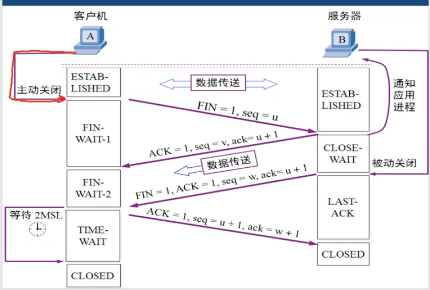

## 首先我们要知道Socket是什么？

**Socket在数据结构上是一个四元组**

**{{源IP,源PORT},{目标IP，目标PORT}}**

然后我们需要知道Socket和运用程序之间的关系，因为我们网络编程中，不管是传统IO还是多路复用NIO在编写网络应用的时候，客户端和服务端都会要求绑定一个Socket。

**关键在于客户端绑定Socket需要目标IP和目标PORT，服务器端只需要绑定监听PORT。**

通过这句话，我们大概能知道应用程序在网络中映射为IP和PORT二元组。我们客户端需要服务端的网络映射也就是服务器端的IP和PORT。这样才可以和服务器进行通信。

## 想要弄明白Socket到底是什么，我们来模拟一个场景。

即我们现在客户端IP为127.0.0.1，服务器IP为121.199.79.104。客户端中有四个应用程序分别占用客户端端口号为8001，8002，8003，8004。服务器上只有一个应用程序占用端口8080。

那么当客户端的四个应用程序想要和服务器上的唯一应用程序进行通信的时候，我们一个一个客户端应用程序来

1）首先是占用8001端口的应用程序，这个应用程序会生成绑定一个Socket，此Socket中数据为{{127.0.0.1,8001},{121.199.79.104,8080}}。

假设和服务器端成功完成TCP连接，那么服务器端的对应Socket数据也就为{{121.199.79.104,8080},{127.0.0.1,8001}}。

2）然后是占用8002端口的应用程序，这个应用程序会生成绑定一个Socket，此Socket中数据为{{127.0.0.1,8002},{121.199.79.104,8080}}。

假设和服务器端成功完成TCP连接，那么服务器端的对应Socket数据也就为{{121.199.79.104,8080},{127.0.0.1,8002}}。

3）之后是占用8003端口的应用程序，这个应用程序会生成绑定一个Socket，此Socket中数据为{{127.0.0.1,8003},{121.199.79.104,8080}}。

假设和服务器端成功完成TCP连接，那么服务器端的对应Socket数据也就为{{121.199.79.104,8080},{127.0.0.1,8003}}。

4）最后是占用8004端口的应用程序，这个应用程序会生成绑定一个Socket，此Socket中数据为{{127.0.0.1,8004},{121.199.79.104,8080}}。

假设和服务器端成功完成TCP连接，那么服务器端的对应Socket数据也就为{{121.199.79.104,8080},{127.0.0.1,8004}}。

综上所示：我们会发现，每一个客户端和服务器之间的连接产生的Socket都是不同的，也都是唯一的。所以我们可以认为：

**Sokcet是客户端和服务器端/服务器端和客户端指定进程之间的唯一通信通道标识。**

## Socket状态解析

我们结合Socket状态以及TCP三次握手和四次挥手来聊聊Socket的变化。

来看看Socket都拥有那些状态以及这些状态所代表的含义。

**先解释一下我自定义名称，为了减少下面文字表示。共有表示客户端****/服务端Socket共有状态****，C独有表示客户端Socket独有状态，S独有表示服务端Socket独有状态。其实都是Socket拥有的状态，但是为了方便理解，逻辑上做了区别。**

1）**CLOSED**：共有。Socket没有进行建立

2）**LISTEN**：S独有。服务端准备好了建立Socket的准备，也就是随时根据客户的的IP和PORT建立一个完整的Socket。

3）**SYN_RECV**：S独有。监听到客户端请求，成功创建并绑定Socket，但是不确定这个Socket能正常使用。

4）**SYN_SENT**：C独有。客户端Socket建立并绑定成功，但是不确定这个Socket能正常使用。

5）**ESTABLISHED**：共有。表明当前的Socket处于正常运行/使用状态。

6）**FIN_WAIT1**：C独有。客户端表面当前我没有东西发了（服务端不一定没有）

7）**Close_WAIT**：S独有，服务器Socket处于等待服务器把所有东西发送关闭状态。

8）**FIN_WAIT2**：C独有。服务器端表面我也没有东西发了之后客户端接受后的客户端Socket状态

9）**TIME_WAIT**：C独有。客户端接受到服务器端说我没有东西发了之后，会给服务器端回发确认报文，告诉服务器端那你可以关闭了。

10）**LAST_ACK**：S独有。等待客户端发送的确认报文，告诉服务器可以关闭了。

光看上面的状态解释，如果是明白TCP三次握手和四次挥手的同学那么不会迷糊，但是初学者，估计都看懵了。所以我们来搭配TCP的三次握手和四次挥手来解析一个其中Socket的状态变化和握手挥手细节。**（建立先掌握一下无Socket状态变化的TCP三次握手基础）**

话不多说，上一张带有Socket状态变化的TCP三次握手图：

1）**第一次握手解析**：我们可以看到刚开始，客户端和服务器的Socket都处于CLOSED状态，也就是未创建状态。

- 当我们启动服务器的时候，服务器进程通过自己的监听的端口号随时准备好生成一个完整的Socket，也就是LISTEN状态。
- 当我们启动客户端的时候，客户端通过我们指定的IP和PORT生成一个独有的Socket，但是无确定这个Socket是否可以正常使用，所以发送一条TCP报文(SYN=1,ACK=0,SEQ=x)的报文去此Socket指定的服务端进程。这就是SYN_SENT状态。

2）**第二次握手解析**：

- 当服务器端接受到客户端发来的TCP报文（SYN=1,ACK=0,SEQ=x）之后，也就可以根据客户端的IP和PORT生成一个完整的服务器端Socket。但是也属于不知道能不能正常使用的状态，所以顺带着要回复客户端发来的TCP报文的机会，把此回复报文也标志上SYN=1，现在回复TCP报文为（SYN=1,ACK=x+1,SEQ=y）测试自己的Socket能不能正常使用。这就是SYN_RCVD状态。
- 当客户端收到服务端的回复TCP报文（SYN=1,ACK=x+1,SEQ=y）之后，就明白自己的Sokcet是全双工可以使用的，就变为ESTABLISHED运行状态。

3）**第三次握手解析**：虽然此时客户端Socket处于运行状态，但是服务端的Socket还处于待确定状态。所以我们需要三次握手，去回复服务器端，告诉服务器端，你的Socket也是可以正常运行的状态。但是客户端Socket状态此时由于不是刚建立Socket，需要去确认能不能用，所以不需要回复报文加上SYN=1。因此TCP在设计的时候第三次握手让客户端发送的回复报文带上了应用层数据。

- 当服务器端接受到客户端发送来的回复TCP报文（ACK=y+1,SEQ=x+1以及应用层数据）后，服务端知道这个Socket可以正常使用，就把此Socket变为ESTABLISHED状态。

–

到这里三次握手结束。我们可以来看看四次握手的过程解析，不多说直接上图

首先在关闭之前，客户端和服务端的Socket都各自处于ESTABLISHED（运行状态）。

1）**第一次挥手**：

- 当客户端没有东西发送的时候，就会发送一个TCP报文(FIN=1,seq=u)，告诉服务端我没有东西发了，想关闭了，等待服务器的回复，此状态就是FIN-WaIT-1

2）**第二次挥手**：

- 服务器端接受到客户端发来的TCP报文(FIN=1,seq=u)之后，准备了一个TCP回复报文（ack=u+1，seq = v），注意没有FIN标志！！！，因为服务端可能还有东西要发送，回复报文这是知道了客户端想关闭，回复他一下之后，等待自己把数据发送完毕。这就是状态CLOSE-WAIT。
- 客户端接受到服务器端的回复TCP报文（ack=u+1，seq = v）之后，知道服务器端还有东西要发，那就进行关闭等待。等待服务器关闭。此状态为FIN-WAIT-2。

3）**第三次挥手**：此次挥手还是服务器端发起的。

- 当服务器端剩余数据发送完毕之后，就会向客户端发送一个FIN=1的TCP报文（FIN=1，seq=w，ack=u+1），告诉客户端自己数据发送完了，可以关闭。此状态为LAST-ACK.

4）**第四次挥手**：

- 客户端接受到服务器发起的FIN标志报文，知道服务器端处于可以关闭的状态，回复一个ACK报文（seq = u+1，ack = w+1），告诉服务器端，你可以关闭连接了，此时客户端Socket处于Time-WAIT状态，为什么不直接处于CLOSED状态呢，因为怕这个ack报文丢失，TIME-WAIT状态让客户端的Socket还可以限时正常运行。超过时间之后Sokcet变为CLOSED。
- 当服务器端收到客户端的TCP回复报文（seq = u+1，ack = w+1），就知道客户端也做好了关闭准备，直接关闭即可，Sokcet状态为CLOSED。

–

–

## Socket状态实战

聊完理论，我们来搞搞实战，使用可以连接外网的linux系统和指定服务器进行TCP交互，然后使用netstat -natp查看当前linux客户端/服务器之中所拥有的Socket集合以及其中Socket状态。

首先当前笔者机器连接校园网IP地址为10.176.138.98，服务器地址为121.199.79.104

我们通过我的机器连接我服务器的mysql，端口为3306以及开启两个远程ssh连接。关闭其中一个ssh连接后，Socket状态如下图所示。

我本地拥有了3个目标IP和目标PORT为服务器的Socket对象，其中mysql和保持连接的ssh为ESTABLISHED状态，关闭的ssh连接由于时间没过多久还处于TIME_WAIT状态。