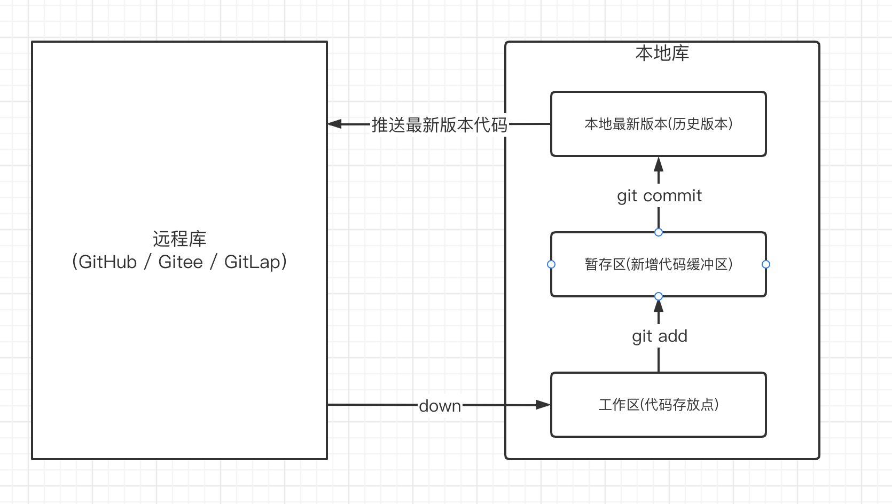

### Git分布式版本控制工具

Git作为分布式版本控制工具，主要特点即每一个台机器都可以算是一台git服务器，我们在使用Git时，首先会把代码从指定的`远程库`down到自己的机器中，并围绕这个代码文件建立`本地库`，进行项目的版本管理。最后向统一的`远程库`提交代码即可。

下图即是Git的工作流程图：



我们需要注意，代码在暂存区中是可以被回滚的，但是如果代码被提交到本地最新版本后，只能进行版本覆盖，但是会保留有版本历史记录，可以被查看到。最终一旦被提交到远程库，那么再无撤回的可能。

&nbsp;

-------

### Git自定义本地库指令

即我们可以不使用远程库中提供的项目，而是自己在本地定义一个项目，围绕此项目建立本地库，然后进行远程库的提交。

***第一步设置本地的用户签名（只用设置一次，用来表示本地用户标签）***

```git
git config --global user.name 用户名
```

&nbsp;

***第二步：设置本地的邮箱签名（只用设置一次，用来表示本地用户标签）***

```git
git config --global user.email 邮箱
```

&nbsp;

***第三步：初始化该项目对应的本地库***

```git
cd 指定工作文件下
git init
```

&nbsp;

***第四步：查看当前本地库的状态***

```git
cd 指定工作文件下
git status
```

&nbsp;

------

### Git管理项目版本指令

***提交新增/修改代码文件到暂存区***

```git
git add 指定文件路径[./代表全部新增/修改]
```

&nbsp;

***删除暂存区中指定文件***

```git
git rm --cached 指定文件路径[./代表缓冲区全部内容]
```

&nbsp;

***将暂存区中内容提交到项目对应本地版本库中***

```git
git commit -m '日志内容' 指定文件路径[./代表全部暂存区中还没提交文件]
```

&nbsp;

***查看项目对应版本库中的历史版本以及当前最新版本***

```git
git relog 
```

```git
git log
```

前者查看简写版本链

后者查看复杂版本链

------

### Git版本穿梭指令

***选定本地版本库中指定的项目版本***

```git
git reset --hard 版本号 
```
