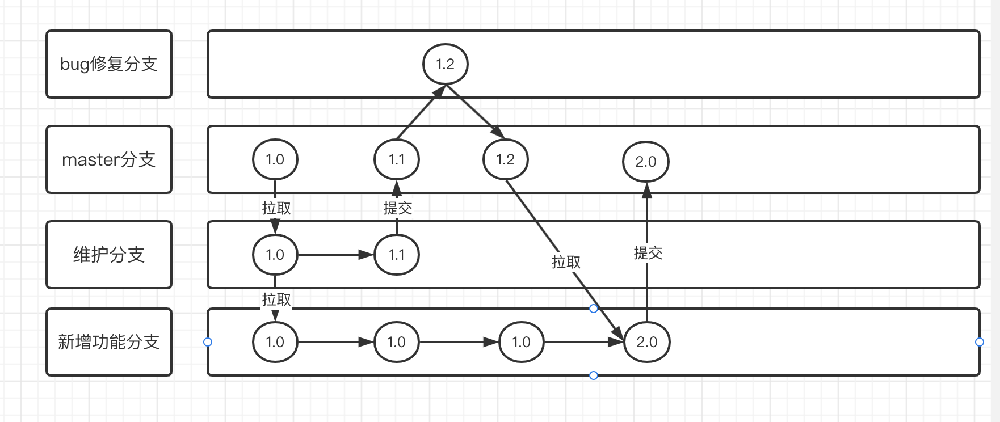

### Git分支控制

> 对于在实际中使用Git都是使用多分支开发，即一个分支对应一个部门，甚至一个分支对应了一个开发人员。通过对不同分支的合并来完成整个项目的不同功能点开发。

在项目的版本控制中，可能存在多个功能模块的同时开发，那么我们可以为每一个功能模块创建单独的分支，每一个分支只需要完成自己的功能模块即可。

使用分支意味着将开发人员的开发从开发主线中延伸一个开发分支，开发自己分支的时候，不会影响主线分支的运行，最后可以通过合并操作将独立分支中新增的功能合并到开发主线中。

我们可以想象成`神圣时间线`和`多元宇宙时间线分支`，一旦出现分支，就意味着发生了与主线不相同的发展，但是保留了分支出现之前的事物。最后人为的干涉多元宇宙时间线分支，使其与神圣时间线合并，那么神圣时间线就会出现分支中出现的原本神圣时间线中没有/替代的事物。

然而对于原本神圣时间线中已经存在的事物，但是被其他分支合并后进行替换的事物，我们都会在合并之前进行一下时间线的同步，同步一下神圣时间线事物到分支中。

接下来直接从时间开发中来解析一下分支的作用：



从上图我们可以看到，在master主分支上有一个正在运行的项目，那么此时：

1. 用户反馈已经上线的项目出现功能问题，那么此时维护分支就会`拉取`一份master主支上的项目代码，进行项目代码的维护，最后生成版本为1.1的项目后`推送`到master主支上，进行发布。

2. 之后发现维护提交的1.1版本项目会出现一个不影响使用的性能问题，那么bug修复分支就会紧急`拉取`一份当前master主支上的最新1.1版本项目，并修复性能问题后直接`推送`到master主支中。

3. 从最开始项目上线时，项目经理就预感到一个新功能必定能获取流量，所以就让新增功能分支最开始就`拉取`了一份1.0版本项目，在此基础上进行新功能的添加，最后功能开发成功，由于与原项目变化较大，所以本地版本名为2.0，那么在`推送`主分支之前，我们需要将1.2版本的项目先拉取下来，防止1.2项目中改变/新增了1.0版本中内容。将原本项目更新为1.2后，再进行2.0版本的提交，完成master主支中实现新功能。

&nbsp;

-----

### Git分支管理指令

***创建分支***

```git
git branch 分支名称
```

&nbsp;

***查看分支***

```git
git branch -v
```

&nbsp;

***切换分支***

```git
git checkout 分支名
```

&nbsp;

***合并分支***

```git
git merge 分支名称
```

-----

### 合并分支的冲突问题

当神圣时间线在某一时刻(A时刻)衍生出时间线分支，那么如果在A时刻之前的事物，两个时间线最开始都是一致的，只能慢慢发展才有可能改变原本就存在的共同事物。

+ **当神圣时间线或者时间线分支只有一条时间线在修改相同的共同事物时**，最后合并时间线这个相同事物采用最新修改后的事物就可。

+ ***当神圣时间线或者时间线分支均修改了相同的共同事物***，那么合并时就会提示合并需要选择(合并过程并未结束)，此时就必须让时间线管理者选择合并内容后再次进行提交本地库后完成合并。

```git
> git branch codedan
> git checkout codedan
  Switched to branch 'codedan'
> ls
  one.txt src     two.txt
> vim one.txt    //末尾添加了CodeDan字符串
> git add ./
> git status
  On branch codedan
  Changes to be committed:
   (use "git restore --staged <file>..." to unstage)
     modified:   one.txt

> git commit -m "冲突修改提交01" one.txt
  [codedan 4ea5473] 冲突修改提交01
  1 file changed, 1 insertion(+)

> git checkout master
  Switched to branch 'master'
> ls
  one.txt src     two.txt
> vim one.txt    /此文件末尾没有CodeDan，尾部追加Master字符串
> git add ./
> git status
  On branch master
  Changes to be committed:
    (use "git restore --staged <file>..." to unstage)
     modified:   one.txt

> git commit -m "冲突解决master" ./
  [master 05e6258] 冲突解决master
  1 file changed, 1 insertion(+)
> git merge codedan
  Auto-merging one.txt
  CONFLICT (content): Merge conflict in one.txt
  Automatic merge failed; fix conflicts and then commit the result.
> vim one.txt    //此时文件末尾会从start到end出现冲突代码，修改之后保持即可
> git add one.txt
> git status
  On branch master
  All conflicts fixed but you are still merging.
   (use "git commit" to conclude merge)

    Changes to be committed:
      modified:   one.txt

> git commit -m "解决分支冲突03"
  [master ba2932b] 解决分支冲突03
```

***<mark>注意：解决分支冲突最后的文件提交不需要也不能填写文件路径</mark>***
