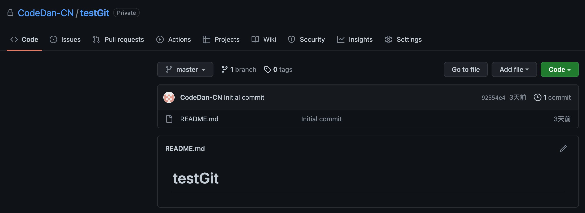
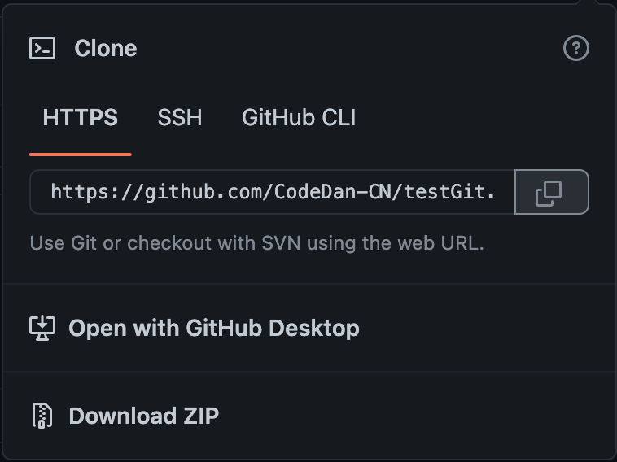
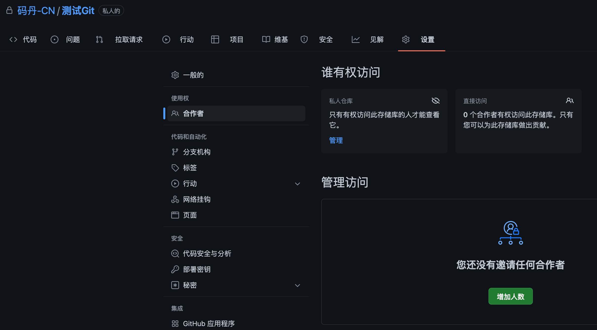
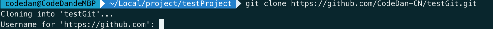
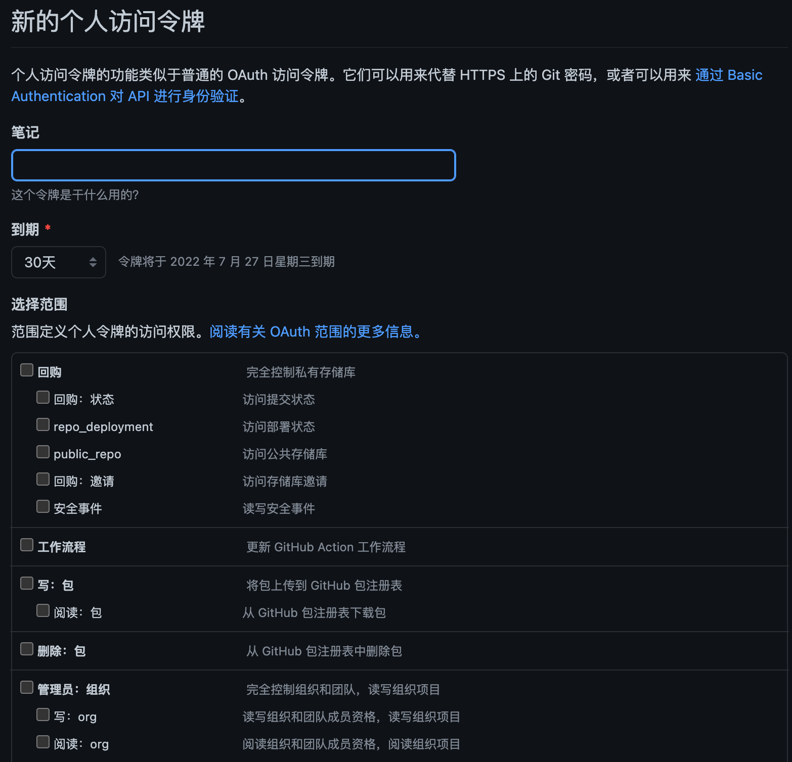
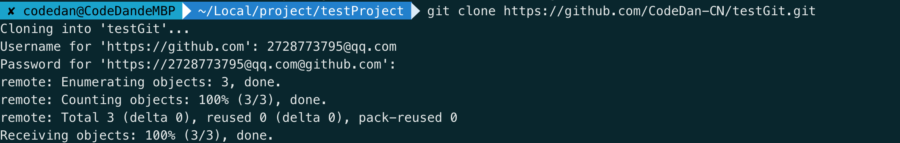
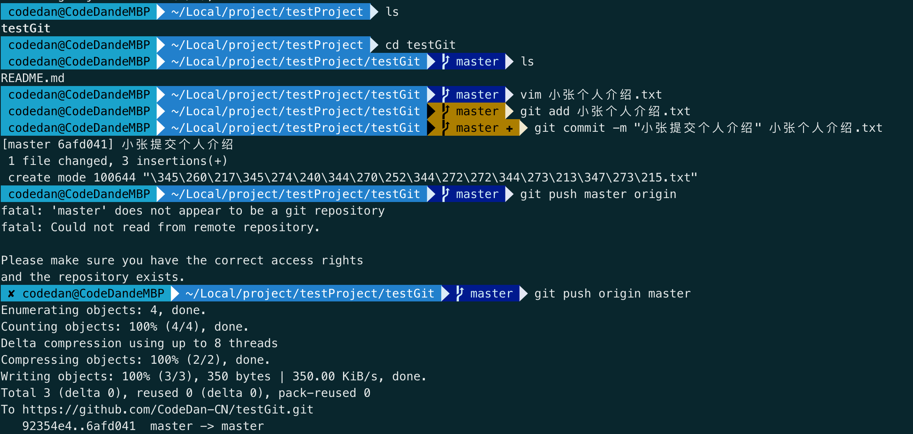
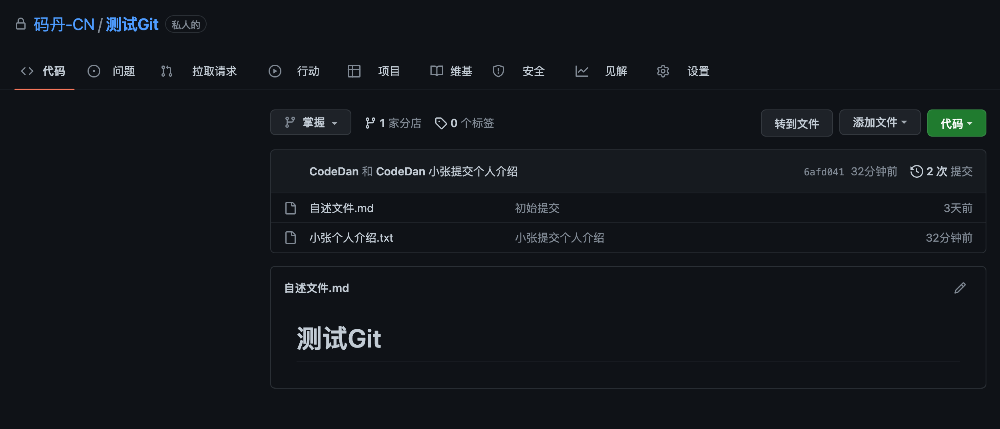
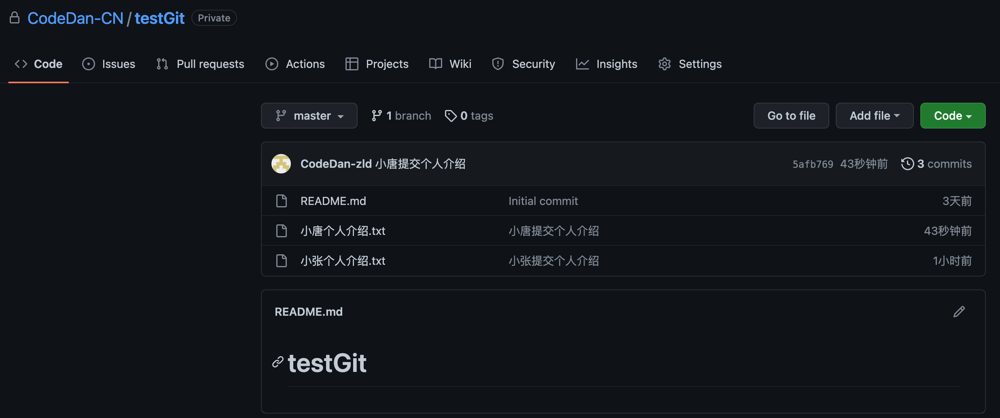

### Git团队开发教程

团队使用Git进行开发分为`团队内成员开发`与`团队外成员共同开发`。然而不管使用什么方式使用Git，我们都需要一个共同的远程库，去管理我们的代码，而并非是本地库。

一般我们开发者自己使用的多以github、gitee为主，而公司一般存在存在自己搭建的gitLab私有远程库(内网访问)。

以下操作均以GitHub作为远程库进行演示，网络请开启梯子或者vpn。

##### Git团队内开发

我们假设项目组里拥有三个成员，组长大文、实习生小张(mac)和小唐(win)。那么此时大文需要在远程库中创建一个项目给小张和小唐布置开发任务。



这是项目名称为testGit的实习生项目，那么此时需要和小张和小文把这个项目从远程库中`clone`到本地成为各自的本地库，最后添加各自的个人介绍.txt到项目中，并上传远程库。

1. 大文将远程库`https路径`通过`飞书`的形式发送到群里，小张和小唐接收到消息，并开始拉取远程库。并将小张和小唐拉入自己的团队中。
   
   
   
   
   
   &nbsp;

2. 小张(mac)进行项目的拉取并创建个人介绍后进行了项目提交，小唐在看着小张先操作(默认已经使用git config --global设置过名称和邮箱)
   
   + 小张首先使用下述指令进行了项目拉取，并设置了项目别名(***默认别名为origin***)
   
   ```git
   git clone https://github.com/CodeDan-CN/testGit.git
   ```
   
   ```tex
   //查看当前别名
   git remote -v
   
   //设置别名
   git remote add 自定义项目别名 项目htpps路径
   ```
   
   + 然后系统让小张输入其的github账号和密码)
   
   
   
   + 最后系统就给小张报错了，爆了一个token错误，那么看看日志可以知道是github最新的规矩，首先账号要去绑定指定设备的token，那么设备才能去访问对应账号的github。
   
   ```tex
   remote: Support for password authentication was removed on August 13, 2021. Please use a personal access token instead.
   remote: Please see https://github.blog/2020-12-15-token-authentication-requirements-for-git-operations/ for more information.
   fatal: Authentication failed for 'https://github.com/CodeDan-CN/testGit.git/'
   ```
   
   + 现在小张就要去github上登录自己的账号，找到设置token的地方给自己当前的设备设置一个token，并配置到自己的设备中。
   
   
   
   + 小张获取专属token之后记录到密码列表(github只会显示一次token，一定要找地方记录)中，重新`git clone`项目，不过要把密码换成token即可。)
   
   
   
   + 小张查看一下拉取的项目情况后，在项目中新增`小张个人介绍.txt`文件，并使用`add`、`commit`指令完成本地库的修改，最后使用`push`指令提交到远程库中。
   
   ```git
   git push 项目名称｜别名 分支名称)
   ```
   
   
   
   

3. 小唐也按照小张的方式通过window下git提供的bash进行相同指令的操作，完成自己个人介绍的提交。
   
   

注意：小唐在push之前，使用pull指令更新了一下本地仓库之后才继续push的

```git
git pull 项目名称｜别名 分支名称
```

&nbsp;

----

##### Git团队外开发

现在大文想要别的小组组长大羊来给小张和小唐的个人介绍进行修改一下，那么大文就得让大羊把此项目`fork`过去，大羊clone到本地之后进行修改后提交到fork之后属于大羊的项目副本远程库中，大羊向大文发送`pull requests`后，大文进行审核，通过之后进行分支合并获取修改之后的项目。


