### IDEA使用git方式

##### 第一步：idea配置git

在idea的setting中搜索version control找到git选项，选出git的安装路径即可

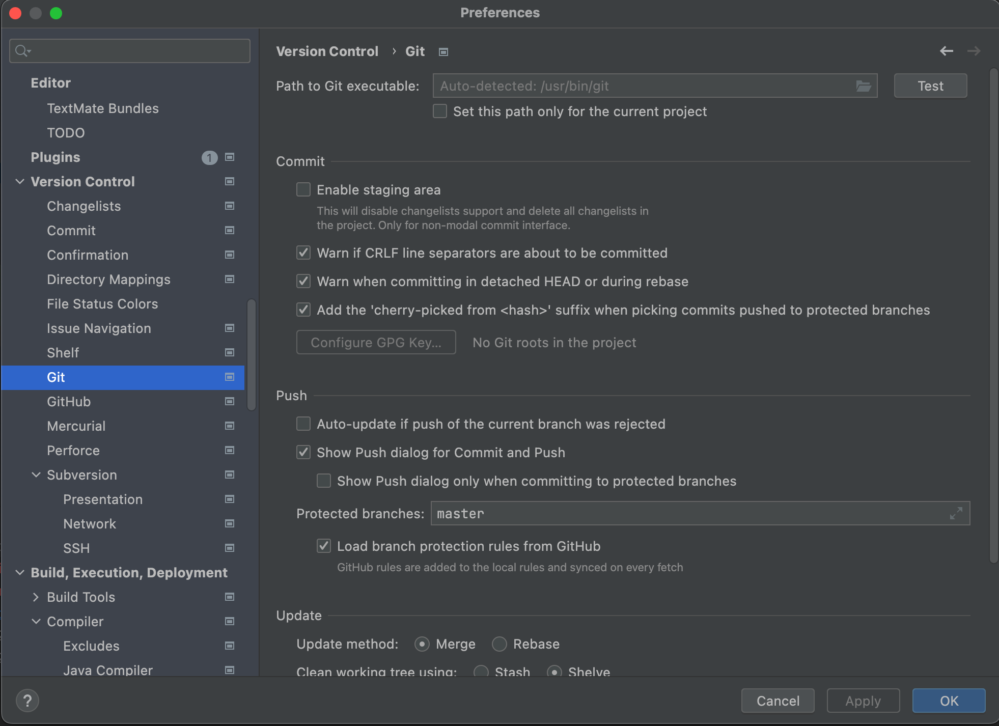

##### 第二步：idea创建此项目本地库

在idea最上部导航栏中寻找到`VCS`后移动到其展开选项`import into Version Control`后，展开二级子菜单，选中其中的`Create Git Repository`即可完成本地库的创建。（Mac的Create Git Repository是一级菜单）

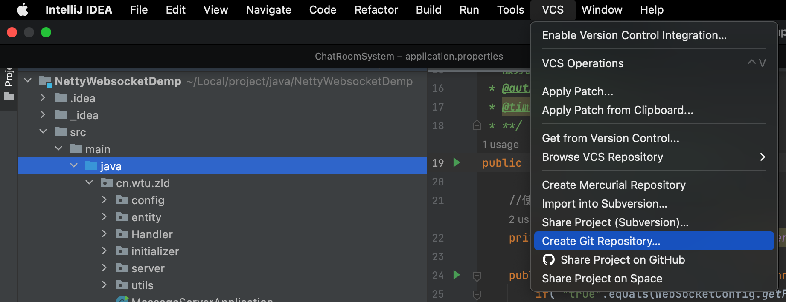

##### 第三步：idea使用本地库

右键项目或者项目内指定文件后，移动到弹出菜单栏中Git选项，即可弹出二级子菜单，通过二级子菜单可以进行本地库的操作。

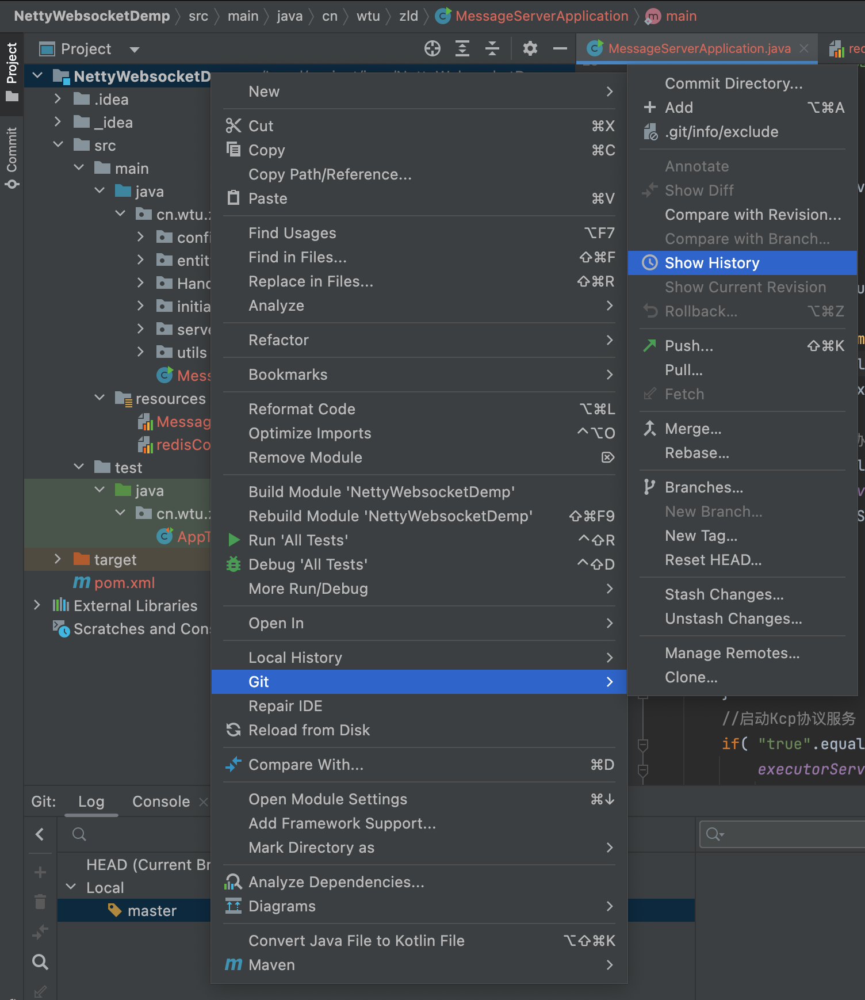

##### 第四步：idea查看与切换当前库版本

即在Idea的底部导航拦中寻找到Version Control后点击即可弹出当前本地库中所有的提交版本以及当前使用版本指针。

右键其他版本选中弹出菜单的Checkout Reversion 版本号即可完成版本的切换，此时idea中代码以及目录结构都有可能发生改变。

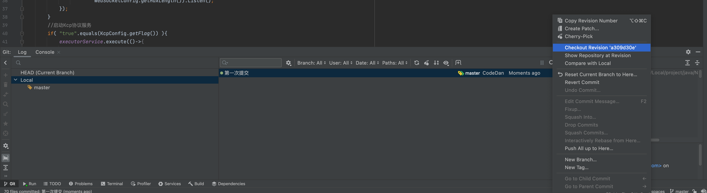

##### 第五步：idea进行分支的管理

首先通过右键项目或者指定文件弹出菜单栏，选中其中git选项，弹出二级子菜单，点击`Branches...`弹出分支管理页面。

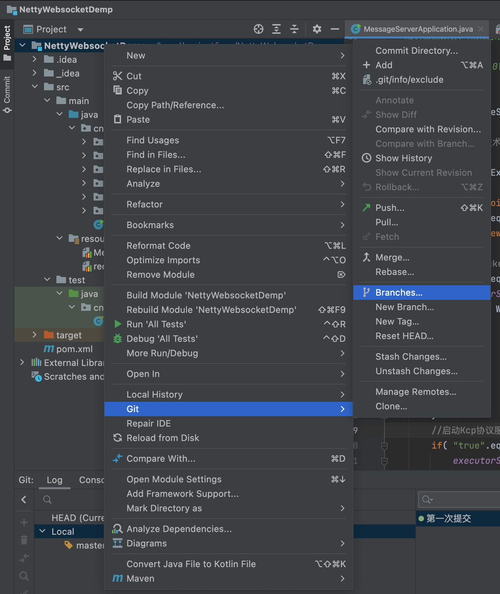

我们可以看到当前进行分支管理的页面，首先`New Branch`即是创建新的分支，`Local Branched`列出来的为当前已存在分支列表。

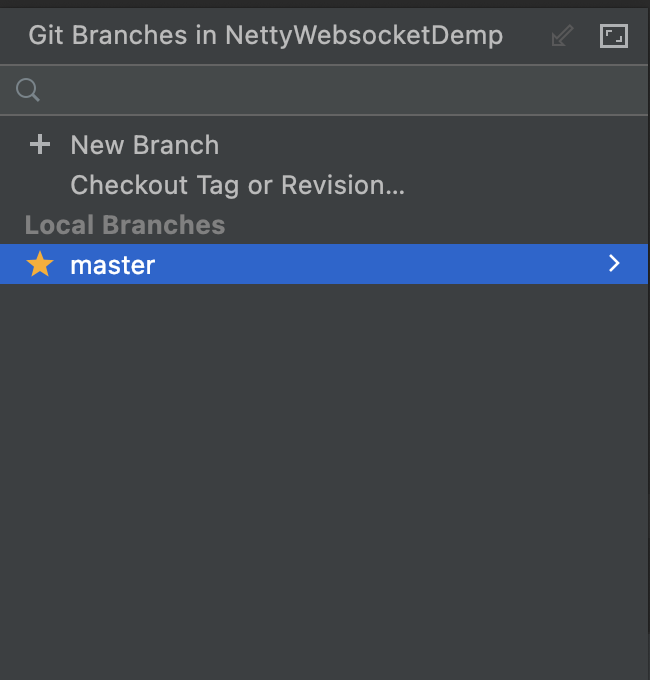

来看看怎么进行分支的切换，首先创建一个test-codedan的分支，然后在`local branched`可以看到出现两个分支，然后切换到新建分支。

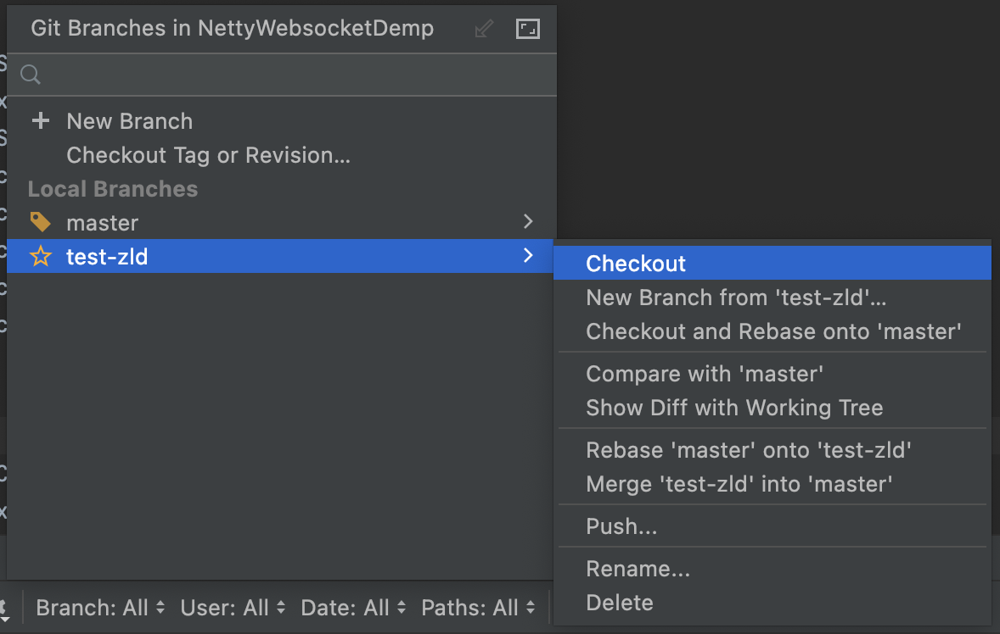

我们可以透过idea右下角查看当前所处分支提醒，如下图所示：

那么现在来模拟一下分支合并以及分支冲突，首先在`Local Branched`列出来的为当前已存在分支列表中选中分支后，出现的菜单栏中`Merge '准备合并分支名称' into '当前分支名称'`就是分支合并选项，点击即可完成合并，通过idea底部Version Control不仅仅可以查看版本情况还可以查看分支情况(包括合并情况。

那么来看看分支冲突时的解决页面，当存在分支冲突时，那么使用`Merge '准备合并分支名称' into '当前分支名称'`就会弹出分支冲突解决页面。

其为三个分屏页面，左边和右边均是不同分支的文件，中间为最终提交文件。那么可以进行粘贴复制也可以使用其提供的`>>`以及`<<`进行不同内容的移入。

&nbsp;

##### 第六步：idea管理github远程库

首先需要在setting中`version control`提供的列表中选中`github`，然后选择使用token的方式进行登录，那么将token复制进去即可。

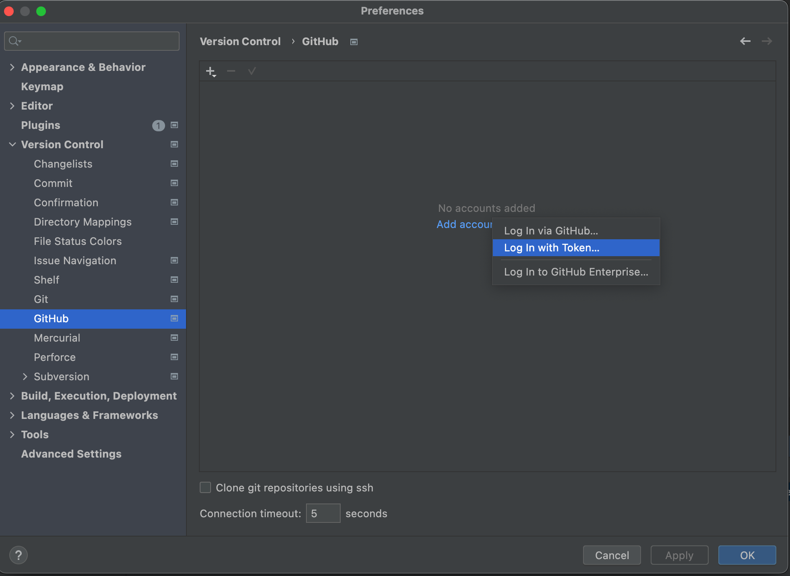

完成idea客户端与github远程库账号绑定之后，就需要选择将本地库直接创建到github上与之对应的远程库，我们只需要在idea顶部导航拦中寻找到`Git(原先VCS)`后，在其二级子菜单中寻找到`GitHub`并点击`Share Project on GitHub`即可开始创建。

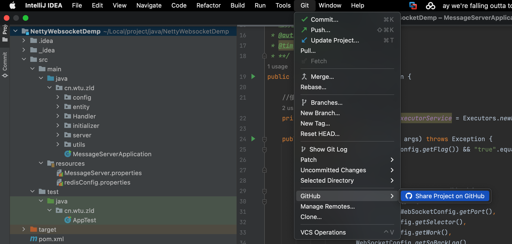

在弹出的创建远程库页面中填写相关信息即可完成创建。

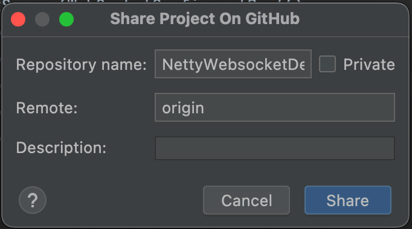

##### 第七步：idea通过github远程库进行项目的push与pull

还在idea顶部导航拦中寻找到`Git(原先VCS)`后，就会出现push与pull的选项，进行选取即可。

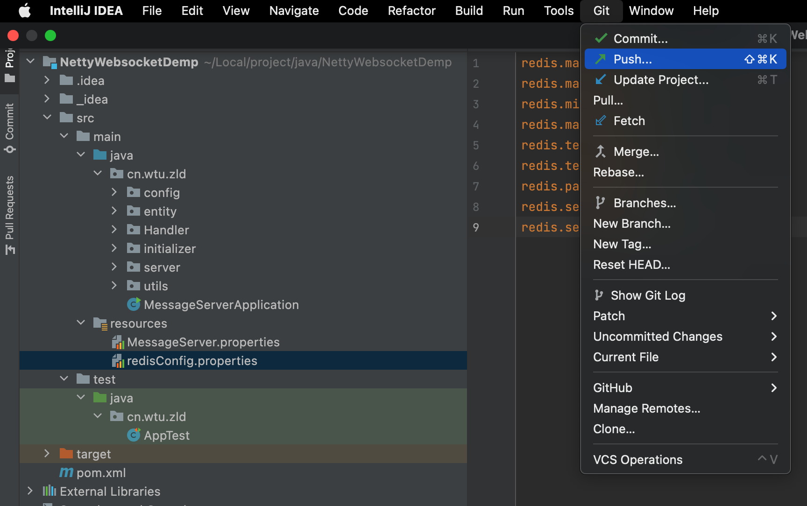

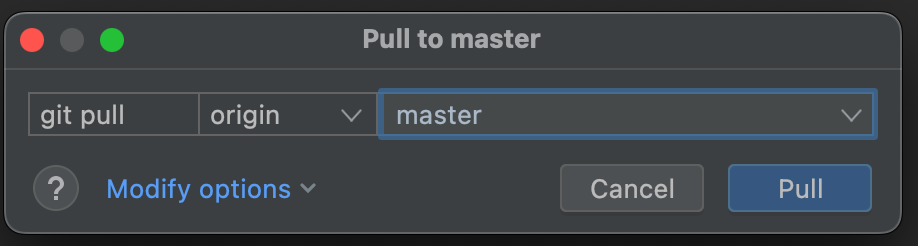

-----

### 关于Github远程pull与push需要注意的问题

##### 第一：在push代码到远程库时，本地库的版本一定要高于远程库。

所以一般在动手修改本地库代码时，都先会pull一下远程库，更新一下本地库的版本。

##### 第二：在pull代码到本地库时，尽量不要修改本地库(防止远程库也修改了，那么就会出现pull冲突)

