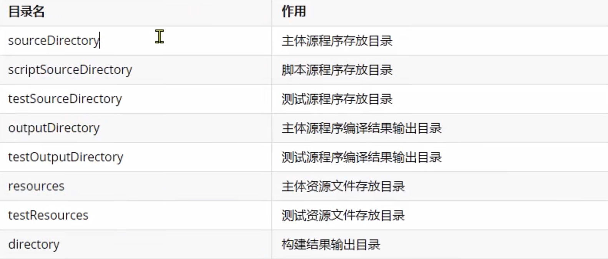

### Maven高级构建

从项目管理的角度来说，Maven提供了如下功能：

1. **项目对象模型(POM)**：将整个项目本身抽象，封装为应用程序中的一个对象，以便于管理和操作。

2. **构件关系定义**：Maven定义了构件之间的三种基本关系，让大型应用系统可以使用Maven来进行管理。
   
   + **继承关系**：通过从上到下的继承关系，将各个子构件中的重复信息提取到父构件中统一管理。
   
   + **聚合关系**：将多个构件聚合为一个整体，便于统一操作。
   
   + **依赖关系**：Maven定义了依赖的范围、依赖的传递、依赖的排除、版本仲裁机制等一些系列规范和标准。

&nbsp;

-------

### Maven的继承关系疏离

对于所有的Pom的基类为`Super Pom`，只要没有指定父亲Pom的Pom都是默认继承`Super Pom`的。<mark>当然父Pom也是可能继承自Super Pom。</mark>

来看看Super Pom到底包含哪些内容：

```xml
<project>

  <modelVersion>4.0.0</modelVersion>

  <!--本地仓库的地址，文件指定后不生效-->
  <repositories>
    <repository>
      <id>central</id>
      <name>Central Repository</name>
      <url>https://repo.maven.apache.org/maven2</url>
      <layout>default</layout>
      <snapshots>
        <enabled>false</enabled>
      </snapshots>
    </repository>
  </repositories>

  <!--远程拉取仓库的地址，文件指定后不生效-->
  <pluginRepositories>
    <pluginRepository>
      <id>central</id>
      <name>Central Repository</name>
      <url>https://repo.maven.apache.org/maven2</url>
      <layout>default</layout>
      <snapshots>
        <enabled>false</enabled>
      </snapshots>
      <releases>
        <updatePolicy>never</updatePolicy>
      </releases>
    </pluginRepository>
  </pluginRepositories>

  <!--对构建过程的操作，默认继承Super Pom的Pom采用这里的build进行构建，
      你会发现下面的地址构成了maven项目的基本结构-->
  <build>
    <directory>${project.basedir}/target</directory>
    <outputDirectory>${project.build.directory}/classes</outputDirectory>
    <finalName>${project.artifactId}-${project.version}</finalName>
    <testOutputDirectory>${project.build.directory}/test-classes</testOutputDirectory>
    <sourceDirectory>${project.basedir}/src/main/java</sourceDirectory>
    <scriptSourceDirectory>${project.basedir}/src/main/scripts</scriptSourceDirectory>
    <testSourceDirectory>${project.basedir}/src/test/java</testSourceDirectory>
    <resources>
      <resource>
        <directory>${project.basedir}/src/main/resources</directory>
      </resource>
    </resources>
    <testResources>
      <testResource>
        <directory>${project.basedir}/src/test/resources</directory>
      </testResource>
    </testResources>


    <pluginManagement>
      <!-- NOTE: These plugins will be removed from future versions of the super POM -->
      <!-- They are kept for the moment as they are very unlikely to conflict with lifecycle mappings (MNG-4453) -->
      <plugins>
        <plugin>
          <artifactId>maven-antrun-plugin</artifactId>
          <version>1.3</version>
        </plugin>
        <plugin>
          <artifactId>maven-assembly-plugin</artifactId>
          <version>2.2-beta-5</version>
        </plugin>
        <plugin>
          <artifactId>maven-dependency-plugin</artifactId>
          <version>2.8</version>
        </plugin>
        <plugin>
          <artifactId>maven-release-plugin</artifactId>
          <version>2.5.3</version>
        </plugin>
      </plugins>
    </pluginManagement>

  </build>


  <reporting>
    <outputDirectory>${project.build.directory}/site</outputDirectory>
  </reporting>

  <profiles>
    <!-- NOTE: The release profile will be removed from future versions of the super POM -->
    <profile>
      <id>release-profile</id>

      <activation>
        <property>
          <name>performRelease</name>
          <value>true</value>
        </property>
      </activation>

      <build>
        <plugins>
          <plugin>
            <inherited>true</inherited>
            <artifactId>maven-source-plugin</artifactId>
            <executions>
              <execution>
                <id>attach-sources</id>
                <goals>
                  <goal>jar-no-fork</goal>
                </goals>
              </execution>
            </executions>
          </plugin>
          <plugin>
            <inherited>true</inherited>
            <artifactId>maven-javadoc-plugin</artifactId>
            <executions>
              <execution>
                <id>attach-javadocs</id>
                <goals>
                  <goal>jar</goal>
                </goals>
              </execution>
            </executions>
          </plugin>
          <plugin>
            <inherited>true</inherited>
            <artifactId>maven-deploy-plugin</artifactId>
            <configuration>
              <updateReleaseInfo>true</updateReleaseInfo>
            </configuration>
          </plugin>
        </plugins>
      </build>
    </profile>
  </profiles>

</project>
```

&nbsp;

##### 有效Pom的说法

对于Pom继承关系中，子Pom可以覆盖父Pom中的配置，如果子Pom没有覆盖，那么父Pom中的配置就会被继承，按照这个规则，继承关系中所有Pom叠加到一起，就会得到一个最终的生效的Pom。就被我们称之为有效Pom。

我们还可以使用指令下载help插件查看有效Pom内容：

```tex
mvn help:effective-pom
```

所以真正的Pom结构其实由四层结构组成：

```tex
        Super Pom
            |
        Father Pom
            |
        Current POM(当前POM文件，我们最多关注和修改的POM文件)
            |
        有效 POM
```

&nbsp;

##### POM继承的写法以及用法

```xml
<parent>
    <groupId>net.bestjoy</groupId>
    <artifactId>labrador-cloud-framework</artifactId>
    <version>1.1.2</version>
</parent>


<!--按照上面的写法，此pom继承了拉布拉多框架版本为1.1.2,
但是没有其他信息，所以此项目其他信息就必须自己重写，如下图所示-->
    <groupId>com.dcone</groupId>
    <artifactId>equipment-service</artifactId>
    <version>1.0.0</version>
    <name>equipment-service</name>
    <description>Demo project for Spring Boot</description>
    <!--打包方式-->
    <packaging>pom</packaging>
```

上面是一个根项目pom的继承用法，那么一个子项目如何继承一个根项目的pom呢？

```xml
    <!--继承部分-->
    <parent>
        <artifactId>equipment-service</artifactId>
        <groupId>com.dcone</groupId>
        <version>1.0.0</version>
    </parent>
    
  
    <!--重写部分，如果不重写就采用父项目pom中的信息，那肯定不行。
    但是版本version或者group id如果一致，可以不重写，和下面相同-->
    <artifactId>equipment-service-facade</artifactId>
    <name>equipment-service-facade</name>
    <description>Demo project for Spring Boot</description>
    
```

&nbsp;

------

### Maven管理版本号推荐方式

当在pom文件中可能会存在多个jar包坐标，如果每个jar的版本都是在坐标中进行管理，那么修改时需要在海量坐标中寻找到相应坐标后在进行此jar包的版本修改。

如果把jar包的版本设置为一个变量，并且通过给此变量设置一个版本值后，在坐标中引入此变量后，将此变量放在专门一个区域进行管理，这样通过改变此变量的值，去改变对应jar包坐标的值。

```xml
    <properties>
        <labrador-cloud.version>1.1.2</labrador-cloud.version>
        <java.version>1.8</java.version>
    </properties>

    <dependencies>

        <!--引入web模块-->
        <dependency>
            <groupId>net.bestjoy</groupId>
            <artifactId>labrador-cloud-web</artifactId>
            <version>${labrador-cloud.version}</version>
        </dependency>

    </dependencies>
```

除了上述变量获取之外，Maven还可以通过`${}`表达式获取其他的值，比如系统变量等等，可以通过下述指令开启查看模式：

```tex
mvn help:evaluate
```

在`help:evaluate`模式下，通过下述方式可以获取到不同性质的值

```java
${标签名} //获取pom文件中对应标签的值

//获取pom文件中指定大标签对应小标签或者更小标签的集合下标中指定元素，
//比如${project.build.plugins[0]}就是project标签下build标签下plugins标签集合[0]的plugin标签的值
${大标签.小标签...[下标]} 

${env.字段}   //获取系统值
${settings.标签名}  //获取settings.xml中的元素值
```

&nbsp;

### Maven的build标签

用来保证Maven进行项目结构的固定构建，一般来说不需要重写超级POM的build标签中的内容，我们可以看看超级POM中build的一部分内容如下：

```xml
<build>
    <directory>${project.basedir}/target</directory>
    <outputDirectory>${project.build.directory}/classes</outputDirectory>
    <finalName>${project.artifactId}-${project.version}</finalName>
    <testOutputDirectory>${project.build.directory}/test-classes</testOutputDirectory>
    <sourceDirectory>${project.basedir}/src/main/java</sourceDirectory>
    <scriptSourceDirectory>${project.basedir}/src/main/scripts</scriptSourceDirectory>
    <testSourceDirectory>${project.basedir}/src/test/java</testSourceDirectory>
    <resources>
      <resource>
        <directory>${project.basedir}/src/main/resources</directory>
      </resource>
    </resources>
    <testResources>
      <testResource>
        <directory>${project.basedir}/src/test/resources</directory>
      </testResource>
    </testResources>
    ......
</build>
```



那么我们一般在项目中pom文件build标签中填写的内容都是对超级POM下build内容的一种`扩展`，不会随便去重写超级POM中build的内容。

&nbsp;

##### pluginManagement标签

那么在build标签中其实还存在有一个比较重要的子标签`pluginManagement`,此标签是用来管理Pom文件中`plugins`标签下的插件版本的。

如果在父工程Pom文件下`pluginManagement`中使用`plugins`标签声明了插件groupid、artifactId、version的信息，那么子工程中pom文件的`plugins`标签下`plugin`标签中只需要填写groupid、artifactId即可，也算是全局版本控制的一种。

```xml
<!--父工程-->
<build>
    <pluginManagement>
        <plugins>
            <plugin>
                <groupId>org.springframework.boot</groupId>
                <artifactId>spring-boot-maven-plugin</artifactId>
                <version>2.6.2</version>
            </plugin>    
        </plugins>
    </pluginManagement>
</build>

```

```xml
<!--子工程-->
<build>
        <plugins>
            <plugin>
                <groupId>org.springframework.boot</groupId>
                <artifactId>spring-boot-maven-plugin</artifactId>
            </plugin>    
        </plugins>
</build>
```

但是一般来说插件这东西，除了maven几个自带的，我们不需要管，看得懂就行，就是下面这几个:

```xml
<pluginManagement>
      <!-- NOTE: These plugins will be removed from future versions of the super POM -->
      <!-- They are kept for the moment as they are very unlikely to conflict with lifecycle mappings (MNG-4453) -->
      <plugins>
        <plugin>
          <artifactId>maven-antrun-plugin</artifactId>
          <version>1.3</version>
        </plugin>
        <plugin>
          <artifactId>maven-assembly-plugin</artifactId>
          <version>2.2-beta-5</version>
        </plugin>
        <plugin>
          <artifactId>maven-dependency-plugin</artifactId>
          <version>2.8</version>
        </plugin>
        <plugin>
          <artifactId>maven-release-plugin</artifactId>
          <version>2.5.3</version>
        </plugin>
      </plugins>
</pluginManagement>
```

除了上面这几个之外，我们需要手动进行构建的其实只有项目全局jdk的版本，因为我们在idea中编写项目使用的使用idea本身`setting.xml`中指定的jdk版本，如果项目到了部署环境可能会出错，比如jdk8的新增拉姆达表达式等报错等情况。

所以一般采用下面标签在build中配置当前项目采用的jdk版本：

```xml
<build>
        <plugins>
            <plugin>
                <groupId>org.apache.maven.plugins</groupId>
                <artifactId>maven-compiler-plugin</artifactId>
                <version>3.1</version>

                <!--重点来咯,jdk版本设置
                source标签是指定版本去兼容我们写的代码
                target标签是生成jdk指定版本的JVM文件-->
                <configuration>
                    <source>1.8</source>
                    <target>1.8</target>
                </configuration>
            </plugin>    
        </plugins>
</build>
```

**<mark>扩展</mark>**：除了上述指定项目jdk版本的方式之外，还有在`properties`标签中指定的方式，如下所示： 

```xml
<properties>
    <maven.compiler.source>1.8</maven.compiler.source>
    <maven.compiler.target>1.8</maven.compiler.source>
</properties>
```

&nbsp;


&nbsp;
